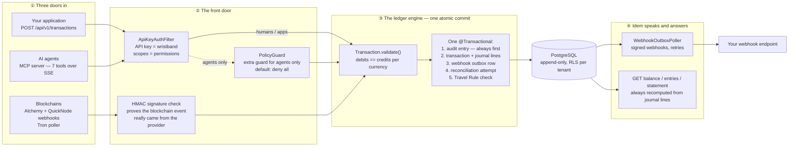
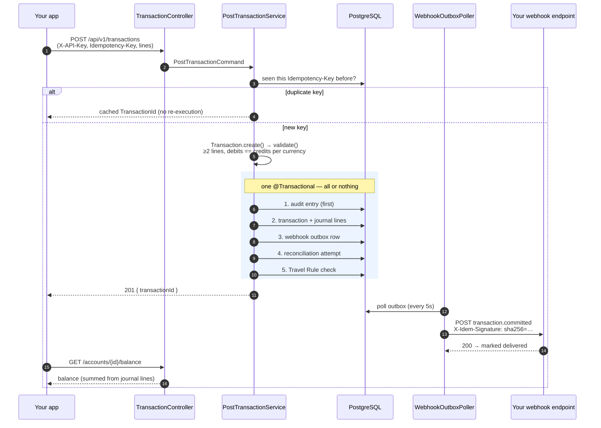
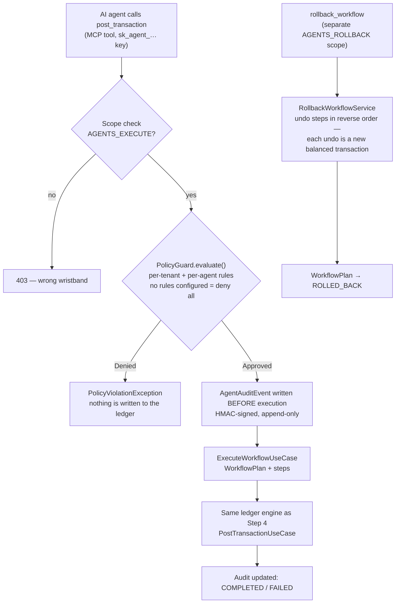

# Architecture overview — how Idem works, end to end

This page explains the whole source-available system in plain language, from the moment a
money movement enters Idem until you fetch a balance or statement. Each step pairs an
everyday analogy with the real component names, so it works both as a first read and
as a map into the detailed component docs in [`docs/`](./).

> **The one-sentence version:** Idem is a notebook that never lies. Every money
> movement is written twice — once as a minus, once as a plus — the page must balance
> before it is accepted, and nothing is ever erased, only appended.

---

## The big picture

Money movements reach Idem through **three doors**, pass a **front door check**,
converge on **one ledger engine** that writes everything in a single all-or-nothing
commit, and then Idem **speaks** (signed webhooks) and **answers questions**
(balance, entries, statement).

Now the same journey, step by step.

---

## Step 1 — A money movement arrives (three doors)

Think of Idem as a house with three doors, and every door leads to the same notebook.

1. **Your application** calls `POST /api/v1/transactions` (REST, or the Kotlin SDK's
   `IdemClient`) with the journal lines it wants recorded and an `Idempotency-Key`
   header — a "don't write this twice" ticket. Send the same ticket twice and, once
   the first attempt has committed, you get the same `TransactionId` back; the ledger
   never double-executes.
2. **Blockchains push events to Idem** — Idem does not sit refreshing the page.
   - **EVM** (Ethereum, Base, Polygon): Alchemy sends address-activity webhooks to
     `POST /internal/webhooks/alchemy` ([`evm-webhook-receiver.md`](evm-webhook-receiver.md)).
   - **Solana**: QuickNode Streams posts to `POST /internal/webhooks/quicknode`
     ([`solana-webhook-receiver.md`](solana-webhook-receiver.md)).
   - **Tron** has no webhooks, so `TronChainReader` politely asks Tronscan every few
     seconds ([`tron-chain-reader.md`](tron-chain-reader.md)).
   - If Idem was asleep (redeploy, crash), `EvmChainReader` and `SolanaChainReader`
     replay everything missed since the last `ChainCheckpoint` — once, at startup
     ([`chain-reader-orchestrator.md`](chain-reader-orchestrator.md)).
3. **AI agents** connect to the MCP server and use seven tools (`post_transaction`,
   `get_balance`, `list_entries`, `describe_account`, `reconcile_batch`,
   `rollback_workflow`, `get_agent_audit_log`) — see
   [Step 8](#step-8--ai-agents-with-guardrails) and [`mcp-server.md`](mcp-server.md).

Whichever door a transfer enters through, it becomes the **same kind of ledger write**,
handled by the same engine (`PostTransactionUseCase`). Chain-detected transfers carry a
deterministic idempotency key (`{chainKey}:{txHash}:{logIndex}` on EVM,
`SOLANA:{signature}:{accountIndex}`, `TRON:{txHash}`), so re-scanning a block can
never create duplicate entries.

## Step 2 — The wristband check (authentication)

At the front door, everyone shows a wristband: the **API key**
(`X-API-Key` or `Authorization: Bearer`).

- Keys are stored only as **bcrypt hashes** — Idem could not reveal your key even if
  asked. Validated keys are cached in Redis for 5 minutes so the door check stays fast.
- The wristband's color is its **scopes** (`TRANSACTIONS_WRITE`, `ACCOUNTS_READ`,
  `AGENTS_EXECUTE`, …). Controllers enforce them with `@PreAuthorize` — a read-only
  wristband simply cannot post transactions.
- Your **tenant identity comes from the key itself** (`ApiKeyAuthFilter` injects it) —
  never from the request body, so nobody can claim to be someone else.
- Behind everything sits a locked filing cabinet: **PostgreSQL Row-Level Security**.
  Even if every check above were somehow bypassed, the database itself refuses to hand
  one tenant another tenant's rows.

Blockchain webhooks use a different proof: an **HMAC signature** computed by the
provider (Alchemy / QuickNode) and verified before a single byte of the payload is
processed. A bad signature is rejected with `401`.

## Step 3 — The two-column rule (double-entry, fiat and crypto together)

Here is the heart of the whole system, and it is a rule a child can check: **the
seesaw must balance.** Money never appears or disappears — it always moves *from*
somewhere *to* somewhere, so every transaction has at least two lines, and for each
currency the minuses (debits) must exactly equal the pluses (credits).

`Transaction.validate()` in the pure-Kotlin `core` module enforces this before
anything touches the database: at least 2 journal lines, debits == credits **per
currency**, all lines belonging to one tenant. An unbalanced page is rejected — it
never becomes history.

Each journal line carries a `MonetaryEntry`, a sealed class with exactly two shapes:

| | `FiatEntry` | `OnChainEntry` |
|---|---|---|
| What it is | Bank-world money | Stablecoin on a blockchain |
| Currency | ISO 4217: BRL, USD, MXN … | Token: USDC, USDT, BRZ … |
| Where it moved | Payment rail: PIX, ACH, WIRE, SWIFT, SEPA | Chain: EVM (Ethereum/Base/Polygon), Solana, Tron |
| Its receipt | Optional bank reference | `txHash`, `blockNumber`, wallet + token contract |

Both shapes are **equal citizens on the same page**: a single transaction can debit a
PIX account in BRL and credit a USDC account on Base. That is the design bet that
removes the usual "fiat ledger vs. blockchain indexer" reconciliation gap. Full model:
[`domain-model.md`](domain-model.md).

## Step 4 — All or nothing (the one atomic commit)

Imagine writing the whole notebook page in one pen stroke — if the ink smears
anywhere, the entire page is thrown away and it is as if nothing happened.

That pen stroke is one `@Transactional` block in `PostTransactionService`. Inside it,
in order:

1. **Audit entry** — written **first**, before anything else. History records the
   attempt even before the transaction itself.
2. **Transaction + journal lines** — the actual ledger write.
3. **Webhook outbox row** — the "letter to be mailed" telling you what happened
   (Step 6). Written in the same commit, so a committed transaction can never
   silently miss its notification.
4. **Reconciliation attempt** — if the transaction contains on-chain lines, Idem
   immediately tries to match them against your expectations (Step 5).
5. **Travel Rule check** — every on-chain entry is validated: entries above the
   threshold must carry IVMS 101 originator/beneficiary data; below-threshold
   entries are exempt (Step 9).

One commit. Either all five happen, or none do. There is **no event bus** — no Kafka,
no in-process event publisher — which means there is no window where the ledger says
one thing and the audit log or outbox says another.

## Step 5 — Matching expectations (reconciliation & settlement)

Reconciliation answers one question: **"was this on-chain transfer expected?"** —
like tracking a package.

- You tell Idem "I'm expecting a package": a `Settlement` row with status **PENDING**
  (which account, token, chain, wallet, amount — optionally the sender address).
- When a real transfer lands (through any door), `BasicReconciliationService` runs
  **inside the same atomic commit** from Step 4 and looks for a matching PENDING
  expectation within the matching window (default 24 hours):
  - **Tier 1 — sender-confirmed:** the expectation named a sender address and the
    on-chain `fromAddress` matches it.
  - **Tier 2 — amount + first-in-first-out:** same amount/token/chain/wallet; the
    oldest expectation wins. An expectation whose named sender *disagrees* is never
    matched this way.
- **Match** → the expectation flips **PENDING → SETTLED** in place, with proof
  attached (`txHash`, `blockNumber`, matched transaction), and a
  `transaction.settled` webhook is queued.
- **No match** → an **UNMATCHED** settlement row is created on the credited account
  and a `reconciliation.unmatched` webhook alerts you — an unexpected package
  arrived; a human should look.

Registered an expectation *after* the transfer already landed? Re-run matching for up
to 100 transactions at once via `POST /api/v1/reconciliation/batch`. Details:
[`reconciliation.md`](reconciliation.md).

## Step 6 — Idem tells you what happened (signed webhooks)

The outbox rows from Step 4 are letters waiting in a mailbox. Every 5 seconds the
mail carrier — `WebhookOutboxPoller` — picks up pending letters and delivers them to
your configured endpoint.

- Every delivery is **HMAC-SHA256 signed** with your tenant's webhook secret and
  carries `X-Idem-Signature: sha256=…`, so you can verify the letter really came
  from Idem and was not altered.
- If your endpoint is down, the carrier retries with growing patience —
  **5s → 30s → 2m → 10m** — and after 5 failed attempts marks the letter **DEAD**
  for investigation instead of retrying forever.
- Event types: `transaction.committed`, `transaction.settled`,
  `reconciliation.unmatched`, `compliance.travel_rule_required`.

Because the letter is written in the same commit as the transaction (Step 4), "the
transaction happened but you were never told" is structurally impossible. Details:
[`webhook-outbox-poller.md`](webhook-outbox-poller.md).

## Step 7 — Asking questions (balance, entries, statement)

Here is the most important thing about reading from Idem: **a balance is never
stored anywhere.** It is always recomputed by summing the journal lines — like
getting your notebook total by adding up the actual pages, never by trusting a number
scribbled on the cover. A stored balance could drift from history; a derived one
cannot, by construction.

| Endpoint | What you get |
|---|---|
| `GET /api/v1/accounts/{id}/balance` | Current balance — add `?asOf=…` to time-travel to any past moment |
| `GET /api/v1/accounts/{id}/entries` | The account's entry timeline, newest first, paginated |
| `GET /api/v1/accounts/{id}/statement` | A statement with opening and closing balances for a period |

Agents get the same answers through the MCP tools `get_balance`, `list_entries`, and
`describe_account`.

## Step 8 — AI agents with guardrails

An AI agent is like a very fast intern with a company card: useful, but you set
spending rules *before* it shops, and everything it does goes on camera.

The guardrails, in plain words:

- **PolicyGuard checks first, always** ([`policy-guard.md`](policy-guard.md)). Six
  rule types: spending caps per session and per hour (`MaxDebitPerSession`,
  `MaxDebitPerHour`), forbidden account pairs, a "call a human above this amount"
  threshold (`RequireHumanApprovalAbove`), and allow-lists for tokens and chains.
  All violations are collected and reported together, and **if you configured no
  rules, the answer is no** — deny by default.
- **The camera runs before the action.** An HMAC-signed `AgentAuditEvent` is
  persisted *before* execution and updated after — so even a crash mid-flight leaves
  a record that the agent tried.
- **Undo is honest.** Rollback does not erase pages (nothing in Idem ever does). It
  posts *compensating transactions* — mirror-image balanced entries — for each
  executed step, in reverse order (the saga pattern). Both the mistake and its
  correction remain visible in history forever. Compensating transactions
  intentionally bypass PolicyGuard: an undo must never be blocked by the same rules
  that allowed the original action.
- **Rollback is a separate privilege.** `AGENTS_ROLLBACK` is deliberately not
  included in `AGENTS_EXECUTE` — an agent that can spend cannot also un-spend unless
  you explicitly grant it.

Everything is inspectable afterwards via `get_agent_audit_log` (`AGENTS_AUDIT_READ`).

## Step 9 — Compliance helpers (Travel Rule & LGPD)

Two quiet assistants run inside the Step 4 commit. Both are **tooling**: Idem
detects, records, queues, and notifies — **the tenant always bears the regulatory
obligation**.

- **Travel Rule** ([`travel-rule.md`](travel-rule.md)): on-chain entries above the
  per-asset threshold (USD 1,000 equivalent) must carry IVMS 101
  originator/beneficiary data. Missing data does **not** fail the transaction — the
  money movement is a fact and gets recorded — but the entry is queued for
  compliance review and a `compliance.travel_rule_required` webhook is sent.
- **LGPD retention** ([`lgpd-retention.md`](lgpd-retention.md)): personal data
  fields are tagged with `@PiiField`, and Travel Rule identity payloads are
  scheduled for deletion after the retention window (default 7 years). A monthly
  sweep deletes expired personal data while the financial record — transactions,
  journal lines, audit log — is preserved untouched.

---

## Where to go deeper

| Topic | Doc |
|---|---|
| Domain model — accounts, `MonetaryEntry`, invariants, ports | [`domain-model.md`](domain-model.md) |
| Chain reader orchestration — startup recovery + Tron scheduling | [`chain-reader-orchestrator.md`](chain-reader-orchestrator.md) |
| EVM ingestion — Alchemy webhook (primary) / Web3j reader (recovery) | [`evm-webhook-receiver.md`](evm-webhook-receiver.md) / [`evm-chain-reader.md`](evm-chain-reader.md) |
| Solana ingestion — QuickNode webhook (primary) / JSON-RPC reader (recovery) | [`solana-webhook-receiver.md`](solana-webhook-receiver.md) / [`solana-chain-reader.md`](solana-chain-reader.md) |
| Tron ingestion — Tronscan REST polling | [`tron-chain-reader.md`](tron-chain-reader.md) |
| Reconciliation & settlement matching | [`reconciliation.md`](reconciliation.md) |
| Webhook outbox delivery, signing, retries | [`webhook-outbox-poller.md`](webhook-outbox-poller.md) |
| Agent policy rules | [`policy-guard.md`](policy-guard.md) |
| MCP server & tool reference | [`mcp-server.md`](mcp-server.md) |
| Travel Rule (IVMS 101) | [`travel-rule.md`](travel-rule.md) |
| LGPD retention | [`lgpd-retention.md`](lgpd-retention.md) |
| Module layout & dependency rule | [`../README.md`](../README.md#architecture) |
