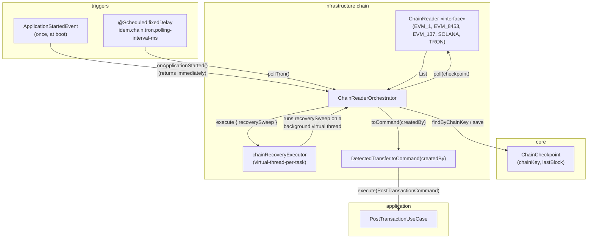
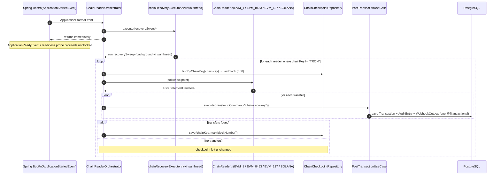
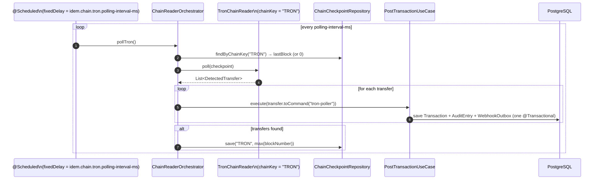

# Idem — Chain Reader Orchestrator

> Infrastructure module (`finance.idem.infrastructure.chain`).
> **Central wiring point for all on-chain event sources.** No event bus — the
> orchestrator drives every `ChainReader` directly via two triggers: a one-time
> startup recovery sweep and a recurring Tron poll.

---

## Role

Before #76, `EvmChainReader`, `SolanaChainReader`, and `TronChainReader` were fully
implemented and individually tested, but nothing in the running application ever
called `poll()`. `ChainReaderOrchestrator` closes that gap with two
`@Component`-scoped triggers over the same `List<ChainReader>` bean
(`EvmChainReaderFactory.chainReaders()`):

| Trigger | When | Readers polled | `createdBy` | Runs on |
|---|---|---|---|---|
| `onApplicationStarted()` | Once, on `ApplicationStartedEvent` | every reader where `chainKey != "TRON"` (`EVM_1`, `EVM_8453`, `EVM_137`, `SOLANA`) | `"chain-recovery"` | `chainRecoveryExecutor` — background virtual thread, dispatched fire-and-forget (#88) |
| `pollTron()` | Recurring `@Scheduled(fixedDelayString = "${idem.chain.tron.polling-interval-ms:5000}")` | every reader where `chainKey == "TRON"` | `"tron-poller"` | `@Scheduled` task-scheduler thread |

EVM and Solana are recovery-only by design — their primary, real-time paths are
the `AlchemyWebhookService` (#73) and `QuickNodeWebhookService` (#74) HTTP
receivers, which post entries and advance checkpoints as transfers happen. The
orchestrator's startup sweep exists purely to replay anything missed while the
app was down. Tron has no webhook API, so the scheduled poll is its **only**
mechanism — see `docs/tron-chain-reader.md`.

As of #88, `onApplicationStarted()` itself does no I/O — it submits the sweep to
`chainRecoveryExecutor` and returns immediately, so `ApplicationReadyEvent` and
Kubernetes readiness probes are never delayed by RPC-heavy `poll()` calls (wide
`ethGetLogs` ranges, paginated Solana `getSignaturesForAddress`). See
"Concurrency & readiness" below.

---

## Component overview



---

## Startup recovery (EVM + Solana)



---

## Concurrency & readiness (#88)

`onApplicationStarted()` returns immediately — the recovery sweep runs on
`chainRecoveryExecutor` (virtual-thread-per-task), so `ApplicationReadyEvent` /
Kubernetes readiness probes are never delayed by RPC-heavy `poll()` calls.

This means the recovery sweep can now run concurrently with `pollTron()`'s
first scheduled invocation. This concurrency already existed before #88:
`@Scheduled` tasks start during `context.refresh()`, before
`ApplicationStartedEvent` fires, so the Tron poller could already overlap with
the (then synchronous) recovery sweep on the main thread. No new
synchronization is required:

- `chain_checkpoint` is keyed by `chainKey` (PK). The recovery sweep only ever
  reads/writes `EVM_1` / `EVM_8453` / `EVM_137` / `SOLANA` rows
  (`chainKey != "TRON"`); `pollTron()` only ever reads/writes the `TRON` row.
  The two triggers never touch the same row.
- Each `pollAndPost(reader, createdBy)` call — whether dispatched from the
  recovery sweep or from `pollTron()` — drives an independently
  `@Transactional` `postTransactionUseCase.execute()` and
  `chainCheckpointRepository.save()`. Transactional proxies are
  thread-agnostic; running on a virtual thread changes nothing here.
- Within the recovery sweep itself, readers are polled sequentially
  (`forEach`) on a single virtual thread — no intra-sweep concurrency either.

Moving the sweep off the main thread changes *which thread* runs
`pollAndPost()`, not *what* it touches or *how* it's synchronized.

### Shutdown

`chainRecoveryExecutor` (`ChainRecoveryExecutorConfig`) is registered with
`destroyMethod = "shutdownNow"`, not the JDK-inferred `close()`. The default
`close()` on an `ExecutorService` blocks up to 1 day waiting for in-flight
tasks to finish — if the recovery sweep is still running an `ethGetLogs`/Solana
scan when the context closes (e.g. a rolling restart shortly after a
long-downtime recovery), that would hang context shutdown. `shutdownNow()`
interrupts the sweep immediately; it resumes from the last saved
`ChainCheckpoint` on next startup, so interrupting it is safe.

Each task also runs on a thread named `chain-recovery-N` (via
`Thread.ofVirtual().name(...)`), so `pollAndPost()` log lines from the sweep
can be correlated by thread name.

---

## Tron scheduled poll



---

## Exception isolation

`pollAndPost(reader, createdBy)` wraps the entire poll-decode-post-checkpoint
sequence for a single reader in `try/catch`. A `RuntimeException` from one
reader (RPC down, malformed response, DB hiccup) is logged as
`"${reader.chainKey}: poll failed"` and does **not**:

- stop the `forEach` over the remaining readers in the same trigger, or
- propagate out of `onApplicationStarted()` / `pollTron()`.

Within the loop, a failed `postTransactionUseCase.execute()` (a `Result.failure`,
e.g. a double-entry validation error) is logged individually via `onFailure` —
this does not abort the loop over the remaining transfers, and does not block
the checkpoint advancement below. This mirrors the convention already
established by `AlchemyWebhookService`/`QuickNodeWebhookService`: log and move
on, rather than inventing a stricter policy for the orchestrator.

---

## Checkpoint advancement

```kotlin
val newCheckpoint = transfers.maxOfOrNull { it.entry.blockNumber } ?: checkpoint
if (newCheckpoint > checkpoint) {
    chainCheckpointRepository.save(reader.chainKey, newCheckpoint)
}
```

The checkpoint advances to the highest `blockNumber` among the transfers
returned by `poll()`. If `poll()` returns an empty list, the checkpoint is left
unchanged.

**Known limitation**: for the EVM/Solana recovery sweep, an empty result means
the checkpoint stays put — the next restart re-scans the same (now wider) block
range. This is acceptable because recovery is fallback-only (the webhook paths
keep checkpoints current during normal operation), and fixing it would require
widening the `ChainReader` interface so `poll()` can report a high-water-mark
independent of `List<DetectedTransfer>` — out of scope for #76 and would touch
three already-tested readers.

---

## Configuration

```yaml
idem:
  chain:
    tron:
      api-url: https://apilist.tronscan.org
      polling-interval-ms: 5000
```

| Property | Default | Notes |
|---|---|---|
| `idem.chain.tron.polling-interval-ms` | `5000` | `@Scheduled(fixedDelayString = ...)` interval for `pollTron()`. Tron's block time is ~3s. Integration tests override to `200` for fast scheduling. |

`onApplicationStarted()` has no interval — it fires exactly once per process
lifetime, regardless of how many EVM/Solana readers are configured.

---

## Scope clarification (#76 vs. #74)

Issue #76's original text referenced a dependency on "#74 (SolanaWebSocketManager)"
and asked the orchestrator to start/stop a WebSocket lifecycle on application
events. No `SolanaWebSocketManager` class exists — #74 was built as
`QuickNodeWebhookService`, an HTTP webhook receiver with no lifecycle to manage
(see `docs/solana-webhook-receiver.md`). `ChainReaderOrchestrator` therefore does
**not** manage any WebSocket connection; `SolanaChainReader`'s only invocation is
the one-time startup recovery poll described above. This matches the M2-3
chain-reader rules already documented in `CLAUDE.md`.

### Related descope: #77 checklist item "SolanaWebSocketManager: disconnection → reconnect with exponential backoff (mock WS server)"

This #77 checklist item is obsolete for the same reason as the #76 dependency
referenced above: no `SolanaWebSocketManager` class exists, and
`QuickNodeWebhookService` (#74) is a stateless HTTP webhook receiver with no
connection lifecycle to disconnect/reconnect. There is therefore nothing to
write a "mock WS server + exponential backoff" test against. #77's actual
integration-test scope (Alchemy webhook receiver + reconciliation, both real
HTTP/Postgres via Testcontainers) is covered by `AlchemyWebhookIntegrationTest`
(see `docs/reconciliation.md` and `docs/evm-webhook-receiver.md` test-coverage
tables).

---

## Error handling

| Category | Behaviour |
|---|---|
| `reader.poll()` throws | Logged as `"${chainKey}: poll failed"`, exception swallowed — other readers in the same trigger still run |
| `postTransactionUseCase.execute()` returns `Result.failure` | Logged per-transfer with `idempotencyKey` and error message — remaining transfers and checkpoint advancement proceed |
| `poll()` returns empty list | Checkpoint left unchanged, no-op |

---

## Test coverage

| Test class | Type |
|---|---|
| `ChainReaderOrchestratorTest` | Unit (Mockito-Kotlin) — dispatch by `chainKey`, `createdBy` wiring, checkpoint advancement, exception isolation, and (#88) that `onApplicationStarted()` submits the recovery sweep to `chainRecoveryExecutor` rather than running it inline |
| `ChainReaderOrchestratorIntegrationTest` | Integration (Testcontainers Postgres) — end-to-end startup recovery and scheduled Tron poll against real `ChainCheckpointRepository`/`TransactionRepository`; the startup-recovery assertion (#88) uses `Awaitility` since the sweep now runs asynchronously on `chainRecoveryExecutor` |

```bash
rtk test mvn test -pl infrastructure
```

---

## Related

- `docs/evm-chain-reader.md` — EVM recovery reader (Alchemy webhook primary, Web3j fallback)
- `docs/solana-chain-reader.md` — Solana recovery reader (QuickNode webhook primary, raw JSON-RPC fallback)
- `docs/tron-chain-reader.md` — Tron's only mechanism (Tronscan REST polling)
- `docs/domain-model.md` — `ChainCheckpoint`, `OnChainEntry`, `MonetaryEntry` sealed class
- `infrastructure/chain/EvmChainReaderFactory.kt` — factory that wires the `List<ChainReader>` bean
- Issue [#76](https://github.com/idem-finance/idem/issues/76)
