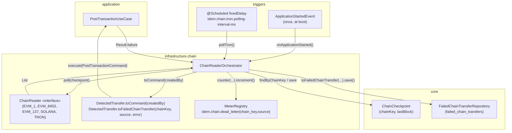
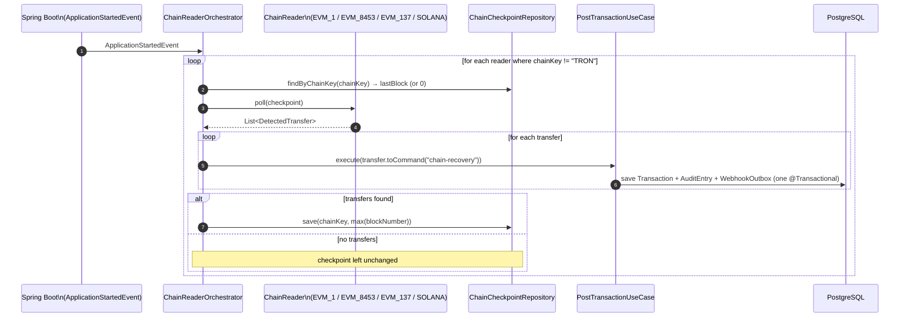
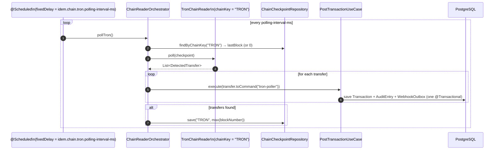

# Idem — Chain Reader Orchestrator

> Infrastructure module (`finance.idem.infrastructure.chain`).
> **Central wiring point for all on-chain event sources.** No event bus — the
> orchestrator drives every `ChainReader` directly via two triggers: a one-time
> startup recovery sweep and a recurring Tron poll.

---

## Role

Before #76, `EvmChainReader`, `SolanaChainReader`, and `TronChainReader` were fully
implemented and individually tested, but nothing in the running application ever
called `poll()`. `ChainReaderOrchestrator` closes that gap with two
`@Component`-scoped triggers over the same `List<ChainReader>` bean
(`EvmChainReaderFactory.chainReaders()`):

| Trigger | When | Readers polled | `createdBy` |
|---|---|---|---|
| `onApplicationStarted()` | Once, on `ApplicationStartedEvent` | every reader where `chainKey != "TRON"` (`EVM_1`, `EVM_8453`, `EVM_137`, `SOLANA`) | `"chain-recovery"` |
| `pollTron()` | Recurring `@Scheduled(fixedDelayString = "${idem.chain.tron.polling-interval-ms:5000}")` | every reader where `chainKey == "TRON"` | `"tron-poller"` |

EVM and Solana are recovery-only by design — their primary, real-time paths are
the `AlchemyWebhookService` (#73) and `QuickNodeWebhookService` (#74) HTTP
receivers, which post entries and advance checkpoints as transfers happen. The
orchestrator's startup sweep exists purely to replay anything missed while the
app was down. Tron has no webhook API, so the scheduled poll is its **only**
mechanism — see `docs/tron-chain-reader.md`.

---

## Component overview



---

## Startup recovery (EVM + Solana)



---

## Tron scheduled poll



---

## Exception isolation

`pollAndPost(reader, createdBy)` wraps the entire poll-decode-post-checkpoint
sequence for a single reader in `try/catch`. A `RuntimeException` from one
reader (RPC down, malformed response, DB hiccup) is logged as
`"${reader.chainKey}: poll failed"` and does **not**:

- stop the `forEach` over the remaining readers in the same trigger, or
- propagate out of `onApplicationStarted()` / `pollTron()`.

Within the loop, a failed `postTransactionUseCase.execute()` (a `Result.failure`,
e.g. a double-entry validation error or `TransactionAccountNotFound`) is handled
individually via `onFailure` — this does not abort the loop over the remaining
transfers, and does not block the checkpoint advancement below. This mirrors the
convention already established by `AlchemyWebhookService`/`QuickNodeWebhookService`:
log and move on, rather than inventing a stricter policy for the orchestrator. As
of #87, the `onFailure` branch additionally increments the `idem.chain.dead_letter`
counter and writes a `failed_chain_transfers` row — see
[Dead-letter table & alerting](#dead-letter-table--alerting) below.

---

## Checkpoint advancement

```kotlin
val newCheckpoint = transfers.maxOfOrNull { it.entry.blockNumber } ?: checkpoint
if (newCheckpoint > checkpoint) {
    chainCheckpointRepository.save(reader.chainKey, newCheckpoint)
}
```

The checkpoint advances to the highest `blockNumber` among the transfers
returned by `poll()`. If `poll()` returns an empty list, the checkpoint is left
unchanged.

**Known limitation**: for the EVM/Solana recovery sweep, an empty result means
the checkpoint stays put — the next restart re-scans the same (now wider) block
range. This is acceptable because recovery is fallback-only (the webhook paths
keep checkpoints current during normal operation), and fixing it would require
widening the `ChainReader` interface so `poll()` can report a high-water-mark
independent of `List<DetectedTransfer>` — out of scope for #76 and would touch
three already-tested readers.

A second consequence of always advancing the checkpoint to `max(blockNumber)`:
a transfer whose `postTransactionUseCase.execute()` call returns `Result.failure`
is never re-surfaced by a later `poll(checkpoint)`, because the checkpoint has
already moved past its block. As of #87, this is no longer "silent" — every such
failure is recorded in `failed_chain_transfers` and increments
`idem.chain.dead_letter`, giving an operator a durable, queryable record to
detect and manually correct the dropped entry. See
[Dead-letter table & alerting](#dead-letter-table--alerting) below.

---

## Dead-letter table & alerting

Added in #87. Whenever `postTransactionUseCase.execute()` returns `Result.failure`
— in `ChainReaderOrchestrator.pollAndPost`, `AlchemyWebhookService.handle`, or
`QuickNodeWebhookService.handle` — the `onFailure` branch does two things, in
addition to the existing `log.error(...)` call:

1. **Increments a Micrometer counter** `idem.chain.dead_letter`, tagged:
   - `chain_key` — e.g. `EVM_1`, `EVM_8453`, `SOLANA`, `TRON`
   - `source` — `chain-recovery`, `tron-poller`, `alchemy-webhook`, or `quicknode-webhook`

   The increment happens unconditionally (it's in-memory and cannot fail), so
   it's reliable even if the DB write below fails. Constant names live in
   `infrastructure/chain/ChainMetrics.kt` (`DEAD_LETTER_COUNTER`, `TAG_CHAIN_KEY`,
   `TAG_SOURCE`). Query it via:

   ```
   GET /actuator/metrics/idem.chain.dead_letter
   GET /actuator/metrics/idem.chain.dead_letter?tag=chain_key:EVM_1&tag=source:chain-recovery
   ```

   (`spring-boot-starter-actuator` is a compile dependency of `infrastructure`;
   `management.endpoints.web.exposure.include` includes `metrics`.)

2. **Writes a row to `failed_chain_transfers`** via
   `DetectedTransfer.toFailedChainTransfer(chainKey, source, error)` →
   `FailedChainTransferRepository.save(...)` (port in `core/chain`, JPA adapter
   in `infrastructure/persistence/chain`, migration `V15`). The insert is
   `INSERT ... ON CONFLICT (idempotency_key) DO NOTHING` — defensive idempotency,
   since under normal checkpoint-advance semantics a given transfer is evaluated
   at most once. This write is wrapped in
   `runCatching { ... }.onFailure { log.error(...) }`: a DB outage here is logged
   but does **not** prevent checkpoint advancement or processing of the remaining
   transfers — same exception-isolation philosophy as the rest of the orchestrator.

### Schema (`V15__create_failed_chain_transfers.sql`)

| Column | Notes |
|---|---|
| `id` | PK, `gen_random_uuid()` |
| `chain_key`, `source`, `idempotency_key`, `tx_hash`, `block_number` | identify the dropped transfer; `idempotency_key` is unique |
| `tenant_id`, `wallet_address`, `token_contract`, `debit_account_id`, `credit_account_id`, `token`, `amount` | everything needed to manually re-`POST /api/v1/transactions` |
| `error_message` | `error.message ?: error.toString()` from the `Result.failure` |
| `resolved`, `resolved_at` | operator marks `true` once the entry has been replayed or otherwise corrected |
| `created_at` | defaults to `now()` |

No RLS — same rationale as `chain_checkpoint` (V6): all writers are cross-tenant
background processes that never call `SET LOCAL app.tenant_id`. `tenant_id` is
stored as a plain column for ops triage/filtering.

### Operator workflow

```sql
SELECT id, chain_key, source, idempotency_key, tx_hash, block_number,
       tenant_id, debit_account_id, credit_account_id, token, amount, error_message, created_at
FROM failed_chain_transfers
WHERE resolved = false
ORDER BY created_at;
```

For each unresolved row: fix the root cause (e.g. create the missing account),
re-`POST /api/v1/transactions` using the stored `debit_account_id` /
`credit_account_id` / `token` / `amount` with a **new** `Idempotency-Key` — the
original `idempotency_key` was already recorded by `tryRecord` against the failed
attempt (no `Transaction` row exists for it), so reusing it returns
`IdempotencyConflict` rather than retrying. Then mark the dead-letter row
resolved:

```sql
UPDATE failed_chain_transfers SET resolved = true, resolved_at = now() WHERE id = :id;
```

---

## Configuration

```yaml
idem:
  chain:
    tron:
      api-url: https://apilist.tronscan.org
      polling-interval-ms: 5000
```

| Property | Default | Notes |
|---|---|---|
| `idem.chain.tron.polling-interval-ms` | `5000` | `@Scheduled(fixedDelayString = ...)` interval for `pollTron()`. Tron's block time is ~3s. Integration tests override to `200` for fast scheduling. |

`onApplicationStarted()` has no interval — it fires exactly once per process
lifetime, regardless of how many EVM/Solana readers are configured.

---

## Scope clarification (#76 vs. #74)

Issue #76's original text referenced a dependency on "#74 (SolanaWebSocketManager)"
and asked the orchestrator to start/stop a WebSocket lifecycle on application
events. No `SolanaWebSocketManager` class exists — #74 was built as
`QuickNodeWebhookService`, an HTTP webhook receiver with no lifecycle to manage
(see `docs/solana-webhook-receiver.md`). `ChainReaderOrchestrator` therefore does
**not** manage any WebSocket connection; `SolanaChainReader`'s only invocation is
the one-time startup recovery poll described above. This matches the M2-3
chain-reader rules already documented in `CLAUDE.md`.

### Related descope: #77 checklist item "SolanaWebSocketManager: disconnection → reconnect with exponential backoff (mock WS server)"

This #77 checklist item is obsolete for the same reason as the #76 dependency
referenced above: no `SolanaWebSocketManager` class exists, and
`QuickNodeWebhookService` (#74) is a stateless HTTP webhook receiver with no
connection lifecycle to disconnect/reconnect. There is therefore nothing to
write a "mock WS server + exponential backoff" test against. #77's actual
integration-test scope (Alchemy webhook receiver + reconciliation, both real
HTTP/Postgres via Testcontainers) is covered by `AlchemyWebhookIntegrationTest`
(see `docs/reconciliation.md` and `docs/evm-webhook-receiver.md` test-coverage
tables).

---

## Error handling

| Category | Behaviour |
|---|---|
| `reader.poll()` throws | Logged as `"${chainKey}: poll failed"`, exception swallowed — other readers in the same trigger still run |
| `postTransactionUseCase.execute()` returns `Result.failure` | Logged per-transfer with `idempotencyKey` and error message; increments `idem.chain.dead_letter{chain_key,source}` and writes a `failed_chain_transfers` row (#87) — remaining transfers and checkpoint advancement proceed |
| `failedChainTransferRepository.save(...)` throws | Logged as `"${chainKey}: failed to write dead-letter row for idempotencyKey=..."`, exception swallowed — counter increment already happened, checkpoint advancement proceeds |
| `poll()` returns empty list | Checkpoint left unchanged, no-op |

---

## Test coverage

| Test class | Type |
|---|---|
| `ChainReaderOrchestratorTest` | Unit (Mockito-Kotlin) — dispatch by `chainKey`, `createdBy` wiring, checkpoint advancement, exception isolation, dead-letter counter + `FailedChainTransferRepository.save()` on `Result.failure` (#87), and that a failing dead-letter write doesn't block checkpoint advancement |
| `ChainReaderOrchestratorIntegrationTest` | Integration (Testcontainers Postgres) — end-to-end startup recovery and scheduled Tron poll against real `ChainCheckpointRepository`/`TransactionRepository`; plus a `Result.failure` (missing account) producing a real `failed_chain_transfers` row and `idem.chain.dead_letter` counter increment (#87) |
| `FailedChainTransferRepositoryAdapterTest` | Integration (Testcontainers Postgres, `@DataJpaTest`) — `save()` persists all fields with `resolved = false`, and `ON CONFLICT (idempotency_key) DO NOTHING` keeps `save()` idempotent (#87) |
| `AlchemyWebhookServiceHandleTest` / `QuickNodeWebhookServiceTest` | Unit — dead-letter counter + `FailedChainTransferRepository.save()` on `Result.failure` at the webhook receivers (#87) |

```bash
rtk test mvn test -pl infrastructure
```

---

## Related

- `docs/evm-chain-reader.md` — EVM recovery reader (Alchemy webhook primary, Web3j fallback)
- `docs/solana-chain-reader.md` — Solana recovery reader (QuickNode webhook primary, raw JSON-RPC fallback)
- `docs/tron-chain-reader.md` — Tron's only mechanism (Tronscan REST polling)
- `docs/domain-model.md` — `ChainCheckpoint`, `OnChainEntry`, `MonetaryEntry` sealed class
- `infrastructure/chain/EvmChainReaderFactory.kt` — factory that wires the `List<ChainReader>` bean
- `infrastructure/chain/ChainMetrics.kt` — `idem.chain.dead_letter` counter name/tag constants
- `core/chain/FailedChainTransfer.kt`, `FailedChainTransferRepository.kt` — dead-letter domain model and port (#87)
- Issue [#76](https://github.com/idem-finance/idem/issues/76)
- Issue [#87](https://github.com/idem-finance/idem/issues/87) — dead-letter / alerting for failed chain entry posts
