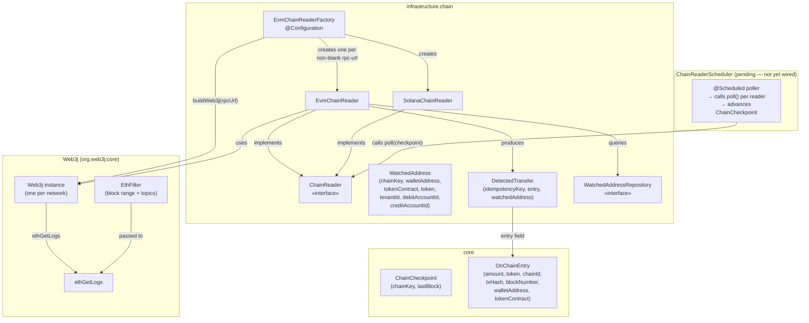
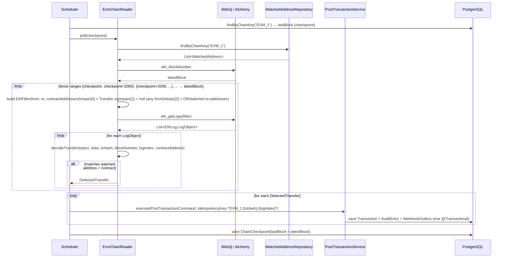
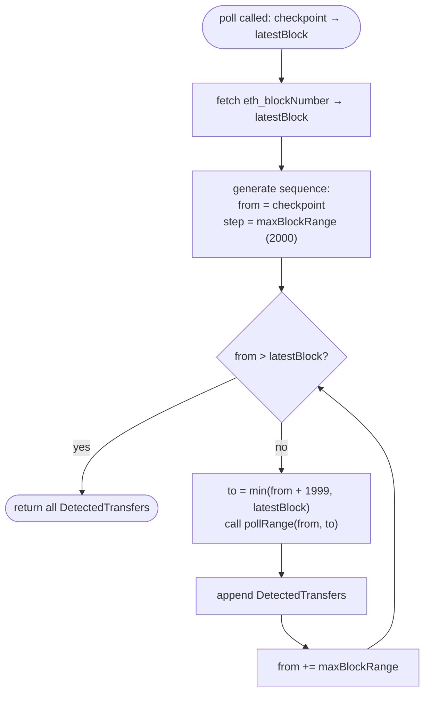

# Idem — EVM Chain Reader (Alchemy / Web3j)

> Infrastructure module (`finance.idem.infrastructure.chain`).
> Polls EVM-compatible chains for ERC-20 Transfer events into watched wallet addresses
> and converts them into `DetectedTransfer` records that feed the ledger.

---

## Why Web3j

Web3j is the standard JVM Ethereum client library, actively maintained under the
Linux Foundation Decentralized Trust umbrella. It migrated to Java 21 and Kotlin 2.1.0
in late 2024 and provides first-class `ethGetLogs` / `EthFilter` support — exactly
what block-range log polling requires. No alternative was evaluated; this was the
planned choice from the start.

Node provider: **Alchemy** (dev/staging) → own node (production). The reader is
provider-agnostic — any JSON-RPC endpoint works.

---

## Supported networks

| Chain | `chainKey` | Chain ID | `ChainId` enum |
|---|---|---|---|
| Ethereum mainnet | `EVM_1` | 1 | `EVM` |
| Base | `EVM_8453` | 8453 | `EVM` |
| Polygon | `EVM_137` | 137 | `EVM` |

`chainKey` is a free-form string rather than the `ChainId` enum because multiple
Ethereum-compatible networks share the same `ChainId.EVM` value. The checkpoint table
is keyed on `chainKey` to track each network independently.

---

## Supported tokens

| Token | Contract (Ethereum mainnet) | Decimals |
|---|---|---|
| USDC | `0xA0b86991c6218b36c1d19D4a2e9Eb0cE3606eB48` | 6 |
| USDT | `0xdAC17F958D2ee523a2206206994597C13D831ec7` | 6 |
| PYUSD | `0x6c3ea9036406852006290770BEdFcAbA0e23A0e8` | 6 |
| BRZ | `0x491604c0FDF08347Dd1fa4Ee062a822A5DD06B5D` | 18 |

Contract addresses differ per network (Base, Polygon). The authoritative address is
stored in `watched_addresses.token_contract` — the reader uses that value, not a
hardcoded constant.

---

## Component overview



`EvmChainReaderFactory` creates one `EvmChainReader` per non-blank RPC URL at startup.
Three readers (Ethereum, Base, Polygon) can run simultaneously if all three URLs are
configured — each has its own `Web3j` instance and its own checkpoint row.

---

## Polling workflow



The checkpoint and ledger write must be atomic — a crash between them would either
skip transfers (if checkpoint advances first) or produce duplicates (if commit advances
first). The idempotency key is the safety net for the overlap window on re-scan.

---

## Block-range chunking

Alchemy (and most providers) enforce a maximum of 2 000 blocks per `eth_getLogs` call.
`EvmChainReader` chunks the range automatically:



`maxBlockRange` defaults to 2 000 and is injectable via the constructor — lower values
are used in tests. A future configuration property can expose this per network.

---

## ERC-20 Transfer event decoding

The ERC-20 `Transfer(address indexed from, address indexed to, uint256 value)` event
is identified by its Keccak-256 topic:

```
0xddf252ad1be2c89b69c2b068fc378daa952ba7f163c4a11628f55a4df523b3ef
```

Topics are ABI-encoded: addresses are left-padded to 32 bytes. The reader strips the
padding and lowercases before comparing against `WatchedAddress.walletAddress`.

```mermaid
flowchart TD
    A([decodeTransfer called]) --> B{topics.size < 3?}
    B -- yes --> SKIP([return null])
    B -- no --> C{topics[0] ==\nTransfer topic hash?}
    C -- no --> SKIP
    C -- yes --> D["toAddress = '0x' + topics[2].takeLast(40).lowercase()"]
    D --> E["normalizedContract = contractAddress.lowercase()"]
    E --> F{watched = findFirst\nwhere tokenContract == normalizedContract\nAND walletAddress == toAddress?}
    F -- null --> SKIP
    F -- found --> G["rawAmount = BigInteger(data.removePrefix('0x'), 16)"]
    G --> H["decimals = decimalsFor(watched.token)"]
    H --> I["amount = BigDecimal(rawAmount).movePointLeft(decimals)"]
    I --> J([return DetectedTransfer])
```

**Address normalisation:** both `tokenContract` and `walletAddress` are lowercased
before comparison. EVM addresses are case-insensitive; the checksummed (EIP-55) form
and the lowercase form must match the same `WatchedAddress` row.

---

## Idempotency

Every detected transfer gets the key `{chainKey}:{txHash}:{logIndex}`.

- A single transaction can emit multiple `Transfer` events (e.g. a contract that fans
  out tokens to several recipients in one call).
- Including `logIndex` ensures each transfer in the same transaction gets a distinct
  idempotency key.
- On a re-scan (restart, range overlap), `PostTransactionService` returns the cached
  `TransactionId` without re-executing.

---

## Decimal precision

| Token | Decimals | Raw unit |
|---|---|---|
| USDC, USDT, PYUSD | 6 | 1 USDC = `1_000_000` in the `uint256` log data |
| BRZ | 18 | 1 BRZ = `1_000_000_000_000_000_000` |

`decimalsFor()` in `EvmChainReader` maps `StablecoinToken` → int. The `MonetaryAmount`
constructor accepts `BigDecimal` with scale ≤ 18 — both cases are within range.

---

## Configuration

Properties are bound under `idem.chain` via `@ConfigurationProperties`:

```yaml
idem:
  chain:
    evm:
      rpc-url: https://eth-mainnet.g.alchemy.com/v2/${ALCHEMY_API_KEY}
    evm-base:
      rpc-url: https://base-mainnet.g.alchemy.com/v2/${ALCHEMY_API_KEY}
    evm-polygon:
      rpc-url: https://polygon-mainnet.g.alchemy.com/v2/${ALCHEMY_API_KEY}
```

A reader is only created when its `rpc-url` is non-blank. Setting a URL to blank (or
omitting it) disables that network at runtime without any code change.

---

## Lifecycle and shutdown

`EvmChainReader` does not implement `Closeable` — the `Web3j` instance it holds does.
`EvmChainReaderFactory` tracks all created `Web3j` instances in `web3jInstances` and
calls `web3j.shutdown()` on each in its `@PreDestroy` method. Readers that implement
`Closeable` (i.e. `SolanaChainReader`) are also closed in the same `@PreDestroy`:

```kotlin
@PreDestroy
fun shutdown() {
    web3jInstances.forEach { it.shutdown() }                         // EVM
    readers.filterIsInstance<Closeable>().forEach(Closeable::close)  // Solana
}
```

---

## Error handling contract

| Condition | Behaviour |
|---|---|
| `ethGetLogs` returns `null` logs list | Treated as empty — `?: emptyList()` |
| Log entry is not `EthLog.LogObject` (e.g. hash-only) | Filtered out via `filterIsInstance` |
| `logIndex` not parseable as `Int` | Log WARN, skip entry |
| `topics.size < 3` | Return `null` from `decodeTransfer` |
| `topic[0]` is not the Transfer hash | Return `null` |
| Contract address not in watched set | Return `null` |
| `to` address not in watched set | Return `null` |
| Web3j RPC exception | Propagates to scheduler — scheduler must catch and log |

The scheduler must catch all exceptions thrown by `poll()` without propagating — a
single failing reader must not terminate the polling loop for other chains.

---

## Test coverage

| Test class | Type | What it covers |
|---|---|---|
| `EvmChainReaderTest` | Unit (Mockito) | `decodeTransfer`: happy path, wrong contract, wrong `to`, < 3 topics, wrong topic[0], logIndex in idempotency key, case-insensitive contract, USDT/PYUSD/BRZ decimals; `paddedAddress`; empty repo fast-path |
| `EvmChainReaderIntegrationTest` | Integration (WireMock) | Full `poll()` path: happy-path USDC detection, unmatched `to` address, empty `eth_getLogs` result |
| `EvmChainReaderFactoryTest` | Unit | Reader counts per URL combination; EVM + Solana together; empty config; shutdown path |

Run with:

```bash
rtk test mvn test -pl infrastructure
```

---

## Adding a new EVM network

1. Add a new `EvmNetworkConfig` field to `ChainConfig` (e.g. `evmArbitrum`).
2. Add the corresponding `idem.chain.evm-arbitrum.rpc-url` property.
3. Register it in `EvmChainReaderFactory.chainReaders()` with the appropriate chain key
   (e.g. `"EVM_42161"`).
4. Seed a `watched_addresses` row with `chain_key = 'EVM_42161'`.
5. The checkpoint table auto-creates the row on the first write — no migration needed.

---

## Related

- `docs/domain-model.md` — `ChainCheckpoint`, `OnChainEntry`, `MonetaryEntry` sealed class
- `docs/solana-chain-reader.md` — Solana counterpart (raw JSON-RPC, pagination algorithm)
- `infrastructure/chain/EvmChainReaderFactory.kt` — factory that wires all chain readers
- Issues [#46](https://github.com/idem-finance/idem/issues/46), [#48](https://github.com/idem-finance/idem/issues/48) — chain checkpoint and chain reader specs
