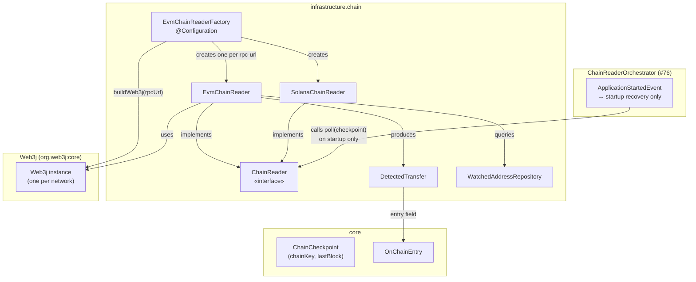
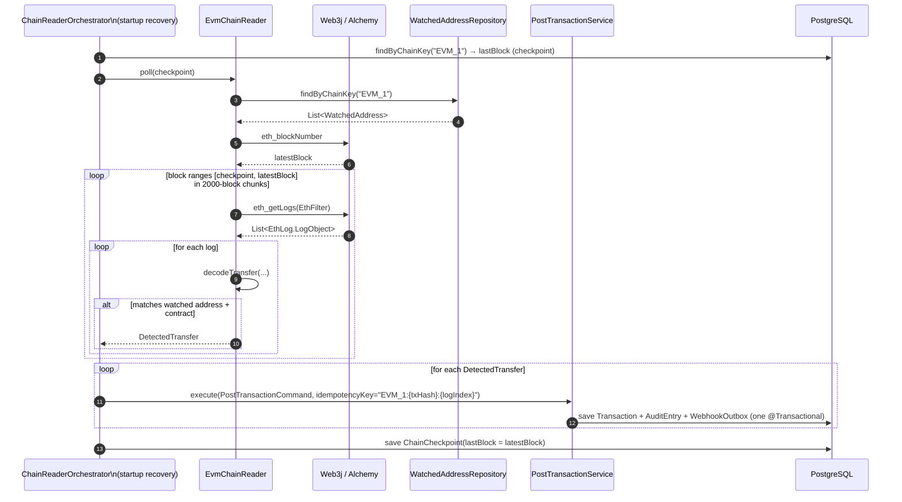
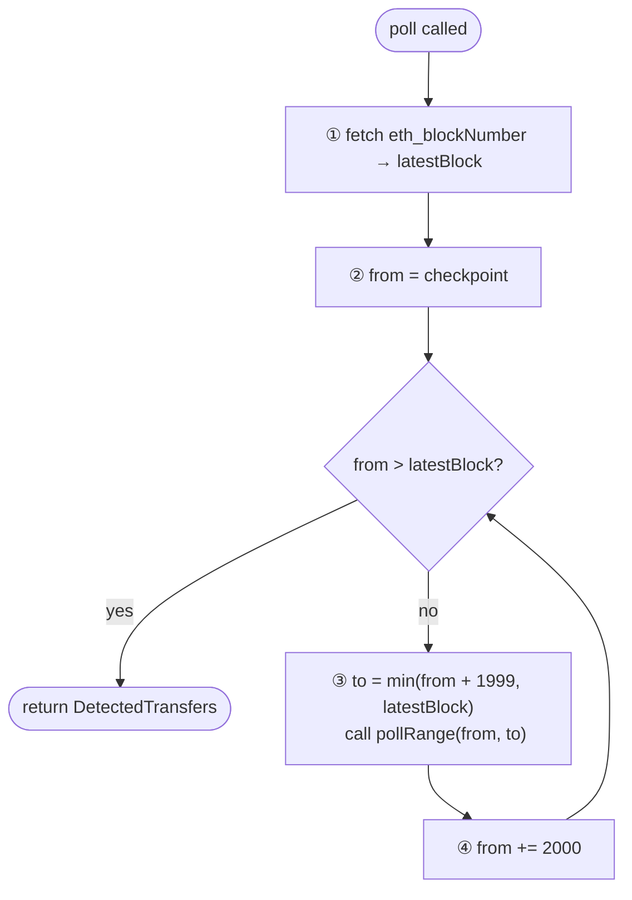
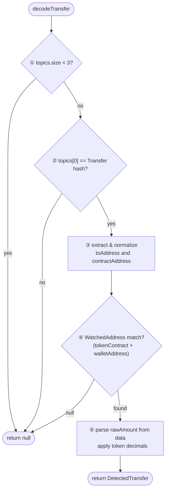

# Idem — EVM Chain Reader (Alchemy / Web3j)

> Infrastructure module (`finance.idem.infrastructure.chain`).
> **Fallback/recovery reader** — called once on startup by `ChainReaderOrchestrator` (#76)
> to replay ERC-20 transfers missed while the application was down.
> Primary detection is `AlchemyWebhookReceiver` (#73).

---

## Why Web3j

Web3j is the standard JVM Ethereum library, updated to Java 21 and Kotlin 2.1.0 in late 2024 with first-class `ethGetLogs` / `EthFilter` support. Node provider: **Alchemy** (dev/staging) → own node (production). The reader is provider-agnostic — any JSON-RPC endpoint works.

---

## Supported networks

| Chain | `chainKey` | Chain ID |
|---|---|---|
| Ethereum mainnet | `EVM_1` | 1 |
| Base | `EVM_8453` | 8453 |
| Polygon | `EVM_137` | 137 |

`chainKey` is a free-form string because multiple networks share `ChainId.EVM`. The checkpoint table is keyed on `chainKey` to track each network independently.

---

## Supported tokens

| Token | Contract (Ethereum mainnet) | Decimals |
|---|---|---|
| USDC | `0xA0b86991c6218b36c1d19D4a2e9Eb0cE3606eB48` | 6 |
| USDT | `0xdAC17F958D2ee523a2206206994597C13D831ec7` | 6 |
| PYUSD | `0x6c3ea9036406852006290770BEdFcAbA0e23A0e8` | 6 |
| BRZ | `0x491604c0FDF08347Dd1fa4Ee062a822A5DD06B5D` | 18 |

Contract addresses differ per network. The authoritative address is in `watched_addresses.token_contract` — not a hardcoded constant.

---

## Component overview

`EvmChainReaderFactory` creates one `EvmChainReader` per non-blank RPC URL at startup. Three readers (Ethereum, Base, Polygon) can run simultaneously — each has its own `Web3j` instance and checkpoint row.



---

## Polling workflow



**Walk-through example**

A customer transfers 50 USDC on Ethereum to your watched address `0xabc...`. The transfer is confirmed at block `19,501,200`, but the app was restarted and missed it. On the next startup:

1. Orchestrator reads the `chain_checkpoint` row for `EVM_1`: `lastBlock = 19,500,000`.
2. Calls `EvmChainReader.poll(checkpoint = 19,500,000)`.
3. Reader fetches watched addresses for `EVM_1` — e.g., `walletAddress = 0xabc...`, `tokenContract = 0xA0b869...` (USDC).
4. Calls `eth_blockNumber` — Alchemy returns `latestBlock = 19,502,350`.
5. Splits the range into 2 000-block chunks (see [Block-range chunking](#block-range-chunking)) and calls `eth_getLogs` for each.
6. Chunk `[19,500,000–19,501,999]` returns a log at block `19,501,200`: `to = 0xabc...`, contract = USDC → `DecodeTransfer` returns a match.
7. Idempotency key: `EVM_1:0x1234...txhash:3` (txHash + logIndex).
8. Orchestrator calls `PostTransactionService.execute(...)` — saves the transaction, audit entry, and webhook outbox row in one commit. The pending entry is now settled.
9. Checkpoint advances to `19,502,350` — the app won't re-scan these blocks on the next restart.

The checkpoint and ledger write are atomic — the idempotency key is the safety net for any re-scan overlap.

---

## Block-range chunking

Alchemy enforces a maximum of 2 000 blocks per `eth_getLogs` call. `EvmChainReader` chunks the range automatically:



**Walk-through example:** recovery scan after a 6 500-block downtime

| Step | `from` | `to` | Blocks | `eth_getLogs` call |
|---|---|---|---|---|
| ① | 19,500,000 | 19,501,999 | 2 000 | #1 |
| ② | 19,502,000 | 19,503,999 | 2 000 | #2 |
| ③ | 19,504,000 | 19,505,999 | 2 000 | #3 |
| ④ | 19,506,000 | 19,506,500 | 501 (partial, final) | #4 |

Each call is independent. A chunk with no matching logs emits nothing — no error, no noise.

`maxBlockRange` defaults to 2 000 and is injectable via the constructor.

---

## ERC-20 Transfer event decoding

The ERC-20 `Transfer(address indexed from, address indexed to, uint256 value)` event is identified by topic `0xddf252ad1be2c89b69c2b068fc378daa952ba7f163c4a11628f55a4df523b3ef`. Topics are ABI-encoded: addresses are left-padded to 32 bytes; the reader strips padding and lowercases before comparing.



**Walk-through example:** a `Transfer` log for a 1 USDC payment

```
topics[0] = "0xddf252ad...b3ef"          ← ERC-20 Transfer signature
topics[1] = "0x000...sender"             ← from address (padded to 32 bytes)
topics[2] = "0x000...0000abc123"         ← to address (padded to 32 bytes)
data       = "0x00...000f4240"           ← raw amount = 1 000 000
contractAddress = "0xa0b86991...eb48"    ← USDC on Ethereum mainnet
logIndex   = 5
```

1. `topics.size == 3` → continue
2. `topics[0]` matches the Transfer hash → confirmed ERC-20 transfer
3. Strip left-padding from `topics[2]`: last 40 hex chars → `"0xabc123..."` (lowercased)
4. Lowercase `contractAddress` → `"0xa0b86991..."`
5. Look up `WatchedAddress` where `tokenContract == "0xa0b86991..."` AND `walletAddress == "0xabc123..."` → found (USDC, 6 decimals)
6. Parse `data`: `BigInteger("0f4240", 16) = 1,000,000` → `1,000,000 × 10⁻⁶ = 1.000000 USDC`
7. Return `DetectedTransfer` with key `EVM_1:0x1234...txhash:5`

**Rejection examples:**
- `tokenContract` on a different network (Base vs Ethereum) → step ⑤ finds no matching row → skip
- Transfer to an address your tenant isn't watching → step ⑤ returns null → skip
- The watched wallet sent tokens (it's in `topics[1]`, not `topics[2]`) → `topics[2]` won't match → skip

Both `tokenContract` and `walletAddress` are lowercased before comparison — EIP-55 checksummed and lowercase forms must match the same `WatchedAddress` row.

---

## Idempotency

Key format: `{chainKey}:{txHash}:{logIndex}`

`logIndex` is included because a single transaction can emit multiple `Transfer` events. On re-scan, `PostTransactionService` returns the cached result without re-executing.

---

## Decimal precision

| Token | Decimals | Raw unit |
|---|---|---|
| USDC, USDT, PYUSD | 6 | 1 USDC = `1_000_000` |
| BRZ | 18 | 1 BRZ = `10^18` |

---

## Configuration

```yaml
idem:
  chain:
    evm:
      rpc-url: https://eth-mainnet.g.alchemy.com/v2/${ALCHEMY_API_KEY}
    evm-base:
      rpc-url: https://base-mainnet.g.alchemy.com/v2/${ALCHEMY_API_KEY}
    evm-polygon:
      rpc-url: https://polygon-mainnet.g.alchemy.com/v2/${ALCHEMY_API_KEY}
```

A reader is only created when its `rpc-url` is non-blank. Omitting a URL disables that network at runtime.

---

## Lifecycle and shutdown

`EvmChainReaderFactory` tracks all `Web3j` instances and calls `web3j.shutdown()` in `@PreDestroy`. Readers that implement `Closeable` (Solana, Tron) are also closed:

```kotlin
@PreDestroy
fun shutdown() {
    web3jInstances.forEach { it.shutdown() }                         // EVM
    readers.filterIsInstance<Closeable>().forEach(Closeable::close)  // Solana + Tron
}
```

---

## Error handling

| Category | Behaviour |
|---|---|
| Null / empty RPC response | Treated as empty — no error |
| Malformed log (< 3 topics, wrong topic[0]) | Return `null` from `decodeTransfer` — skip |
| Address or contract mismatch | Return `null` — skip |
| Unparseable `logIndex` | Log WARN, skip |
| Web3j RPC exception | Propagates to orchestrator — orchestrator must catch and log |

The orchestrator must catch all exceptions without propagating — a failing reader must not abort recovery for other chains.

---

## Test coverage

| Test class | Type |
|---|---|
| `EvmChainReaderTest` | Unit (Mockito) |
| `EvmChainReaderIntegrationTest` | Integration (WireMock) |
| `EvmChainReaderFactoryTest` | Unit |

```bash
rtk test mvn test -pl infrastructure
```

---

## Adding a new EVM network

1. Add a new `EvmNetworkConfig` field to `ChainConfig` (e.g. `evmArbitrum`).
2. Add `idem.chain.evm-arbitrum.rpc-url` to config.
3. Register in `EvmChainReaderFactory.chainReaders()` with the chain key (e.g. `"EVM_42161"`). Also configure an Alchemy Address Activity webhook pointing to `POST /internal/webhooks/alchemy` — the recovery reader alone is not sufficient for production.
4. Seed a `watched_addresses` row with `chain_key = 'EVM_42161'`.
5. The checkpoint table auto-creates on the first write — no migration needed.

---

## Related

- `docs/evm-webhook-receiver.md` — primary EVM event source (Alchemy Address Activity webhook)
- `docs/chain-reader-orchestrator.md` — central wiring point that calls `poll()` once on startup
- `docs/domain-model.md` — `ChainCheckpoint`, `OnChainEntry`, `MonetaryEntry` sealed class
- `docs/tron-chain-reader.md` — Tron counterpart (Tronscan REST polling)
- `infrastructure/chain/EvmChainReaderFactory.kt` — factory that wires all chain readers
- Issues [#46](https://github.com/idem-finance/idem/issues/46), [#47](https://github.com/idem-finance/idem/issues/47), [#73](https://github.com/idem-finance/idem/issues/73), [#76](https://github.com/idem-finance/idem/issues/76)
