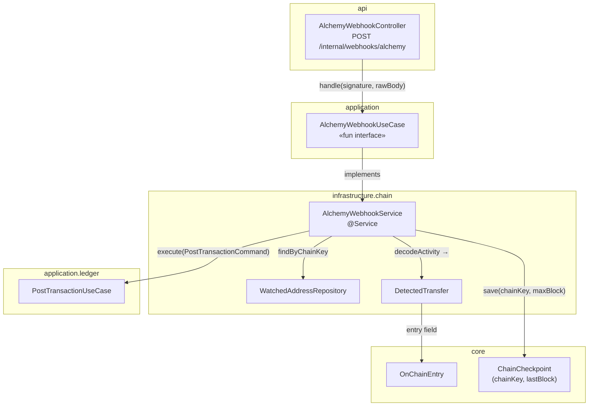
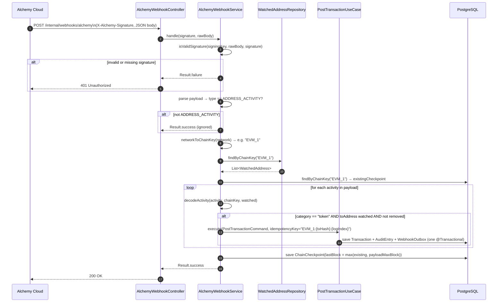
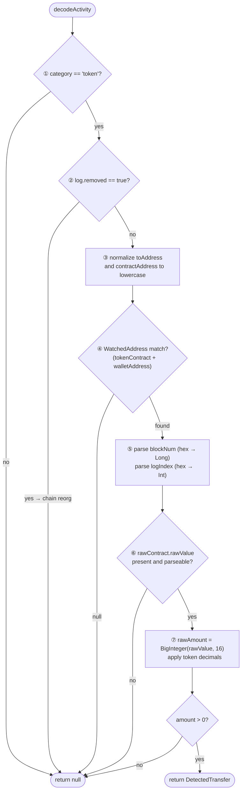

# Idem — EVM Webhook Receiver (Alchemy Address Activity)

> HTTP entry point: `finance.idem.api.internal` — Service: `finance.idem.infrastructure.chain`.
> **Primary EVM event source** — receives real-time `ADDRESS_ACTIVITY` push notifications
> from Alchemy and posts them directly to the ledger.
> Fallback/recovery is `EvmChainReader` (#76), which replays missed blocks on startup.

---

## Role in the architecture

Alchemy sends a `POST /internal/webhooks/alchemy` request every time a watched address receives a token transfer on a configured network. The receiver validates the HMAC signature, decodes the activity, and posts the `OnChainEntry` to the ledger — all in one synchronous call, with no polling.

```
Alchemy cloud ──POST /internal/webhooks/alchemy──► AlchemyWebhookController
                                                        │
                                                  AlchemyWebhookUseCase
                                                        │
                                                  AlchemyWebhookService
                                                   ├── HMAC validation
                                                   ├── decodeActivity per activity
                                                   ├── PostTransactionUseCase.execute()
                                                   └── ChainCheckpointRepository.save()
```

---

## Component overview



---

## Request flow



**Walk-through example**

A customer sends 50 USDC on Ethereum to your watched address `0xabc...`. Alchemy detects it and calls your endpoint within seconds:

1. `POST /internal/webhooks/alchemy` arrives with `X-Alchemy-Signature: abc123...` and JSON body.
2. Controller delegates to `AlchemyWebhookService.handle(signature, rawBody)`.
3. HMAC-SHA256 of the raw body is computed with the configured signing key and compared with the header using `MessageDigest.isEqual` (constant-time). Match → continue; mismatch → return `Result.failure` → 401.
4. Payload `type == "ADDRESS_ACTIVITY"` → proceed. (Other types like `NFT_ACTIVITY` are accepted with 200 but not processed.)
5. `network = "ETH_MAINNET"` → `chainKey = "EVM_1"`.
6. Fetches watched addresses for `EVM_1` — finds `0xabc...` watching USDC.
7. Reads the current checkpoint for `EVM_1`: `lastBlock = 19,500,000`.
8. For the activity: `category = "token"`, `toAddress = "0xabc..."`, `rawContract.address = "0xa0b869..."` → match found.
9. `rawValue = "0x000f4240"` → `BigInteger("0f4240", 16) = 1,000,000` → `1.000000 USDC`.
10. Calls `PostTransactionUseCase.execute(...)` with idempotency key `EVM_1:0x1234...txhash:0`.
11. Checkpoint advances to `max(19,500,000, 19,501,200) = 19,501,200` — even if future payloads are about unmatched addresses, this block will not be re-scanned by the fallback reader.
12. Returns `Result.success` → 200 OK to Alchemy.

---

## HMAC signature validation

Alchemy signs each webhook request body with a shared secret and includes it in `X-Alchemy-Signature`.

```
HMAC-SHA256(signingKey, rawBody) == X-Alchemy-Signature
```

Implementation notes:
- Comparison uses `MessageDigest.isEqual` — constant-time, not `==` (prevents timing attacks).
- If `idem.chain.alchemy-webhook-signing-key` is **blank**, HMAC validation is skipped with a WARN log. This is dev mode only — never run in production without a signing key.
- The raw request body must be read as bytes before any JSON parsing — any transformation changes the HMAC.

---

## Activity decode

Only `category = "token"` activities are processed. Native ETH transfers (`category = "external"`) are ignored.



**Walk-through example:** Alchemy `AlchemyActivity` object

```
category        = "token"
log.removed     = false
toAddress       = "0xABC123..."           ← mixed-case from Alchemy
rawContract:
  address       = "0xA0b86991..."         ← checksummed (EIP-55)
  rawValue      = "0x000f4240"            ← 1 000 000 in hex
blockNum        = "0x12a05f2"             ← hex block number
hash            = "0x1234...txhash"
log.logIndex    = "0x0"
```

1. `category == "token"` → continue
2. `log.removed == false` → not a reorged log, continue
3. Lowercase both: `toAddress = "0xabc123..."`, `contractAddress = "0xa0b86991..."`
4. Look up `WatchedAddress` → found (USDC, 6 decimals)
5. `blockNum = "0x12a05f2"` → `toLongOrNull(16) = 19,531,250`; `logIndex = "0x0"` → `0`
6. `rawValue = "0x000f4240"` → `BigInteger("000f4240", 16) = 1,000,000`
7. `amount = 1,000,000 × 10⁻⁶ = 1.000000 USDC`
8. Return `DetectedTransfer` with key `EVM_1:0x1234...txhash:0`

**Rejection examples:**
- `category = "external"` → native ETH transfer, not a token event; skip
- `log.removed = true` → block was reorged away; skip to avoid posting a transfer that never settled
- `toAddress` not in watched set → transfer to an unmonitored wallet; skip
- `rawValue` is null or unparseable → log WARN and skip; do not guess the amount

---

## Checkpoint advancement

The checkpoint is advanced to the **highest block number in the entire payload** — regardless of whether any activity matched a watched address.

```kotlin
val payloadMaxBlock = payload.event.activity
    .mapNotNull { it.blockNum.removePrefix("0x").toLongOrNull(16) }
    .maxOrNull() ?: 0L

val newCheckpoint = maxOf(existingCheckpoint, payloadMaxBlock)
if (newCheckpoint > existingCheckpoint) {
    runCatching { chainCheckpointRepository.save(chainKey, newCheckpoint) }
        .onFailure { log.error("Alchemy webhook: failed to advance checkpoint for $chainKey to $newCheckpoint", it) }
}
```

**Why:** if Alchemy delivers a payload for block 19,531,250 but none of the activities match your watched addresses, the fallback `EvmChainReader` must still not re-scan that block on restart. Advancing the checkpoint unconditionally closes that gap.

---

## Idempotency

Key format: `{chainKey}:{txHash}:{logIndex}`

Same format as `EvmChainReader` — if the fallback reader re-scans a block already delivered by the webhook, `PostTransactionUseCase` returns the cached `TransactionId` without re-executing.

---

## Configuration

```yaml
idem:
  chain:
    alchemy-webhook-signing-key: ${ALCHEMY_WEBHOOK_SIGNING_KEY:}
```

| Property | Required | Description |
|---|---|---|
| `alchemy-webhook-signing-key` | Yes (prod) | Shared secret from the Alchemy webhook dashboard. Blank = dev mode (HMAC skipped). |

The endpoint `POST /internal/webhooks/alchemy` is always registered regardless of whether the signing key is set. In production, always configure the signing key and configure Alchemy to use it.

---

## Error handling

| Condition | Behaviour |
|---|---|
| Missing or invalid `X-Alchemy-Signature` | Return `Result.failure` → 401 |
| `type != ADDRESS_ACTIVITY` | Return `Result.success` — accepted but not processed |
| Unknown `network` value | Log WARN, return `Result.success` — Alchemy retries on 5xx only |
| `category != "token"` | Skip activity silently |
| `log.removed == true` | Skip activity silently |
| Unparseable `blockNum` or `rawValue` | Log WARN, skip activity |
| Unsupported token | Log ERROR, skip activity |
| `PostTransactionUseCase` failure | Log ERROR — return `Result.success` so Alchemy does not retry |

Returning 200 even on processing errors is intentional: Alchemy retries on 4xx/5xx, and a retry of a successfully-received payload would cause duplicate processing attempts. The idempotency key is the correct guard, not retry suppression.

---

## Test coverage

| Test class | Type |
|---|---|
| `AlchemyWebhookServiceHandleTest` | Unit (Mockito) — `handle()`: HMAC validation, non-ADDRESS_ACTIVITY ignored, unknown network, valid USDC transfer, unmatched address, checkpoint advances for unmatched payloads |
| `AlchemyWebhookServiceTest` | Unit (Mockito) — `decodeActivity()`: happy path, removed log, non-token category, missing rawValue, unparseable rawValue, unsupported token, address normalization |
| `AlchemyWebhookControllerTest` | Unit (MockMvc) — 200 on success, 401 on failure |
| `AlchemyWebhookIntegrationTest` (app module) | Integration (Testcontainers Postgres, real HTTP `POST /internal/webhooks/alchemy` via `TestRestTemplate`, full api+infrastructure+application+core wiring) — valid HMAC → 200 + Transaction posted; invalid/missing HMAC → 401, nothing posted; duplicate webhook → idempotent (no second Transaction) |

```bash
rtk test mvn test -pl infrastructure,api
rtk test mvn test -pl app
```

---

## Related

- `docs/evm-chain-reader.md` — `EvmChainReader` fallback/recovery (Web3j `ethGetLogs`)
- `docs/domain-model.md` — `ChainCheckpoint`, `OnChainEntry`, `MonetaryEntry` sealed class
- `docs/webhook-outbox-poller.md` — WebhookOutboxPoller (#55): delivers transaction.committed/settled/reconciliation.unmatched events to per-tenant webhooks
- `application/chain/AlchemyWebhookUseCase.kt` — use case interface
- `infrastructure/chain/AlchemyWebhookService.kt` — implementation
- `api/internal/AlchemyWebhookController.kt` — HTTP entry point
- Issues [#47](https://github.com/idem-finance/idem/issues/47), [#73](https://github.com/idem-finance/idem/issues/73)
