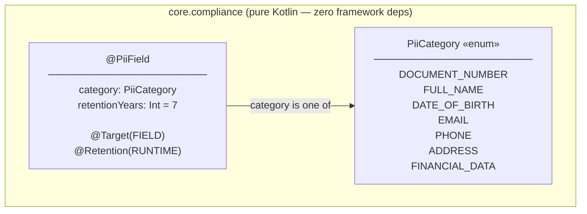
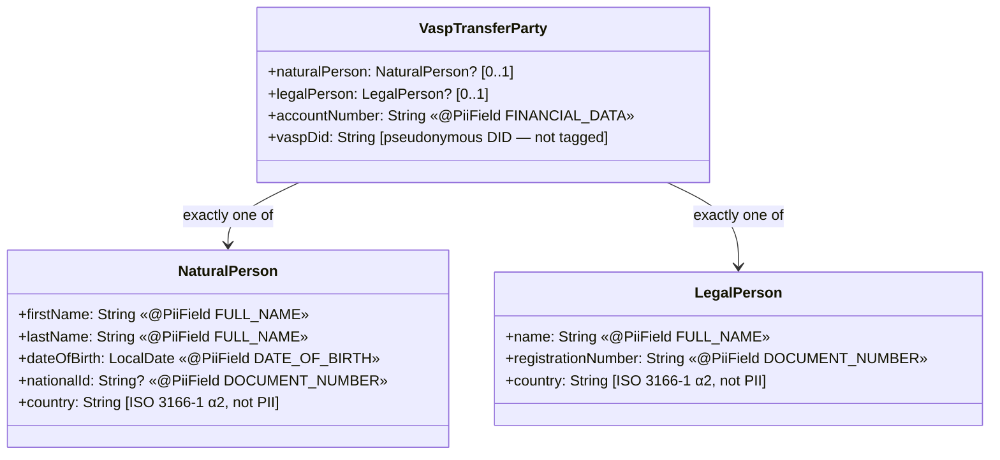
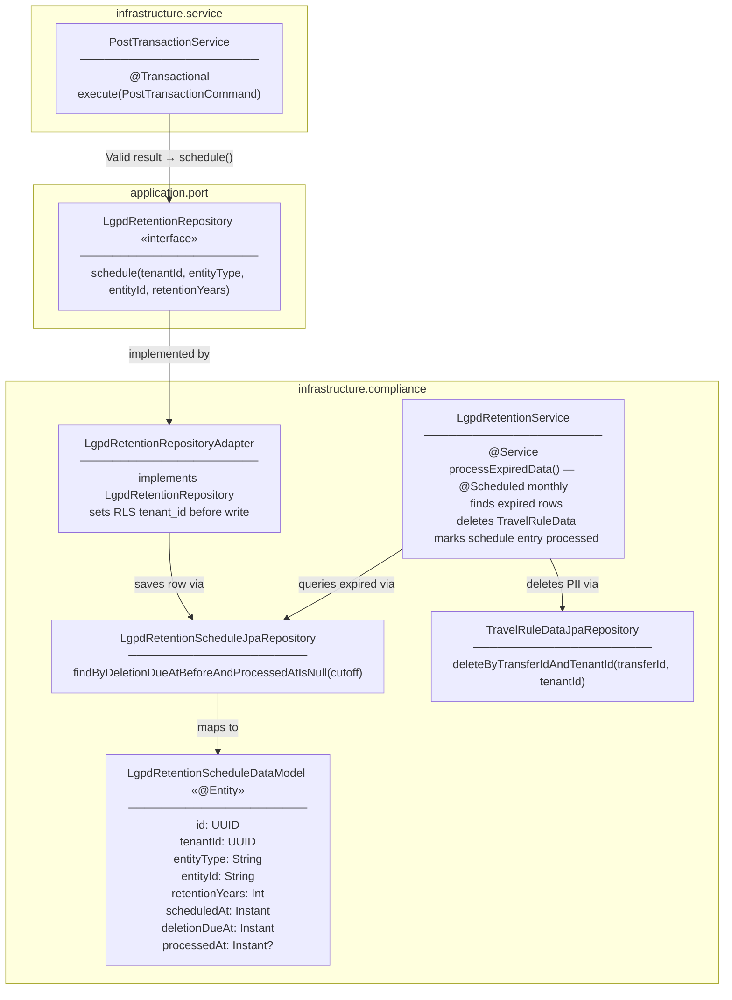
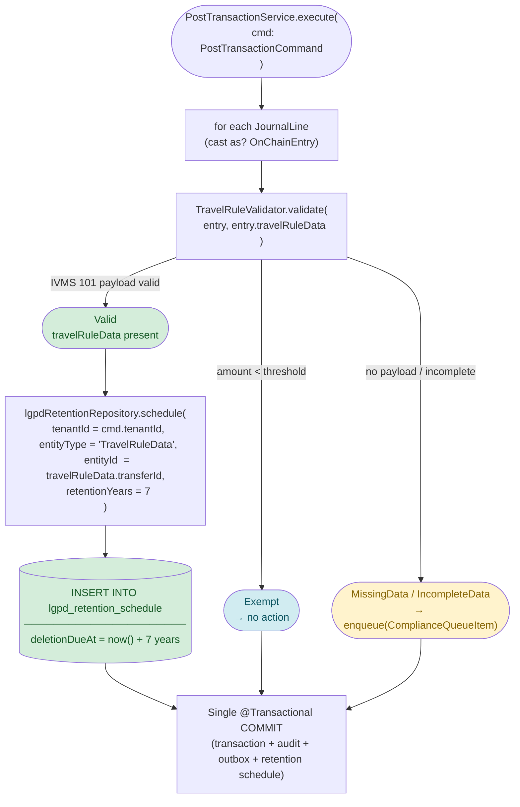
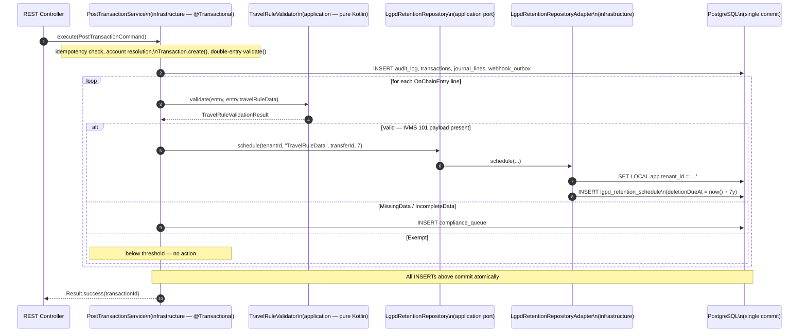
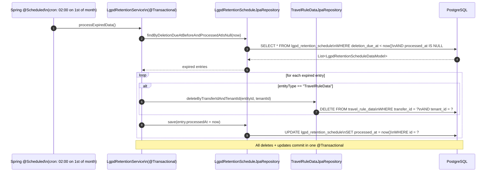
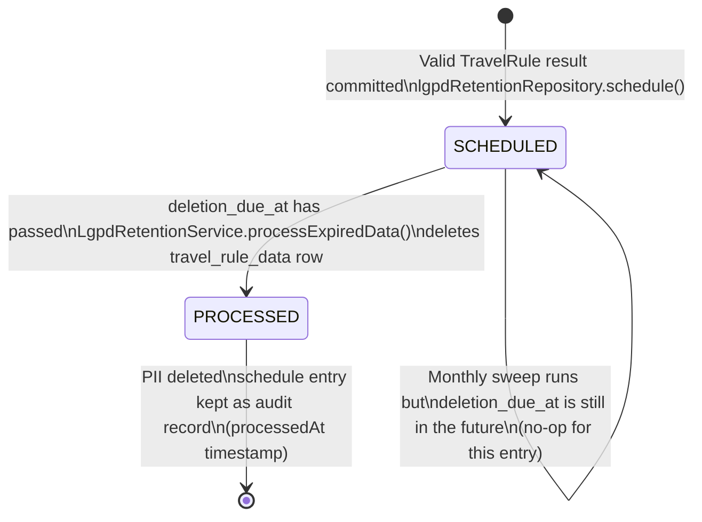
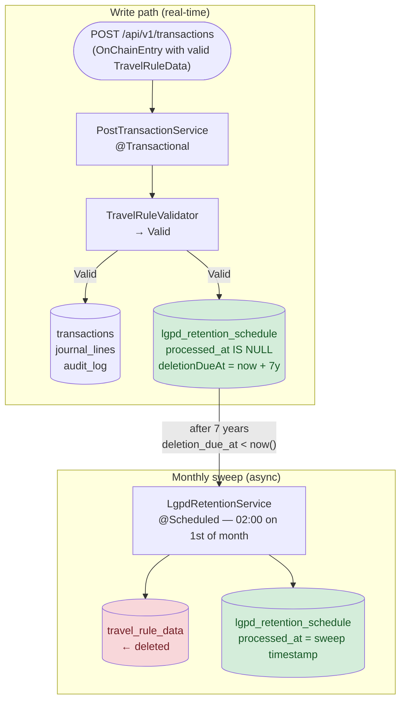

# Idem — LGPD Data Retention Flow

> Modules: `core.compliance`, `application.port`, `infrastructure.compliance`
> **PII tagging via `@PiiField` + automated deletion of Travel Rule identity data after a
> configurable retention period, driven by a monthly scheduled sweep.**

---

## Role

**LGPD** (Lei Geral de Proteção de Dados, Law 13,709/2018) is Brazil's data protection law,
modelled on the GDPR. It requires that personal data be retained only as long as necessary for
the stated purpose and deleted once that purpose has been fulfilled.

**Idem is ledger infrastructure.** Idem stores Travel Rule identity data (IVMS 101 originator
and beneficiary payloads) on behalf of tenants to satisfy FATF compliance. That data — names,
dates of birth, national IDs, account numbers — qualifies as PII under LGPD. Idem's
responsibilities under this flow are:

1. **Tag** every PII field in the domain model with `@PiiField(category, retentionYears)` so
   the data inventory is machine-readable and audit-ready.
2. **Schedule** a deletion record at the instant Travel Rule data is committed — not retroactively.
3. **Delete** the PII payload (the `travel_rule_data` row) when the retention window expires,
   while preserving the double-entry transaction record (which must be kept for financial
   regulatory purposes).

| Without retention management | With Idem's LGPD retention |
|---|---|
| PII stored indefinitely | Retention window enforced per entity |
| No machine-readable PII inventory | `@PiiField` annotation discoverable at runtime via reflection |
| Manual deletion process | Monthly automated sweep (`processExpiredData`) |
| Double-entry record and PII coupled | Double-entry record preserved; only identity payload deleted |

---

## `@PiiField` annotation



`@Retention(RUNTIME)` means the annotation survives compilation and is accessible via Java
reflection — any layer (infrastructure adapters, export services, audit tools) can scan
annotated fields without coupling to Spring or any framework.

The default `retentionYears = 7` aligns with Brazil's financial record-keeping requirement
under LGPD's legitimate-interest basis for financial data. Tenants may override per entity.

---

## PII field inventory

All annotated fields are in `core/src/main/kotlin/finance/idem/core/compliance/`.



| Class | Field | `PiiCategory` | Rationale |
|---|---|---|---|
| `NaturalPerson` | `firstName` | `FULL_NAME` | Directly identifies an individual |
| `NaturalPerson` | `lastName` | `FULL_NAME` | Directly identifies an individual |
| `NaturalPerson` | `dateOfBirth` | `DATE_OF_BIRTH` | Sensitive profile data |
| `NaturalPerson` | `nationalId` | `DOCUMENT_NUMBER` | CPF / passport / national ID number |
| `NaturalPerson` | `country` | — | ISO 3166-1 alpha-2 code — public data |
| `LegalPerson` | `name` | `FULL_NAME` | Legal entity name, may identify individuals |
| `LegalPerson` | `registrationNumber` | `DOCUMENT_NUMBER` | CNPJ / company registration |
| `LegalPerson` | `country` | — | ISO 3166-1 alpha-2 code — public data |
| `VaspTransferParty` | `accountNumber` | `FINANCIAL_DATA` | Blockchain wallet address or account ref |
| `VaspTransferParty` | `vaspDid` | — | Pseudonymous DID — not directly identifying |

---

## Type map — retention layer



---

## Retention scheduling — when and how a row is created

A `lgpd_retention_schedule` row is written **in the same `@Transactional`** as the Travel Rule
validation, only when the result is `Valid` (i.e., a well-formed IVMS 101 payload is present
and committed). Exempt transfers and flagged transfers (MissingData / IncompleteData) do not
produce schedule entries — there is no Travel Rule data to retain.



---

## Full write path — sequence



---

## Monthly deletion sweep

`LgpdRetentionService.processExpiredData()` runs on a cron schedule (`0 0 2 1 * *` —
02:00 on the 1st of each month). It operates across all tenants in a single transaction
(the DB owner role bypasses non-FORCE RLS, giving it cross-tenant visibility for system jobs).



---

## Retention lifecycle — state machine



| State | Column values | Meaning |
|---|---|---|
| `SCHEDULED` | `processed_at IS NULL`, `deletion_due_at` in future | PII retained, deletion pending |
| `SCHEDULED (overdue)` | `processed_at IS NULL`, `deletion_due_at` in past | Pending next monthly sweep |
| `PROCESSED` | `processed_at IS NOT NULL` | PII deleted; schedule row kept as audit trail |

The `lgpd_retention_schedule` row is **never deleted** — it serves as a permanent, immutable
record that the PII was retained for exactly this many years and deleted on this date. This
is itself an LGPD audit requirement.

---

## Database schema — `lgpd_retention_schedule`

```sql
CREATE TABLE lgpd_retention_schedule (
    id              UUID        NOT NULL DEFAULT gen_random_uuid(),
    tenant_id       UUID        NOT NULL,
    entity_type     TEXT        NOT NULL,       -- 'TravelRuleData' (extensible)
    entity_id       TEXT        NOT NULL,       -- transferId for TravelRuleData
    retention_years INT         NOT NULL,
    scheduled_at    TIMESTAMPTZ NOT NULL DEFAULT now(),
    deletion_due_at TIMESTAMPTZ NOT NULL,       -- scheduled_at + retention_years * 365 days
    processed_at    TIMESTAMPTZ,               -- NULL until sweep runs
    PRIMARY KEY (id)
);

ALTER TABLE lgpd_retention_schedule ENABLE ROW LEVEL SECURITY;

CREATE POLICY tenant_isolation ON lgpd_retention_schedule
    USING (tenant_id = current_setting('app.tenant_id')::uuid);

-- Partial index: only unprocessed future entries need fast lookup
CREATE INDEX lgpd_retention_schedule_due_idx
    ON lgpd_retention_schedule (deletion_due_at)
    WHERE processed_at IS NULL;
```

**RLS**: tenant-scoped API reads (e.g., a future compliance export endpoint) are automatically
filtered. The monthly sweep runs as the DB owner role which bypasses non-FORCE RLS — this is
intentional, since the sweep must process all tenants in one pass.

**`entity_type`**: currently only `'TravelRuleData'` is supported. The column is a plain `TEXT`
string (not a CHECK-constrained enum) so new entity types (e.g., `'AuditEntry'`, `'ApiKey'`)
can be added in future without a schema migration.

**Partial index**: only rows where `processed_at IS NULL` are indexed. Processed rows (the audit
trail) are not scanned by the monthly sweep, keeping the index small even after years of
accumulation.

---

## What deletion means

Idem's LGPD retention implementation uses **hard-delete** of the `travel_rule_data` row:

```
DELETE FROM travel_rule_data WHERE transfer_id = ? AND tenant_id = ?
```

The underlying financial record is **preserved**:

| Table | Action after retention expiry |
|---|---|
| `travel_rule_data` | **Deleted** — IVMS 101 identity payload (names, IDs, wallet addresses) removed |
| `transactions` | Kept — transaction ID, amounts, timing, status |
| `journal_lines` | Kept — debit/credit entries, amounts, account IDs |
| `audit_log` | Kept — who committed what, when (HMAC-signed, append-only) |
| `compliance_queue` | Kept — the flag was raised; amounts and tx_hash are not PII |

This aligns with financial record-keeping rules: the fact that a transfer happened (and its
amount) must be retained; the PII of the counterparties may be deleted once the LGPD retention
window closes.

---

## End-to-end picture



---

## Key invariants

### PII is deleted, not anonymised
Idem deletes the entire `travel_rule_data` row. There is no partial anonymisation (nulling
individual fields). The double-entry record is retained in full — only the supplementary
identity payload is removed.

### Scheduling is atomic with the transaction commit
The `INSERT INTO lgpd_retention_schedule` happens in the same `@Transactional` as the primary
transaction commit. There are no orphaned schedule entries without a corresponding transaction,
and no transactions whose Travel Rule data was silently never scheduled.

### Only `Valid` results are scheduled
`Exempt` transfers have no Travel Rule data to delete. `MissingData` / `IncompleteData`
transfers have no IVMS 101 payload stored in `travel_rule_data`. Only a `Valid` result
confirms that a `travel_rule_data` row exists and needs scheduling.

### The schedule row is the audit trail
`lgpd_retention_schedule` rows are never deleted. After `processedAt` is set, the row
records exactly when the PII was scheduled, how long the retention window was, and when
deletion occurred. This satisfies the LGPD article 37 obligation to maintain records of
data processing activities.

### Monthly sweep is idempotent
`deleteByTransferIdAndTenantId` returns 0 rows affected if the target was already deleted
(e.g., manually, or by a previous failed-and-retried sweep run). The sweep then still sets
`processed_at` on the schedule entry. Running the sweep twice causes no harm.

### `@PiiField` is runtime-readable
`@Retention(RUNTIME)` is the only framework contract. Any code that can call
`field.getAnnotation(PiiField::class.java)` can discover the PII inventory. No Spring
context is required to read the annotations.

---

## What is not yet implemented

| Gap | Description |
|---|---|
| ShedLock guard on sweep | Monthly `processExpiredData()` is not guarded by `@SchedulerLock`. Add when multi-replica locking is required for the sweep (ticket separate from issue #174). |
| Other entity types | Only `TravelRuleData` is deleted. Future: `AuditEntry` PII fields, `ApiKey` metadata, etc. |
| Field-level encryption | `@PiiField` is a tag; it does not encrypt the annotated fields. Encryption at rest (column-level or application-level) is out of scope for #174. |
| Consent management | LGPD articles 7–11 (legal bases, consent records, withdrawal). Out of scope — Idem processes data under legitimate interest for FATF compliance, not consent. |
| Per-tenant retention override | `retentionYears = 7` is the global default. No tenant-override API exists yet. |
| LGPD export endpoint | `GET /compliance/lgpd-export` — export all PII held for a data subject on request. Tracked separately from the audit export in issue #175. |

---

## Test coverage

| Test class | Type | What it covers |
|---|---|---|
| `PiiFieldAnnotationTest` | Unit (reflection) | 10 cases: `@PiiField` present on each of the 7 annotated fields, correct `PiiCategory` per field, `country`/`vaspDid` correctly untagged, default `retentionYears = 7` |
| `LgpdRetentionServiceTest` | Integration (Testcontainers) | 4 cases: `schedule()` persists row with correct `deletionDueAt`; expired entry → deletes `travel_rule_data` + sets `processedAt`; future entry → no deletion; already-processed entry → unchanged |
| `PostTransactionServiceTest` | Unit (Mockito) | 3 new cases: `Valid` result → `schedule()` called ×N (once per Valid line); `Exempt` → `schedule()` not called; `MissingData` → `schedule()` not called |
| `FlywayMigrationTest` | Integration | V24 applies cleanly; `lgpd_retention_schedule` table exists after migration |

```bash
rtk test mvn test -pl core,infrastructure
```

---

## Related

- `docs/travel-rule.md` — IVMS 101 validation flow, compliance queue, webhook event
- `core/compliance/PiiField.kt` — annotation + `PiiCategory` enum
- `core/compliance/NaturalPerson.kt` — annotated PII fields
- `core/compliance/LegalPerson.kt` — annotated PII fields
- `core/compliance/VaspTransferParty.kt` — annotated `accountNumber`
- `application/port/LgpdRetentionRepository.kt` — port interface
- `infrastructure/compliance/LgpdRetentionRepositoryAdapter.kt` — writes schedule row with RLS
- `infrastructure/compliance/LgpdRetentionService.kt` — monthly sweep
- `infrastructure/compliance/LgpdRetentionScheduleDataModel.kt` — JPA entity
- `V24__create_lgpd_retention_schedule.sql` — schema + RLS + index
- Issue [#174](https://github.com/idem-finance/idem/issues/174) — implementation
