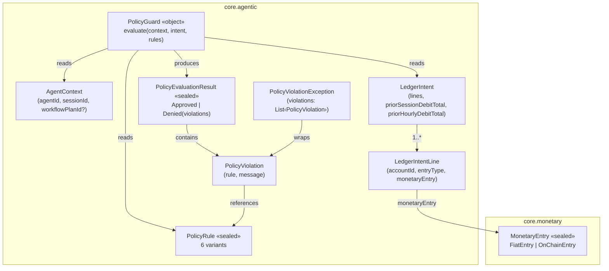
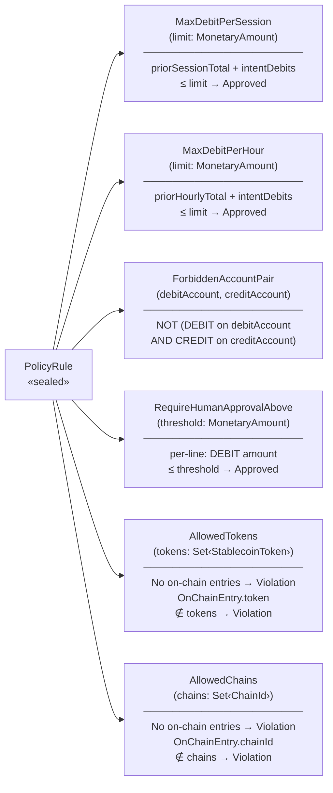
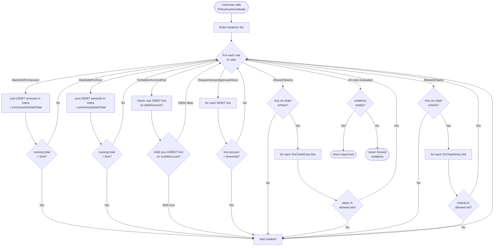
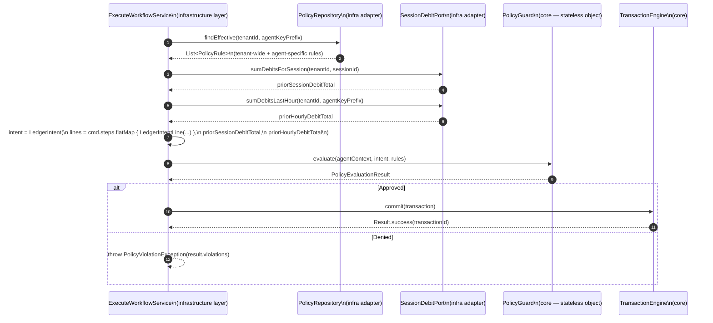
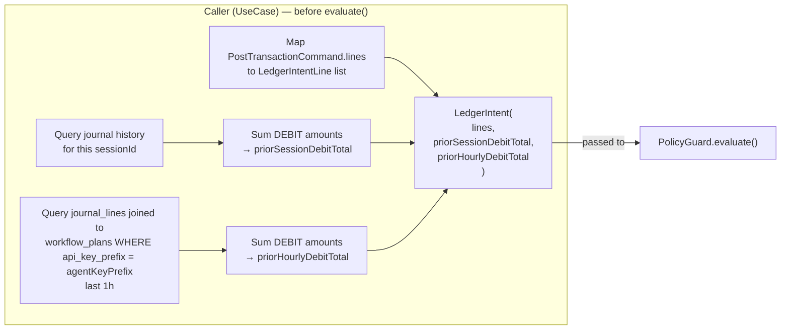
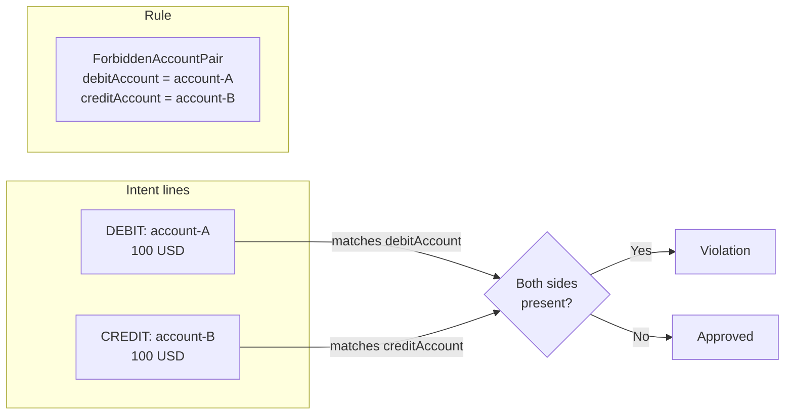
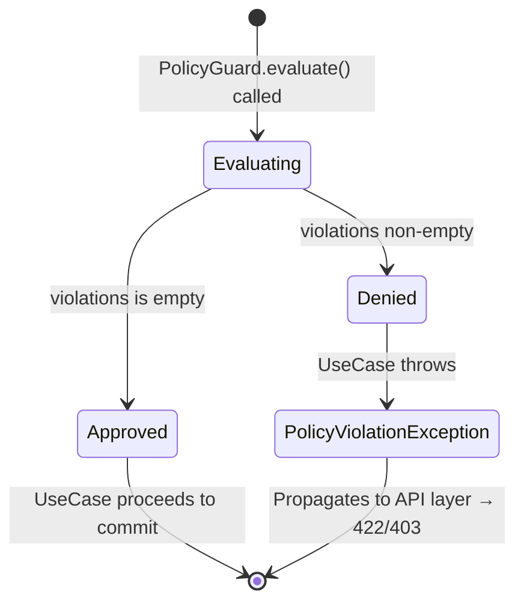

# Idem — PolicyRule + PolicyGuard

> Core module (`finance.idem.core.agentic`).
> **Pre-flight policy evaluation for agent-originated ledger mutations.** Pure Kotlin,
> zero infrastructure dependencies. Every agent call passes through `PolicyGuard.evaluate`
> before any transaction is committed — if any rule is violated the mutation is blocked
> and the caller throws `PolicyViolationException`.

---

## Role

Idem exposes a first-class agentic execution surface (MCP server, future workflow engine).
Agents carry elevated authority — they can post transactions, trigger settlements, and
initiate rollbacks programmatically, without a human in the loop. `PolicyGuard` is the
single chokepoint that prevents an agent from exceeding its authorised boundaries:

| Without PolicyGuard | With PolicyGuard |
|---|---|
| Agent posts unlimited debits | Session and hourly debit limits enforced |
| Agent can move funds between any accounts | Forbidden account pairs blocked |
| Agent can use any token or chain | Allowlists enforced per-agent |
| Large transfers execute autonomously | Threshold-based human approval gates enforced |

`PolicyGuard` is **not** a firewall — it evaluates a list of `PolicyRule` instances
supplied by the caller at evaluation time. It is the caller's responsibility (the
use case layer) to load the correct rules for the current tenant and agent before
calling `evaluate`.

---

## Type map



---

## PolicyRule variants



| Rule | What it checks | Fiat lines |
|---|---|---|
| `MaxDebitPerSession` | Running debit total for this agent session (prior + intent) vs limit | Included |
| `MaxDebitPerHour` | Running debit total in the last hour (prior + intent) vs limit | Included |
| `ForbiddenAccountPair` | Both the debit account AND credit account appear in the intent lines | Included |
| `RequireHumanApprovalAbove` | Any single DEBIT line's amount exceeds the threshold | Included |
| `AllowedTokens` | Any `OnChainEntry` uses a token not in the allowed set; fiat-only intent with this rule active | **Violation** |
| `AllowedChains` | Any `OnChainEntry` uses a chain not in the allowed set; fiat-only intent with this rule active | **Violation** |

---

## Evaluation pipeline



> **Non-fail-fast**: every rule is evaluated regardless of whether a prior rule
> already produced a violation. A single `evaluate` call returns the **complete**
> list of violated rules, not just the first one. This lets the caller surface all
> problems at once rather than requiring iterative fix-and-retry.

---

## Caller integration flow



> `sumDebitsLastHour` is scoped to the calling agent key (`agentKeyPrefix`) when set,
> so Agent A's debits do not count against Agent B's `MaxDebitPerHour` limit.
> `sumDebitsForSession` is always scoped to the current `sessionId` regardless of agent key.

---

## LedgerIntent construction

`PolicyGuard` is purely stateless. It cannot query a database or call any service.
For rules that involve historical data (`MaxDebitPerSession`, `MaxDebitPerHour`), the
**caller** is responsible for pre-computing the prior totals and embedding them in
`LedgerIntent`:

```kotlin
data class LedgerIntent(
    val lines: List<LedgerIntentLine>,
    val priorSessionDebitTotal: MonetaryAmount = MonetaryAmount.ZERO, // ← caller fills in
    val priorHourlyDebitTotal: MonetaryAmount = MonetaryAmount.ZERO,  // ← caller fills in
)
```



**Currency normalization is the caller's responsibility.** `MonetaryAmount` is a raw
`BigDecimal` wrapper with no currency tag. `PolicyGuard` sums DEBIT amounts using
plain BigDecimal arithmetic. If an agent operates across multiple currencies, the
caller must normalize amounts to a common unit (e.g., USD equivalent) before
constructing the intent and the rule limits.

---

## Key invariants

### `ForbiddenAccountPair` — both sides required



A DEBIT on `account-A` without a matching CREDIT on `account-B` is **not** a
violation — and vice versa. Both sides of the forbidden pair must appear in the same
intent for the rule to fire.

### `RequireHumanApprovalAbove` — per-line, not aggregate

The threshold is evaluated against each individual DEBIT line's amount, not the sum
of all debits. A transaction with two DEBIT lines of $600 each (total $1,200) is
flagged at a threshold of $1,000 — *each line individually* exceeds the threshold.
CREDIT lines are ignored regardless of their amount.

### `AllowedTokens` / `AllowedChains` — require at least one on-chain entry

When either rule is active, a fiat-only intent (no `OnChainEntry` lines at all) is a
**violation**. The rule expresses "this agent is restricted to specific tokens / chains",
and an intent with zero on-chain entries cannot satisfy that restriction.

Once the rule confirms at least one on-chain entry exists, each `OnChainEntry` is checked
against the allowed set. `FiatEntry` lines alongside on-chain entries are ignored — only the
on-chain portion is evaluated.

```
AllowedTokens({USDC}) + intent with only PIX fiat lines → Violation
AllowedTokens({USDC}) + intent with USDC on-chain + PIX fiat lines → Approved
AllowedTokens({USDC}) + intent with USDT on-chain line → Violation (wrong token)
```

---

## PolicyEvaluationResult states



`Denied` enforces a non-empty invariant in its `init` block — it is impossible to
construct `Denied(emptyList())`. `PolicyGuard` only returns `Denied` when at least
one violation was collected.

---

## Where limits come from

`PolicyRule` instances are plain data — the limit values are embedded in each
instance at construction time:

```kotlin
PolicyRule.MaxDebitPerSession(limit = MonetaryAmount.of("5000.00"))
PolicyRule.AllowedChains(chains = setOf(ChainId.EVM, ChainId.SOLANA))
```

Rules are persisted in the `policy_rules` table (Flyway V25) and managed via
`POST/GET/DELETE /api/v1/admin/policy-rules` (requires `ADMIN` scope).
`PolicyRepository` (core port) is implemented by `PolicyRepositoryAdapter` in infrastructure.

### policy_rules table

```
policy_rules
──────────────────────────────────────────────────────────
id               UUID          PK
tenant_id        UUID          FK tenants.id — RLS enforced
agent_key_prefix VARCHAR(12)   nullable — null = applies to all agents for this tenant
rule_type        TEXT          'MAX_DEBIT_PER_SESSION' | 'MAX_DEBIT_PER_HOUR' | ...
params           JSONB         {"amount": "5000.00"} | {"chains": ["EVM","SOLANA"]} | ...
enabled          BOOLEAN       default true
created_at       TIMESTAMPTZ
updated_at       TIMESTAMPTZ
```

### Rule scoping: tenant-wide vs per-agent

Rules with `agent_key_prefix = null` apply to every agent key for that tenant.
Rules with a specific prefix apply only to the agent key that matches — they are
combined (not replaced) with any tenant-wide rules:

```
effective rules = tenant-wide rules (prefix IS NULL)
               + agent-specific rules (prefix = current agent key prefix)
```

`ExecuteWorkflowService` loads effective rules via
`PolicyRepository.findEffective(tenantId, agentContext.apiKeyPrefix)` before calling
`PolicyGuard.evaluate`.

### Default deny

When a tenant has no configured rules at all, `ExecuteWorkflowService` defaults to
`MaxDebitPerSession(ZERO)`, which blocks every agent debit. An admin must
explicitly configure at least one permissive rule before agents can post transactions.

### Managing rules via the API

```bash
# Create a session debit limit for all agents under this tenant
curl -X POST http://localhost:8081/api/v1/admin/policy-rules \
  -H "X-API-Key: $ADMIN_KEY" \
  -H "Content-Type: application/json" \
  -d '{"type":"MAX_DEBIT_PER_SESSION","amount":"10000.00"}'

# Restrict a specific agent key to EVM only
curl -X POST http://localhost:8081/api/v1/admin/policy-rules \
  -H "X-API-Key: $ADMIN_KEY" \
  -d '{"type":"ALLOWED_CHAINS","agentKeyPrefix":"sk_agent_abc1","chains":["EVM"]}'

# List all rules for this tenant
curl http://localhost:8081/api/v1/admin/policy-rules \
  -H "X-API-Key: $ADMIN_KEY"

# Delete a rule
curl -X DELETE http://localhost:8081/api/v1/admin/policy-rules/{ruleId} \
  -H "X-API-Key: $ADMIN_KEY"
```

`PolicyGuard` itself requires no changes — it accepts whatever `List<PolicyRule>` the
caller supplies, regardless of how that list was built.

---

## Worked examples

### Example 1 — session debit limit enforced

Agent `agent-fx` is allowed a maximum of $5,000 in debits per session.
It has already debited $4,800. It attempts a $300 USDC transfer:

```
priorSessionDebitTotal = 4800.00
Intent DEBIT lines total = 300.00
Running total = 5100.00 > 5000.00 → Violation
```

Result: `Denied([PolicyViolation(MaxDebitPerSession(5000.00), "Debit total for session (5100.00) exceeds limit (5000.00)")])`

---

### Example 2 — forbidden account pair blocked

Tenant has a compliance rule preventing direct transfers from the treasury account
to any external account:

```kotlin
PolicyRule.ForbiddenAccountPair(
    debitAccount  = AccountId.of("treasury-uuid"),
    creditAccount = AccountId.of("external-uuid"),
)
```

Intent lines:
- `DEBIT account=treasury-uuid  amount=1000 USD`
- `CREDIT account=external-uuid amount=1000 USD`

Both sides match → `Denied`.

If only the DEBIT line targets `treasury-uuid` and the CREDIT goes to an internal
clearing account: `Approved` — the forbidden credit side is absent.

---

### Example 3 — multiple violations collected

Agent submits a cross-chain intent with three violations simultaneously:

```kotlin
rules = listOf(
    MaxDebitPerSession(MonetaryAmount.of("1000")),
    AllowedTokens(setOf(StablecoinToken.USDC)),
    AllowedChains(setOf(ChainId.EVM)),
)

intent = LedgerIntent(
    lines = listOf(
        // $1500 USDT on TRON
        LedgerIntentLine(accountId, DEBIT, OnChainEntry(amount=1500, token=USDT, chainId=TRON, ...)),
        LedgerIntentLine(accountId, CREDIT, OnChainEntry(amount=1500, token=USDT, chainId=TRON, ...)),
    ),
    priorSessionDebitTotal = MonetaryAmount.ZERO,
)
```

Result: `Denied` with **three** violations:
1. Session debit 1500 > limit 1000
2. Token USDT not in {USDC}
3. Chain TRON not in {EVM}

All three are reported in a single `evaluate` call.

---

## Test coverage

| Test class | Type |
|---|---|
| `PolicyGuardTest` | Unit — all 6 rule variants (boundary values at/over limit, both pass and fail), multi-rule collection (fail-fast absence), per-entry `RequireHumanApprovalAbove`, `ForbiddenAccountPair` partial-side approved, `AllowedTokens`/`AllowedChains` fiat-only → Denied, mixed fiat+on-chain → Approved, empty rules → Approved |
| `PolicyRepositoryTypesTest` | Unit — `PolicyRuleId` generation and wrapping, `PolicyRuleRecord` field contract, `typeName()` for all 6 variants, `params()` serialization shape for all 6 variants |
| `PolicyRepositoryAdapterTest` | Integration (Testcontainers) — save and reload all 6 rule types, `findEffective` tenant/agent scoping, delete |
| `ExecuteWorkflowServicePolicyTest` | Unit — default deny-all, permissive rule allows, prior session debit accumulated, `findEffective` called with correct tenant + agent key prefix |
| `PolicyEvaluationResultTest` | Unit — `Approved` singleton identity, `Denied` non-empty invariant, exhaustive `when` without `else` |
| `LedgerIntentTest` | Unit — default ZERO totals, explicit prior totals, empty lines valid |
| `PolicyViolationExceptionTest` | Unit — `RuntimeException`, message joining, violations accessible |
| `PolicyRuleControllerTest` | WebMvcTest — POST/GET/DELETE happy paths, missing field → 400, empty token/chain list → 400, unknown type → 400, non-ADMIN key → 403 |

```bash
rtk test mvn test -pl core
```

---

## Related

- `docs/domain-model.md` — `AgentContext`, `MonetaryEntry`, `Transaction`
- `core/agentic/PolicyGuard.kt` — evaluator implementation
- `core/agentic/PolicyRule.kt` — all rule variants (including `typeName()` / `params()` for serialization)
- `core/agentic/PolicyRepository.kt` — core port interface
- `core/agentic/LedgerIntent.kt` — intent structure
- `core/agentic/PolicyEvaluationResult.kt` — result sealed class
- `application/agentic/ManagePolicyRulesUseCase.kt` — CRUD use-case interface
- `application/agentic/SessionDebitPort.kt` — prior-debit query port (agent-scoped)
- `infrastructure/persistence/policy/PolicyRepositoryAdapter.kt` — DB adapter (JSONB, all 6 types)
- `infrastructure/persistence/policy/SessionDebitAdapter.kt` — native SQL, joins workflow_plans for agent scoping
- `infrastructure/service/ManagePolicyRulesService.kt` — use-case implementation
- `api/policy/PolicyRuleController.kt` — REST endpoints (`POST/GET/DELETE /api/v1/admin/policy-rules`)
- Issue [#159](https://github.com/idem-finance/idem/issues/159) — PolicyGuard implementation
- Issue [#200](https://github.com/idem-finance/idem/issues/200) — PolicyRepository + REST endpoints
- Issue [#160](https://github.com/idem-finance/idem/issues/160) — AgentAuditEvent (next step: audit before execution)
