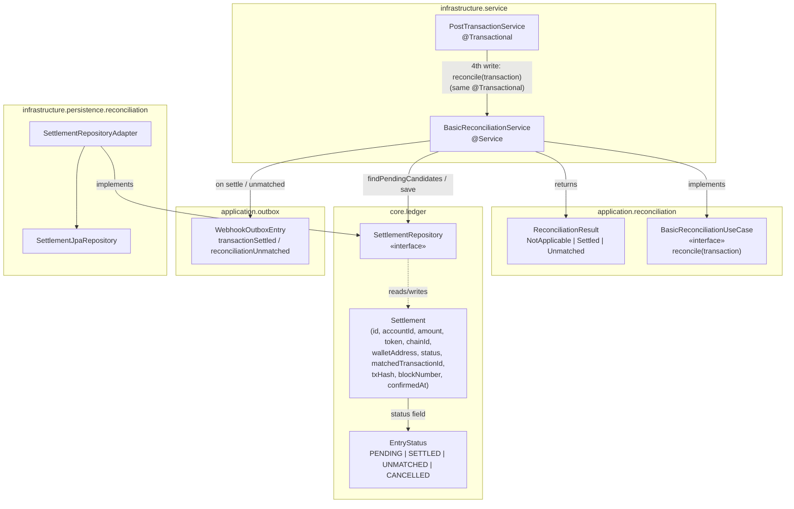

# Idem — Reconciliation (BasicReconciliationService)

> Infrastructure module (`finance.idem.infrastructure.service`).
> Called synchronously from `PostTransactionService.execute()`, **after** the
> transaction/audit/webhook writes, inside the **same `@Transactional`**. No event bus,
> no scheduler — matches the MVP event/outbox rule (one commit, everything or nothing).

---

## Purpose

When an `OnChainEntry`-typed `Transaction` is posted (by a chain reader, a webhook
receiver, or the API), reconciliation answers one question: **was this transfer
expected?**

- **Expected** (a `PENDING` `Settlement` row exists with the same tenant, account,
  token, chain, wallet, and amount, created within the matching window) → mark it
  `SETTLED`, attach on-chain proof, emit `transaction.settled`.
- **Not expected** → create a new `UNMATCHED` `Settlement` row with the on-chain proof
  already attached, emit `reconciliation.unmatched`, and log a warning.

Either way, nothing is silently dropped — every on-chain receipt produces a
`Settlement` row in one of these two terminal states (or remains untouched if
reconciliation is disabled or the transaction has no on-chain legs).

---

## Trigger point

```kotlin
// PostTransactionService.execute(), inside @Transactional
transactionRepository.save(transaction)
auditRepository.save(AuditEntry.from(transaction, cmd.agentContext, cmd.createdBy))
webhookOutboxRepository.save(WebhookOutboxEntry.transactionCommitted(transaction))
reconciliationService.reconcile(transaction)   // ← 4th write, same transaction
```

The return value of `reconcile()` is not propagated to the caller — `execute()`'s
`Result<TransactionId>` contract is unchanged. Reconciliation outcomes are observable
via the `transaction.settled` / `reconciliation.unmatched` webhook events and the
`settlements` table (a future `RECONCILIATION_READ`-scoped endpoint will expose this
directly).

---

## Algorithm

```kotlin
override fun reconcile(transaction: Transaction): ReconciliationResult {
    if (!enabled) return ReconciliationResult.NotApplicable

    val onChainLines = transaction.lines.filter { it.monetaryEntry is OnChainEntry }
    if (onChainLines.isEmpty()) return ReconciliationResult.NotApplicable

    val onChainEntry = onChainLines.first().monetaryEntry as OnChainEntry
    val candidateAccountIds = onChainLines.map { it.accountId }.toSet()
    val since = Instant.now().minusSeconds(matchingWindowHours * 3600)

    val candidates = settlementRepository.findPendingCandidates(
        tenantId = transaction.tenantId,
        accountIds = candidateAccountIds,
        token = onChainEntry.token,
        chainId = onChainEntry.chainId,
        walletAddress = onChainEntry.walletAddress,
        since = since,
    )

    val match = candidates.firstOrNull { it.amount == onChainEntry.amount }
    return if (match != null) settle(match, transaction, onChainEntry)
           else createUnmatched(transaction, onChainLines, onChainEntry)
}
```

1. **Early exits** (`NotApplicable`, no DB call): reconciliation disabled, or the
   transaction has no `OnChainEntry`-typed lines (pure `FiatEntry` transactions never
   reach `SettlementRepository`).
2. **Match key**: the chain-reader convention is that the DEBIT (custody/Nostro) and
   CREDIT (customer-facing) lines of an on-chain transfer carry an *identical*
   `OnChainEntry` (same amount/token/chainId/walletAddress/txHash/blockNumber) — so the
   first on-chain line's `monetaryEntry` is sufficient as the match key.
3. **`candidateAccountIds`**: the union of `accountId` across all on-chain-typed
   lines, so a PENDING expectation registered against either the custody account or
   the customer account is found.
4. **`findPendingCandidates`**: a single indexed query
   (`idx_settlements_matching` on `(tenant_id, status, account_id, token, chain_id,
   wallet_address, created_at)`) filters to `status='PENDING'`, the candidate account
   set, exact token/chain/wallet, and `created_at >= since`. Results are ordered
   `created_at ASC`.
5. **Amount match**: done in Kotlin via `MonetaryAmount.equals` (scale-insensitive —
   `100` == `100.000000`), so the matching logic is unit-testable without a database.
   `firstOrNull` on an ascending-by-`createdAt` list means **the oldest matching
   expectation wins** when multiple PENDING rows have the same amount.
6. **Settle** (match found): `match.copy(status=SETTLED, matchedTransactionId=tx.id,
   txHash, blockNumber, confirmedAt=now)`, saved **in place** (same `id` — no
   duplicate row). Writes `WebhookOutboxEntry.transactionSettled(tx)`.
7. **Create UNMATCHED** (no match): a brand-new `Settlement` row, `status=UNMATCHED`,
   `accountId` = the **CREDIT-side** on-chain line's account (the customer-facing
   account, by convention), all proof fields (`txHash`, `blockNumber`, `confirmedAt`)
   populated immediately since the chain data is already in hand,
   `matchedTransactionId=tx.id` (self-referential — the proof *is* this transaction).
   Writes `WebhookOutboxEntry.reconciliationUnmatched(tx)` and `log.warn(...)` with the
   full match context (tenant, amount, token, chain, wallet, txHash, settlement id).

---

## Configuration

```yaml
idem:
  reconciliation:
    enabled: true              # idem.reconciliation.enabled
    matching-window-hours: 24  # idem.reconciliation.matching-window-hours
```

| Key | Default | Effect |
|---|---|---|
| `idem.reconciliation.enabled` | `true` | When `false`, `reconcile()` is a no-op (`NotApplicable`) for every transaction — no `SettlementRepository` calls at all. |
| `idem.reconciliation.matching-window-hours` | `24` | How far back `findPendingCandidates` looks for a PENDING expectation (`since = now - N hours`). PENDING rows older than this are never matched and remain `PENDING` indefinitely (candidates for a future cleanup/expiry job). |

---

## Component overview



---

## Reconciliation flow (settled / unmatched paths)


---

## Worked example — settled path

1. A customer registers an expectation ahead of time (future `POST
   /accounts/{custodyAccountId}/settlements`):
   `Settlement(status=PENDING, accountId=custodyAccountId, amount=500.000000,
   token=USDC, chainId=SOLANA, walletAddress="5FHwk...", createdAt=T0)`.
2. Some time later (within 24h), `QuickNodeWebhookService` detects the actual 500 USDC
   transfer to `5FHwk...` and calls `PostTransactionService.execute(...)` with two
   `OnChainEntry` lines (DEBIT `custodyAccountId`, CREDIT `customerAccountId`),
   `txHash="5j7s6..."`, `blockNumber=250_000_000`.
3. `PostTransactionService` saves the transaction, then calls `reconcile(transaction)`:
   - `candidateAccountIds = {custodyAccountId, customerAccountId}`
   - `findPendingCandidates(tenantId, candidateAccountIds, USDC, SOLANA, "5FHwk...",
     since=T0 - 23h)` → returns the PENDING row from step 1 (within window)
   - `match = candidates.firstOrNull { it.amount == 500.000000 }` → matches
4. `settle()` updates the **same row** (`id` unchanged) →
   `status=SETTLED, matchedTransactionId=tx.id, txHash="5j7s6...",
   blockNumber=250_000_000, confirmedAt=now`.
5. Writes `WebhookOutboxEntry.transactionSettled(tx)` → `eventType="transaction.settled"`.

## Worked example — unmatched path

1. A customer sends 75 USDC to the watched wallet without any prior registered
   expectation (or no PENDING row matches `amount=75.000000` within the window).
2. The chain reader posts the transaction as usual; `reconcile()` runs:
   - `findPendingCandidates(...)` returns `[]` (or only rows with a different amount)
   - `match = null`
3. `createUnmatched()`:
   - `creditLine` = the on-chain line with `entryType=CREDIT` (the customer-facing
     account)
   - new `Settlement(status=UNMATCHED, accountId=creditLine.accountId,
     amount=75.000000, token=USDC, chainId=SOLANA, walletAddress="5FHwk...",
     matchedTransactionId=tx.id, txHash, blockNumber, confirmedAt=now,
     createdAt=now, createdBy="system")`
4. Writes `WebhookOutboxEntry.reconciliationUnmatched(tx)` →
   `eventType="reconciliation.unmatched"`.
5. `log.warn(...)` records the full match context (tenant, amount, token, chain,
   wallet, txHash, settlement id) for ops/compliance follow-up.

---

## Known limitations

- **Retry-created duplicate UNMATCHED rows**: a defensive re-run of `reconcile()` for
  the same transaction would create a *second* `UNMATCHED` row — `findPendingCandidates`
  only returns `PENDING` rows, so a settled match from a first run is never re-found,
  and a second "no match" run creates another row. In practice
  `PostTransactionService`'s idempotency store prevents `execute()` from re-running for
  a `COMMITTED` transaction, so this is defense-in-depth, not a normal-path concern.
  Future: a unique constraint on `(tenant_id, matched_transaction_id, status)` or a
  check-before-create.
- **`confirmedAt` is wall-clock time**, not the chain's block timestamp — acceptable
  because reconciliation runs synchronously, moments after the on-chain entry is
  posted.
- **No REST endpoint yet to create PENDING expectations** — `SettlementRepository`
  is fully wired and tested, but `POST /accounts/{id}/settlements` is a future issue.
  Until it exists, every on-chain receipt falls through to `UNMATCHED`, which is the
  safe default (nothing is silently dropped).
- **Exception-queue dashboard and a configurable matching-rules DSL** (tolerance
  windows, fuzzy amount matching, multi-currency netting) are cloud/enterprise-tier
  features — out of scope for this OSS engine.

---

## Test coverage

| Test class | Type |
|---|---|
| `BasicReconciliationServiceTest` | Unit (Mockito) — all branches of the algorithm above |
| `SettlementRepositoryAdapterTest` | Integration (Testcontainers Postgres) — `findPendingCandidates` filtering/ordering, RLS tenant isolation, PENDING→SETTLED in-place update |
| `PostTransactionServiceTest` | Unit — `reconcile()` called with the persisted transaction, last among the four writes |

```bash
rtk test mvn test -pl infrastructure
```

---

## Related

- `docs/domain-model.md` — `Settlement`, `EntryStatus`, `SettlementRepository`
- `docs/evm-chain-reader.md`, `docs/solana-chain-reader.md`, `docs/tron-chain-reader.md` — on-chain entry sources that feed `PostTransactionService`
- `infrastructure/.../service/BasicReconciliationService.kt`
- `infrastructure/.../service/PostTransactionService.kt` — call site
- `infrastructure/.../persistence/reconciliation/SettlementRepositoryAdapter.kt`
- Issue [#75](https://github.com/idem-finance/idem/issues/75)
