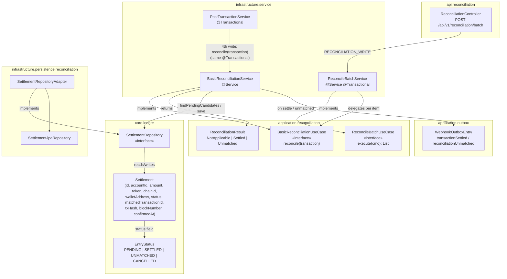
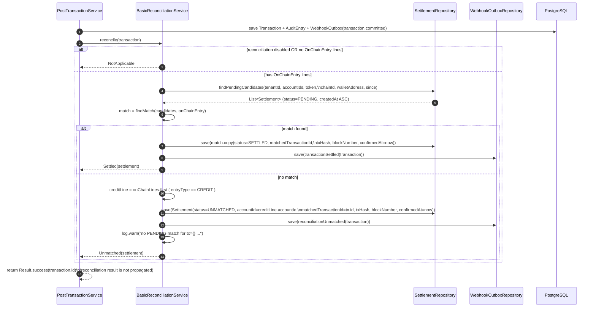

# Idem — Reconciliation (BasicReconciliationService)

> Infrastructure module (`finance.idem.infrastructure.service`).
> Called synchronously from `PostTransactionService.execute()`, **after** the
> transaction/audit/webhook writes, inside the **same `@Transactional`**. No event bus,
> no scheduler — matches the MVP event/outbox rule (one commit, everything or nothing).

---

## Purpose

When an `OnChainEntry`-typed `Transaction` is posted (by a chain reader, a webhook
receiver, or the API), reconciliation answers one question: **was this transfer
expected?**

- **Expected** (a `PENDING` `Settlement` row exists with the same tenant, account,
  token, chain, wallet, and amount, created within the matching window) → mark it
  `SETTLED`, attach on-chain proof, emit `transaction.settled`.
- **Not expected** → create a new `UNMATCHED` `Settlement` row with the on-chain proof
  already attached, emit `reconciliation.unmatched`, and log a warning.

Either way, nothing is silently dropped — every on-chain receipt produces a
`Settlement` row in one of these two terminal states (or remains untouched if
reconciliation is disabled or the transaction has no on-chain legs).

---

## Trigger point

```kotlin
// PostTransactionService.execute(), inside @Transactional
transactionRepository.save(transaction)
auditRepository.save(AuditEntry.from(transaction, cmd.agentContext, cmd.createdBy))
webhookOutboxRepository.save(WebhookOutboxEntry.transactionCommitted(transaction))
reconciliationService.reconcile(transaction)   // ← 4th write, same transaction
```

The return value of `reconcile()` is not propagated to the caller — `execute()`'s
`Result<TransactionId>` contract is unchanged. Reconciliation outcomes are observable
via the `transaction.settled` / `reconciliation.unmatched` webhook events and the
`settlements` table (a future `RECONCILIATION_READ`-scoped endpoint will expose this
directly). For transactions not matched at commit time, the manual batch re-trigger
endpoint (see below) can re-run reconciliation after a `PENDING` expectation is created.

---

## Algorithm

```kotlin
override fun reconcile(transaction: Transaction): ReconciliationResult {
    if (!enabled) return ReconciliationResult.NotApplicable

    val onChainLines = transaction.lines.filter { it.monetaryEntry is OnChainEntry }
    if (onChainLines.isEmpty()) return ReconciliationResult.NotApplicable

    val onChainEntry = onChainLines.first().monetaryEntry as OnChainEntry
    val candidateAccountIds = onChainLines.map { it.accountId }.toSet()
    val since = Instant.now().minusSeconds(matchingWindowHours * 3600)

    val candidates = settlementRepository.findPendingCandidates(
        tenantId = transaction.tenantId,
        accountIds = candidateAccountIds,
        token = onChainEntry.token,
        chainId = onChainEntry.chainId,
        walletAddress = onChainEntry.walletAddress,
        since = since,
    )

    val match = findMatch(candidates, onChainEntry)
    return if (match != null) settle(match, transaction, onChainEntry)
           else createUnmatched(transaction, onChainLines, onChainEntry)
}
```

1. **Early exits** (`NotApplicable`, no DB call): reconciliation disabled, or the
   transaction has no `OnChainEntry`-typed lines (pure `FiatEntry` transactions never
   reach `SettlementRepository`).
2. **Match key**: `reconcile()` requires that a transaction's on-chain lines form
   *exactly one* DEBIT/CREDIT pair sharing an *identical* `OnChainEntry` (same
   amount/token/chainId/walletAddress/txHash/blockNumber) — the chain-reader
   convention for every current producer (Alchemy/QuickNode webhooks, EVM/Solana/Tron
   readers). Given that, the first on-chain line's `monetaryEntry` is sufficient as
   the match key. `Transaction.validate()` does not enforce this precondition (it only
   checks per-currencyKey debit==credit balance), so step 7 below defends against it
   being violated.
3. **`candidateAccountIds`**: the union of `accountId` across all on-chain-typed
   lines, so a PENDING expectation registered against either the custody account or
   the customer account is found.
4. **`findPendingCandidates`**: a single indexed query
   (`idx_settlements_matching` on `(tenant_id, status, account_id, token, chain_id,
   wallet_address, created_at)`) filters to `status='PENDING'`, the candidate account
   set, exact token/chain/wallet, and `created_at >= since`. Results are ordered
   `created_at ASC` and locked with `SELECT ... FOR UPDATE`
   (`@Lock(LockModeType.PESSIMISTIC_WRITE)`) — if two on-chain transfers are
   reconciled concurrently for the same wallet/token, the second blocks until the
   first commits, then re-evaluates `status='PENDING'` against the now-committed row
   and no longer sees it as a candidate.
5. **Two-tier match** (`findMatch`, done in Kotlin — unit-testable without a
   database): first restrict `candidates` to `it.amount == onChainEntry.amount`
   (`MonetaryAmount.equals` is scale-insensitive — `100` == `100.000000`).
   - **Tier 1 (sender-confirmed)**: `firstOrNull` over the amount-matches whose
     `expectedFromAddress` is non-null and equals `onChainEntry.fromAddress`
     (also non-null), compared **case-insensitively**. Case-insensitive because
     EVM `fromAddress` is canonical lowercase hex, while Tron `fromAddress` is
     stored as a lowercased Base58Check string (an internal-only
     representation) — an operator registering `expectedFromAddress` is
     expected to enter standard mixed-case Base58. Preferred over FIFO
     regardless of `createdAt` order.
   - **Tier 2 (amount + FIFO — the original behavior)**: if tier 1 finds nothing,
     `firstOrNull { it.expectedFromAddress == null }` over the same
     amount-matches. Since `candidates` is ordered `createdAt ASC`, **the oldest
     eligible expectation wins** when multiple PENDING rows have the same amount.
   - **Exclusion rule**: a candidate whose `expectedFromAddress` is set but
     *disagrees* with `onChainEntry.fromAddress` is excluded from **both**
     tiers — positive evidence the transfer is not that expectation, so falling
     back to FIFO and consuming it would be strictly worse than UNMATCHED. See
     "Sender-address matching — MVP scope and roadmap" below for per-chain
     `fromAddress` coverage.
6. **Settle** (match found): for a transaction posted through the real-time Alchemy
   webhook path (`transaction.createdBy == FinalityPolicy.WEBHOOK_SOURCE`), the match
   is saved as `match.copy(status=WATCHING, matchedTransactionId=tx.id, txHash,
   blockNumber, confirmedAt=null, chainKey, logIndex)` and `transaction.settled` is
   **deferred** — see "Chain finality and reorg reversal" below. Every other source
   (chain-recovery replay, the Tron poller) already surfaces transfers past their
   chain's finality bound, so those settle immediately:
   `match.copy(status=SETTLED, matchedTransactionId=tx.id, txHash, blockNumber,
   confirmedAt=now)`, saved **in place** (same `id` — no duplicate row), with
   `WebhookOutboxEntry.transactionSettled(tx)` written right away.
7. **Create UNMATCHED** (no match): a brand-new `Settlement` row, `status=UNMATCHED`,
   `accountId` = the **CREDIT-side** on-chain line's account (the customer-facing
   account, by convention), all proof fields (`txHash`, `blockNumber`, `confirmedAt`)
   populated immediately since the chain data is already in hand,
   `matchedTransactionId=tx.id` (self-referential — the proof *is* this transaction).
   Writes `WebhookOutboxEntry.reconciliationUnmatched(tx)` and `log.warn(...)` with the
   full match context (tenant, amount, token, chain, wallet, txHash, settlement id).
   If `onChainLines` contains **no CREDIT-typed line** — violating the step 2
   precondition — `reconcile()` logs a WARN and returns `NotApplicable` instead of
   throwing, so a reconciliation-side gap can never roll back an otherwise-valid
   ledger commit (`reconcile()` is called with no exception handling, as the last
   write inside `PostTransactionService.execute()`'s `@Transactional`).

---

## Configuration

```yaml
idem:
  reconciliation:
    enabled: true              # idem.reconciliation.enabled
    matching-window-hours: 24  # idem.reconciliation.matching-window-hours
```

| Key | Default | Effect |
|---|---|---|
| `idem.reconciliation.enabled` | `true` | When `false`, `reconcile()` is a no-op (`NotApplicable`) for every transaction — no `SettlementRepository` calls at all. |
| `idem.reconciliation.matching-window-hours` | `24` | How far back `findPendingCandidates` looks for a PENDING expectation (`since = now - N hours`). PENDING rows older than this are never matched and remain `PENDING` indefinitely (candidates for a future cleanup/expiry job). |

Both are global (`@Value`-injected), not per-tenant. Acceptable for MVP; if a pilot
customer needs reconciliation disabled or a different matching window for just their
tenant, this would move to a per-tenant config table (mirroring the LGPD retention
pattern).

---

## Manual batch re-trigger — POST /api/v1/reconciliation/batch

Automatic reconciliation runs synchronously at transaction commit time. For transactions
that were not matched on initial commit (e.g. because no `PENDING` expectation existed
yet, or after settlement expectations have been updated), callers can manually re-run
reconciliation for up to 100 committed transactions in a single request.

**Scope:** `RECONCILIATION_WRITE`

**Request body:**
```json
{ "transactionIds": ["<uuid>", "..."] }
```
Max 100 IDs per call (`@Size(max = 100)`); `transactionIds` must not be empty.

**Application layer types** (`finance.idem.application.reconciliation`):

```kotlin
data class ReconcileBatchCommand(
    val transactionIds: List<TransactionId>,
    val tenantId: TenantId,
)

data class ReconcileBatchItemResult(
    val transactionId: TransactionId,
    val outcome: ReconcileOutcome,
)

enum class ReconcileOutcome { SETTLED, UNMATCHED, NOT_APPLICABLE, NOT_FOUND }
```

**Per-item `ReconcileOutcome` values:**

| Outcome | Meaning |
|---|---|
| `SETTLED` | A matching `PENDING` expectation was found and transitioned to `SETTLED` |
| `UNMATCHED` | No match found — a new `UNMATCHED` `Settlement` row was created |
| `NOT_APPLICABLE` | Transaction has no `OnChainEntry` lines, or reconciliation is globally disabled |
| `NOT_FOUND` | No transaction with that ID exists for this tenant |

`ReconcileBatchService` (infrastructure layer, `@Transactional` across the whole batch)
loads each transaction from `TransactionRepository` and delegates to
`BasicReconciliationUseCase.reconcile()` — the same two-tier matching algorithm as the
automatic path. A failure on any item rolls back the entire batch.

> **Duplicate UNMATCHED rows:** re-triggering reconciliation for a transaction that was
> already processed as `UNMATCHED` during the automatic pass will create a second
> `UNMATCHED` row (see "Known limitations" below). Re-trigger is most useful when a
> `PENDING` expectation has since been registered and the original automatic pass found
> no match.

> **Not the same as the `reconcile_batch` MCP tool.** This REST endpoint re-runs
> reconciliation *for known transactions* (matches PENDING candidates against a given
> transaction's on-chain lines). The MCP `reconcile_batch` tool (`ReconcileEntriesUseCase`
> / `ReconcileEntriesService`) instead sweeps `UNMATCHED` `Settlement` rows in a time
> window and matches them against `PENDING` `Settlement` rows directly — settlement-to-
> settlement, with no `Transaction` re-derivation. Both paths independently apply the
> finality gate described below; see "Chain finality and reorg reversal".

---

## Chain finality and reorg reversal

The algorithm above answers "was this transfer expected?" but says nothing about
whether the on-chain evidence itself is final. A chain reorg can invalidate a
transfer *after* it has already been reconciled. Idem handles this with a hybrid
approach — **hold below finality, and reverse with a compensating entry if a reorg
is caught anyway**:

- **Hold**: a match sourced from the real-time Alchemy webhook
  (`transaction.createdBy == FinalityPolicy.WEBHOOK_SOURCE`) is saved as
  `EntryStatus.WATCHING`, not `SETTLED` — `confirmedAt` stays `null` and the
  `transaction.settled` webhook is deferred. Matches sourced from chain-recovery
  replay or the Tron poller settle immediately, since those sources only ever surface
  transfers already past their chain's finality bound.
- **Actively re-verify, don't just wait out a timer**: `SettlementFinalityPoller`
  (`infrastructure/.../chain/SettlementFinalityPoller.kt`) sweeps `WATCHING` and
  webhook-sourced `UNMATCHED` rows (`confirmedAt IS NULL`) once they've cleared the
  chain's finality bound (`EvmChainReader.resolveScanBound()` — the RPC's `finalized`
  block tag where supported, falling back to a fixed confirmation count). Before
  promoting a row to `SETTLED`, it re-verifies the log is still present on-chain
  (`verifyLogStillPresent`). This poller is the *primary* reorg-detection mechanism,
  not merely a promoter — it's the reliable backstop for a missed webhook delivery.
- **Reverse, never mutate**: when a reorg is detected — either via the webhook's
  real-time `removed:true` signal or the poller's active re-verification —
  `ReorgReversalService` (`infrastructure/.../service/ReorgReversalService.kt`) posts
  a **compensating transaction** (every DEBIT/CREDIT line swapped) rather than
  touching the original transaction or settlement row, mirroring the saga pattern
  `RollbackWorkflowService` uses for agent-initiated rollbacks. The original
  settlement is flagged `REORGED`, with `reversalTransactionId` pointing at the
  compensation.
- **`reconcile_batch` (MCP) respects the same gate**: `ReconcileEntriesService`
  checks the same `confirmedAt == null` signal before settling a matched pair — an
  agent triggering a manual sweep cannot bypass finality and force an unconfirmed,
  webhook-sourced transfer straight to `SETTLED`.
- **Mutual exclusion with agent rollbacks**: an agent-executed workflow step with an
  on-chain leg can, in principle, be compensated by *either* `RollbackWorkflowService`
  (an operator/agent-initiated rollback) or `ReorgReversalService` (a reorg). Both tag
  their compensating transaction with a deterministic idempotency key derived from the
  original transaction id (`rollback:<id>` vs `reorg-reversal:<id>`); whichever runs
  second detects the first one's compensation via `TransactionRepository
  .findByIdempotencyKey` and reuses it instead of posting a duplicate. When the
  original transaction traces back to a `WorkflowStep` (`WorkflowPlanRepository
  .findByTransactionId`), a reorg reversal marks that step `StepStatus.REORGED`
  (distinct from `ROLLED_BACK`) and writes a `CHAIN_REORG_REVERSAL` `AgentAuditEvent`,
  so the reversal is traceable through `get_agent_audit_log`.
- **`get_balance` / `describe_account` report the unconfirmed portion separately**:
  the MCP tools' on-chain balance breakdown includes `pendingFinalityAmount` per
  token — the slice of the balance still `WATCHING` and therefore still reversible.
  Agents deciding whether to act on on-chain funds should treat
  `amount - pendingFinalityAmount` as the reorg-safe figure.

---

## Component overview



---

## Reconciliation flow (settled / unmatched paths)



---

## Worked example — settled path

1. A customer registers an expectation ahead of time (future `POST
   /accounts/{custodyAccountId}/settlements`):
   `Settlement(status=PENDING, accountId=custodyAccountId, amount=500.000000,
   token=USDC, chainId=SOLANA, walletAddress="5FHwk...", createdAt=T0)`.
2. Some time later (within 24h), `QuickNodeWebhookService` detects the actual 500 USDC
   transfer to `5FHwk...` and calls `PostTransactionService.execute(...)` with two
   `OnChainEntry` lines (DEBIT `custodyAccountId`, CREDIT `customerAccountId`),
   `txHash="5j7s6..."`, `blockNumber=250_000_000`.
3. `PostTransactionService` saves the transaction, then calls `reconcile(transaction)`:
   - `candidateAccountIds = {custodyAccountId, customerAccountId}`
   - `findPendingCandidates(tenantId, candidateAccountIds, USDC, SOLANA, "5FHwk...",
     since=T0 - 23h)` → returns the PENDING row from step 1 (within window)
   - `match = candidates.firstOrNull { it.amount == 500.000000 }` → matches
4. `settle()` updates the **same row** (`id` unchanged) →
   `status=SETTLED, matchedTransactionId=tx.id, txHash="5j7s6...",
   blockNumber=250_000_000, confirmedAt=now`.
5. Writes `WebhookOutboxEntry.transactionSettled(tx)` → `eventType="transaction.settled"`.

## Worked example — unmatched path

1. A customer sends 75 USDC to the watched wallet without any prior registered
   expectation (or no PENDING row matches `amount=75.000000` within the window).
2. The chain reader posts the transaction as usual; `reconcile()` runs:
   - `findPendingCandidates(...)` returns `[]` (or only rows with a different amount)
   - `match = null`
3. `createUnmatched()`:
   - `creditLine` = the on-chain line with `entryType=CREDIT` (the customer-facing
     account)
   - new `Settlement(status=UNMATCHED, accountId=creditLine.accountId,
     amount=75.000000, token=USDC, chainId=SOLANA, walletAddress="5FHwk...",
     matchedTransactionId=tx.id, txHash, blockNumber, confirmedAt=now,
     createdAt=now, createdBy="system")`
4. Writes `WebhookOutboxEntry.reconciliationUnmatched(tx)` →
   `eventType="reconciliation.unmatched"`.
5. `log.warn(...)` records the full match context (tenant, amount, token, chain,
   wallet, txHash, settlement id) for ops/compliance follow-up.

---

## Known limitations

- **Retry-created duplicate UNMATCHED rows**: a defensive re-run of `reconcile()` for
  the same transaction would create a *second* `UNMATCHED` row — `findPendingCandidates`
  only returns `PENDING` rows, so a settled match from a first run is never re-found,
  and a second "no match" run creates another row. In practice
  `PostTransactionService`'s idempotency store prevents `execute()` from re-running for
  a `COMMITTED` transaction, so this is defense-in-depth, not a normal-path concern.
  The same caveat applies when using `POST /api/v1/reconciliation/batch` to re-trigger
  a transaction that was already processed as `UNMATCHED` — use with care.
  Future: a unique constraint on `(tenant_id, matched_transaction_id, status)` or a
  check-before-create.
- **`confirmedAt` is wall-clock time**, not the chain's block timestamp — acceptable
  because reconciliation runs synchronously, moments after the on-chain entry is
  posted.
- **No REST endpoint yet to create PENDING expectations** — `SettlementRepository`
  is fully wired and tested, but `POST /accounts/{id}/settlements` is a future issue.
  Until it exists, every on-chain receipt falls through to `UNMATCHED`, which is the
  safe default (nothing is silently dropped).
- **Exception-queue dashboard and a configurable matching-rules DSL** (tolerance
  windows, fuzzy amount matching, multi-currency netting) are cloud/enterprise-tier
  features — out of scope for this OSS engine.
- **Sender-address matching is MVP-scoped** — see "Sender-address matching — MVP
  scope and roadmap" below for current per-chain `fromAddress` coverage and the
  Cloud/Enterprise resolution path.
- **Double-reversal guard is a read-before-write check, not a DB row lock** — the
  mutual-exclusion mechanism between `RollbackWorkflowService` and
  `ReorgReversalService` (see "Chain finality and reorg reversal" above) works by each
  service checking whether the *other's* deterministic idempotency key
  (`rollback:<id>` / `reorg-reversal:<id>`) already exists before compensating. This
  closes the realistic failure mode — one saga runs to completion, then the other
  finds it and reuses the existing compensation — but the two keys are distinct from
  each other, so `PostTransactionUseCase`'s idempotency store (which only enforces
  uniqueness *per key*) does not provide a DB-level guarantee against both sagas
  posting simultaneously inside the same narrow race window. In practice, rollback is
  operator/agent-triggered and reorg reversal is webhook/poller-triggered — truly
  concurrent execution against the same original transaction is an edge case, not the
  common path. A stronger guarantee (e.g. a `SELECT ... FOR UPDATE` on the original
  transaction, or a single shared compensation-claim table) is a candidate hardening
  if this is ever observed in practice.

---

## Sender-address matching — MVP scope and roadmap

This OSS engine captures the on-chain sender (`fromAddress`) where it's
cheaply available and uses it as a *preferred, non-exclusive* match
discriminator (tier 1 above). Current state per chain:

- **EVM and Tron** (direct readers and Alchemy webhook): `fromAddress` is
  always populated — from the ERC-20 `Transfer` event's `topics[1]` (EVM) or
  `from_address` (Tron/Alchemy activity). Recorded on every `OnChainEntry` for
  audit, even before any `expectedFromAddress` expectations exist. EVM
  `fromAddress` is canonical lowercase hex; Tron `fromAddress` is stored
  lowercased (an internal-only Base58Check representation). Tier 1's
  case-insensitive comparison means an `expectedFromAddress` registered in
  standard mixed-case Base58 (as an operator would naturally enter a Tron
  address) still matches.
- **Solana / QuickNode**: `fromAddress` remains `null`. Extracting the sender
  requires parsing transaction instructions/`accountKeys`, which the raw
  JSON-RPC `SolanaChainReader` does not implement (see chain-reader notes:
  re-evaluate once sol4k or SolanaJ closes this gap). Solana settlements remain
  amount+FIFO-only (tier 2) regardless of this change.
- **`expectedFromAddress` is always `null` today** — there is no
  `POST /accounts/{id}/settlements` endpoint yet to register a PENDING
  expectation with a sender hint (see "No REST endpoint yet..." above). Tier 1
  is dormant until that endpoint exists. Capturing `fromAddress` now means it's
  already on record for the moment that endpoint and tier 1 activate.
- **Same-amount collisions** — on Solana always, or on EVM/Tron before the
  creation endpoint exists — continue to resolve via amount+FIFO, unchanged
  from today.

### Cloud / Enterprise resolution

| Capability | OSS (this engine) | Cloud | Enterprise |
|---|---|---|---|
| Sender-confirmed matching | Tier-1 preferred match (EVM/Tron `fromAddress` vs registered `expectedFromAddress`); amount+FIFO fallback everywhere else | Same engine + exception-queue dashboard surfaces FIFO-resolved/ambiguous matches for review | + configurable matching-rules DSL (tolerance windows, multi-field precedence, fuzzy amounts) |
| Solana sender extraction | Not implemented — `fromAddress` always null | Same as OSS | Full instruction-level sender extraction (or SDK migration once sol4k/SolanaJ ships it) |
| Deposit addressing | Shared watched wallet per chain/token — amount/sender are the only signals | Same as OSS | Per-customer HD-derived deposit addresses — eliminates amount/sender ambiguity entirely |

---

## Test coverage

| Test class | Type |
|---|---|
| `BasicReconciliationServiceTest` | Unit (Mockito) — all branches of the algorithm above |
| `SettlementRepositoryAdapterTest` | Integration (Testcontainers Postgres) — `findPendingCandidates` filtering/ordering, RLS tenant isolation, PENDING→SETTLED in-place update |
| `PostTransactionServiceTest` | Unit — `reconcile()` called with the persisted transaction, last among the four writes |
| `ReconcileBatchServiceTest` | Unit (Mockito) — all four `ReconcileOutcome` values plus multi-item batch |
| `ReconciliationControllerTest` | `@WebMvcTest` — happy path, empty batch 400, scope enforcement |
| `AlchemyWebhookIntegrationTest` (app module) | Integration (Testcontainers Postgres + real HTTP via `TestRestTemplate`, full Spring context) — end-to-end: valid/invalid HMAC webhook → `PostTransactionService.execute()` → `BasicReconciliationService.reconcile()` as the 4th write; covers PENDING→SETTLED, UNMATCHED creation (no candidate / amount mismatch / outside 24h window), idempotent duplicate webhook |

```bash
rtk test mvn test -pl infrastructure
rtk test mvn test -pl app                   # AlchemyWebhookIntegrationTest (full end-to-end)
```

---

## Related

- `docs/domain-model.md` — `Settlement`, `EntryStatus`, `SettlementRepository`
- `docs/evm-chain-reader.md`, `docs/solana-chain-reader.md`, `docs/tron-chain-reader.md` — on-chain entry sources that feed `PostTransactionService`
- `docs/webhook-outbox-poller.md` — WebhookOutboxPoller (#55): delivers transaction.committed/settled/reconciliation.unmatched events to per-tenant webhooks
- `infrastructure/.../service/BasicReconciliationService.kt`
- `infrastructure/.../service/ReconcileBatchService.kt` — manual batch re-trigger (REST)
- `infrastructure/.../service/ReconcileEntriesService.kt` — settlement-sweep batch reconciliation (MCP `reconcile_batch`)
- `infrastructure/.../service/PostTransactionService.kt` — call site
- `infrastructure/.../persistence/reconciliation/SettlementRepositoryAdapter.kt`
- `infrastructure/.../chain/SettlementFinalityPoller.kt` — finality confirmation + primary reorg detection
- `infrastructure/.../service/ReorgReversalService.kt` — compensating-entry reorg reversal
- `infrastructure/.../service/RollbackWorkflowService.kt` — agent workflow rollback (the other saga `ReorgReversalService` coordinates with)
- Issue [#75](https://github.com/idem-finance/idem/issues/75)
- Issues #278, #279 (EVM finality-aware settlement + chain-reorg reversal), #280 (review remediation)
