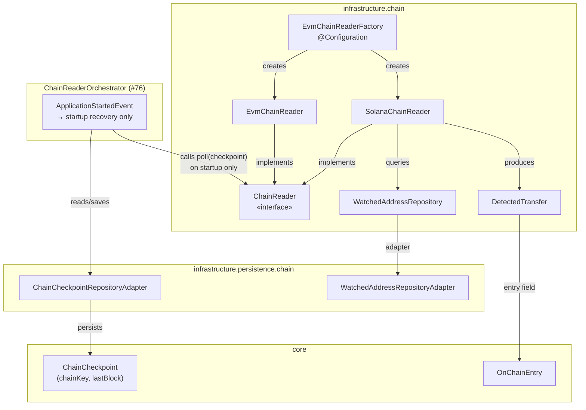
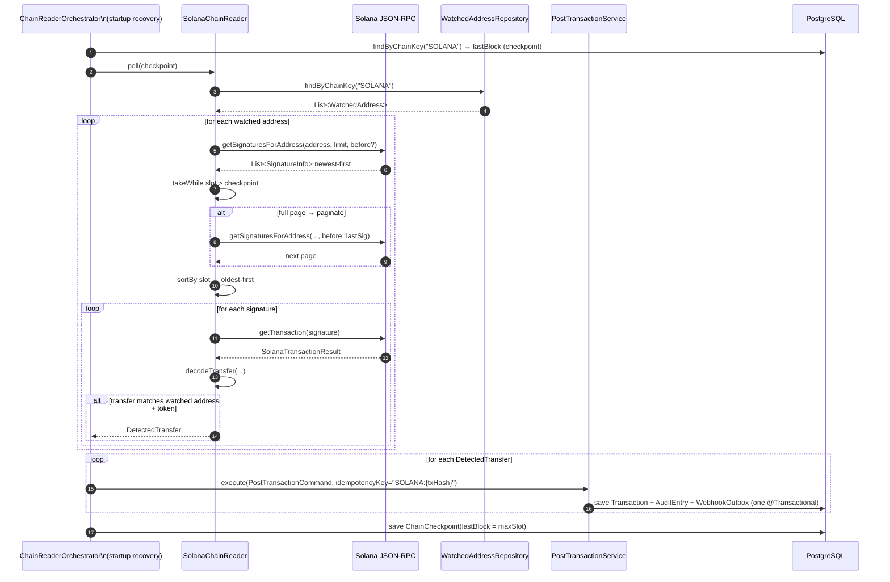
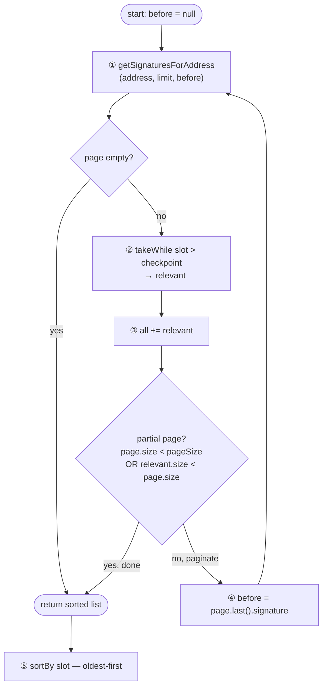
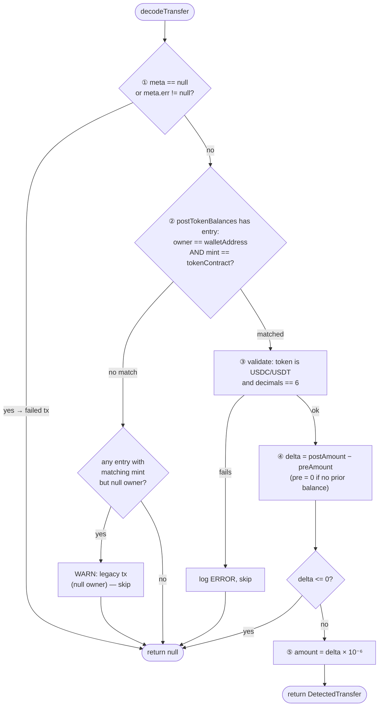

# Idem — Solana Chain Reader

> Infrastructure module (`finance.idem.infrastructure.chain`).
> **Fallback/recovery reader** — called once on startup by `ChainReaderOrchestrator` (#76)
> to replay missed SPL token transfers. Primary detection is `QuickNodeWebhookReceiver` (#74).

---

## Why raw JSON-RPC (no SDK)

Both Kotlin/Java Solana libraries were evaluated and are blocked:

| Library | Version | Blocker |
|---|---|---|
| **sol4k** | 0.7.0 | `getTransaction` not implemented — cannot read `postTokenBalances` |
| **SolanaJ** | 1.28.0 | `TokenBalance` missing `owner` field (open [issue #104](https://github.com/skynetcap/solanaj/issues/104)) |

Without `owner`, there is no way to match a balance entry to a watched wallet. `java.net.http.HttpClient` + Jackson is the intentional choice until one of these libraries closes the gap.

---

## Component overview

`EvmChainReaderFactory` wires `SolanaChainReader` alongside EVM and Tron readers at startup. `ChainReaderOrchestrator` calls `poll(checkpoint)` once on `ApplicationStartedEvent` — not on a recurring schedule.



---

## Polling workflow



**Walk-through example**

A customer sends 100 USDC on Solana to your watched address `Abc...xyz`. The transfer lands at slot `265,001,500`, but the app was down and missed the `QuickNodeWebhookReceiver` delivery for that slot. On the next startup:

1. Orchestrator reads the checkpoint for `SOLANA`: `lastBlock = 265,000,000`.
2. Calls `SolanaChainReader.poll(checkpoint = 265,000,000)`.
3. Reader fetches watched addresses — e.g., `walletAddress = Abc...xyz`, mint = `EPjFWdd5...` (USDC).
4. Calls `getSignaturesForAddress("Abc...xyz", limit=1000)` — RPC returns up to 1 000 signatures newest-first.
5. Filters: takes signatures with `slot > 265,000,000` — e.g., 12 signatures qualify.
6. Page was not full (12 < 1000), so no further pagination needed.
7. Sorts the 12 signatures oldest-first (ascending by slot).
8. For each signature, calls `getTransaction(sig)` and runs `decodeTransfer(...)`.
9. The transaction at slot `265,001,500` has `postTokenBalances`: `owner = Abc...xyz`, mint = USDC, delta = `100,000,000 × 10⁻⁶ = 100.000000 USDC`.
10. Emits `DetectedTransfer` with key `SOLANA:5eR7...txhash`. The pending entry is now settled.
11. Checkpoint advances to `265,001,500`.

The idempotency key (`SOLANA:{txHash}`) guards against duplicates on re-scan.

---

## Pagination algorithm

`getSignaturesForAddress` returns signatures newest-first, paginated via a `before` cursor. All signatures above the checkpoint are collected before processing.



**Walk-through example:** wallet received 2 450 new signatures since the last checkpoint (page size = 1 000)

| Step | Call | `before` cursor | Sigs returned | Above checkpoint | Continue? |
|---|---|---|---|---|---|
| ① | page 1 | `null` | 1 000 | 1 000 | yes — full page |
| ② | page 2 | `sig_1000` | 1 000 | 1 000 | yes — full page |
| ③ | page 3 | `sig_2000` | 450 | 450 | no — partial page, stop |

Total collected: 2 450 → sorted oldest-first → each processed with `getTransaction`.

**Why oldest-first:** processing ascending order means a crash mid-batch leaves the checkpoint at the last committed slot — the next run re-processes only the tail, not the whole page.

---

## Transfer decode



**Walk-through example:** `getTransaction` result for a 100 USDC deposit

```
meta.err      = null                             ← transaction succeeded
postTokenBalances[0]:
  owner       = "Abc...xyz"                      ← matches walletAddress
  mint        = "EPjFWdd5...t1v"                 ← USDC mint
  amount      = "101000000"                      ← post-balance: 101 USDC
  decimals    = 6
preTokenBalances[0]:
  owner       = "Abc...xyz"
  amount      = "1000000"                        ← pre-balance: 1 USDC (had some before)
```

1. `meta != null` and `meta.err == null` → valid transaction
2. `postTokenBalances` has an entry where `owner == "Abc...xyz"` and `mint == USDC mint` → matched
3. Token is USDC and `decimals == 6` → continue
4. `delta = 101,000,000 − 1,000,000 = 100,000,000`
5. `delta > 0` → incoming transfer (wallet received tokens)
6. `amount = 100,000,000 × 10⁻⁶ = 100.000000 USDC`
7. Return `DetectedTransfer` with key `SOLANA:5eR7...txhash`

**Rejection examples:**
- `meta.err != null` → the transaction failed on-chain (e.g. insufficient fees); skip silently — no money moved
- `delta <= 0` → wallet sent tokens or balance unchanged; skip
- `owner` is `null` → legacy transaction format (pre-token-account-reorg); log WARN and skip, do not process

**Key invariants:**
- `owner` match is case-insensitive — Solana addresses are base58 and may be stored mixed-case.
- `decimals` is validated against the known constant (6 for USDC/USDT) — a mismatch logs an error rather than silently producing a wrong amount.
- `delta` is always `post − pre`; pre defaults to 0 when the account held no tokens before the transaction.

---

## Supported tokens

| Token | Mint address (mainnet) | Decimals |
|---|---|---|
| USDC | `EPjFWdd5AufqSSqeM2qN1xzybapC8G4wEGGkZwyTDt1v` | 6 |
| USDT | `Es9vMFrzaCERmJfrF4H2FYD4KCoNkY11McCe8BenwNYB` | 6 |

Any other token on a watched address is logged at ERROR and skipped. To add a new token: extend the `when` branch in `decodeTransfer`, update `knownDecimals`, and add the mint to `WatchedAddress` records.

---

## Idempotency

Key format: `SOLANA:{txHash}`

A Solana transaction hash is unique per transaction — only one `postTokenBalances` result per hash. On re-scan, `PostTransactionService` returns the cached result without re-executing.

---

## Configuration

```yaml
idem:
  chain:
    solana:
      rpc-url: https://your-quicknode-endpoint.quiknode.pro/your-key/
```

`SolanaChainReader` is only instantiated when `rpc-url` is non-blank. Page size defaults to 1000 (Solana RPC max); override via the constructor for testing.

---

## RPC calls used

| Method | Purpose |
|---|---|
| `getSignaturesForAddress` | Fetch confirmed signatures for a wallet, paginated via `before` cursor (newest-first) |
| `getTransaction` | Fetch full transaction + token balance deltas |

Both are called with `encoding=json`, `commitment=confirmed`, `maxSupportedTransactionVersion=0`.

---

## Lifecycle and shutdown

`SolanaChainReader` implements `Closeable`. `EvmChainReaderFactory.@PreDestroy` calls `close()` on all `Closeable` readers, shutting down the underlying `HttpClient`.

---

## Error handling

| Category | Behaviour |
|---|---|
| HTTP non-200 or JSON parse failure | Log WARN, return empty — caller continues |
| Null `meta` or non-null `meta.err` | Skip silently (failed on-chain tx) |
| Null `owner` on a matching mint | Log WARN (legacy tx format), skip |
| Unsupported token or unexpected decimals | Log ERROR, skip |
| Unparseable amount | Log WARN, skip |
| `delta <= 0` | Skip silently |

`ChainReaderOrchestrator` must catch all exceptions without propagating — a failing reader must not abort startup recovery for other chains.

---

## Test coverage

| Test class | Type |
|---|---|
| `SolanaChainReaderTest` | Unit (Mockito) |
| `SolanaChainReaderIntegrationTest` | Integration (WireMock) |
| `EvmChainReaderFactoryTest` | Unit |

```bash
rtk test mvn test -pl infrastructure
```

---

## Related

- `docs/solana-webhook-receiver.md` — primary Solana event source (QuickNode Streams HTTP webhook)
- `docs/chain-reader-orchestrator.md` — central wiring point that calls `poll()` once on startup
- `docs/domain-model.md` — `ChainCheckpoint`, `OnChainEntry`, `MonetaryEntry` sealed class
- `docs/evm-chain-reader.md` — EVM counterpart (Alchemy webhook primary, Web3j fallback)
- `docs/tron-chain-reader.md` — Tron counterpart (Tronscan REST polling — primary and only)
- Issues [#48](https://github.com/idem-finance/idem/issues/48), [#74](https://github.com/idem-finance/idem/issues/74), [#76](https://github.com/idem-finance/idem/issues/76)
- PR [#70](https://github.com/idem-finance/idem/pull/70) — review findings and fixes applied
