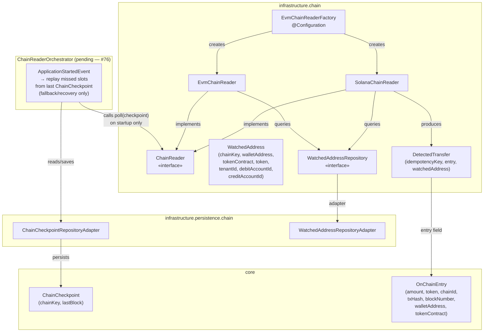
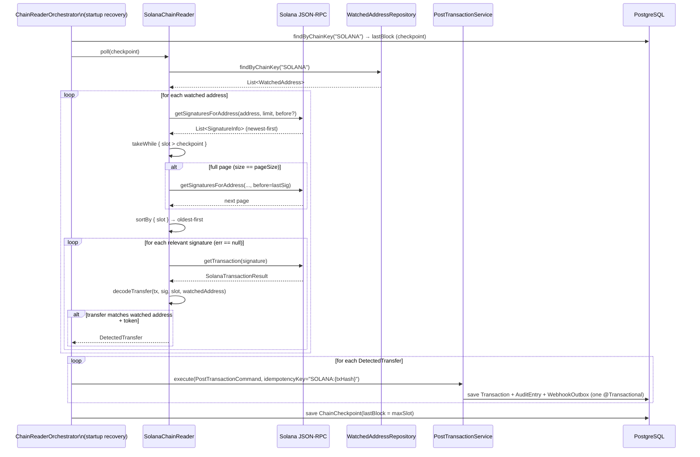
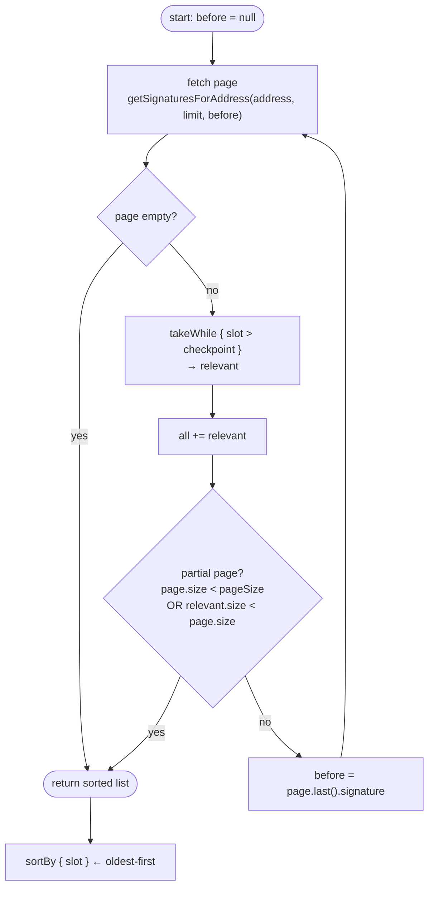
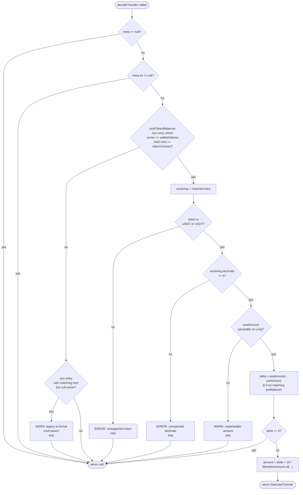

# Idem — Solana Chain Reader

> Infrastructure module (`finance.idem.infrastructure.chain`).
> Fallback/recovery reader: replays missed Solana SPL token transfers from the last
> `ChainCheckpoint` on startup. Primary detection is handled by `SolanaWebSocketManager` (#74).

---

## Why raw JSON-RPC (no SDK)

Both Kotlin/Java Solana libraries were evaluated at integration time and are blocked:

| Library | Version | Blocker |
|---|---|---|
| **sol4k** | 0.7.0 | `getTransaction` is not implemented — cannot read `postTokenBalances` |
| **SolanaJ** | 1.28.0 | `TokenBalance` missing `owner` field (open [issue #104](https://github.com/skynetcap/solanaj/issues/104)) |

Without `owner`, there is no way to match a token balance entry to a watched wallet address — it is the sole filter criterion.

`java.net.http.HttpClient` + Jackson is the intentional choice until one of these libraries closes its gap. Re-evaluate when sol4k ships `getTransaction` or SolanaJ fixes `TokenBalance.owner`.

---

## Component overview



`EvmChainReaderFactory` is the Spring `@Configuration` that wires `SolanaChainReader` alongside the EVM and Tron readers at startup. All readers are returned as a single `List<ChainReader>` bean. `ChainReaderOrchestrator` (#76) calls `poll(checkpoint)` on `SolanaChainReader` once on `ApplicationStartedEvent` to replay any slots missed while the application was down — it is not called on a recurring schedule.

---

## Polling workflow

> **Architecture note (revised Jun 2026):** `SolanaChainReader` is a **fallback/recovery reader**.
> The primary Solana event source is `SolanaWebSocketManager` (issue #74).
> `SolanaChainReader.poll()` is called once on startup by `ChainReaderOrchestrator` (#76)
> to replay any slots missed while the application was down.



The checkpoint advance and the ledger write must happen in the same transaction to prevent a crash between the two from causing duplicate or missing entries. The idempotency key (`SOLANA:{txHash}`) is the safety net for any re-scan — the second attempt returns the cached result without re-executing.

---

## Pagination algorithm

Solana's `getSignaturesForAddress` returns signatures newest-first, paginated via a `before` cursor (exclusive). A single poll must collect all signatures above the checkpoint before advancing.



**Why oldest-first after collection:** the orchestrator advances the checkpoint to the highest slot seen. Processing in ascending order means a crash mid-batch leaves the checkpoint at the last successfully committed slot — the next run re-processes only the tail, not the whole page.

---

## Transfer decode decision tree



**Key invariants:**
- `owner` match is case-insensitive — Solana addresses are base58 and wallets may be stored with mixed case.
- `decimals` is validated against the known constant (6 for USDC/USDT) — a mismatch indicates an unexpected token or node behaviour; skip and log rather than silently produce a wrong monetary amount.
- `delta` is always `post - pre`; pre defaults to 0 if the account did not hold any tokens before the transaction.

---

## Supported tokens

| Token | Mint address (mainnet) | Decimals | `StablecoinToken` |
|---|---|---|---|
| USDC | `EPjFWdd5AufqSSqeM2qN1xzybapC8G4wEGGkZwyTDt1v` | 6 | `USDC` |
| USDT | `Es9vMFrzaCERmJfrF4H2FYD4KCoNkY11McCe8BenwNYB` | 6 | `USDT` |

Any other token encountered on a watched address is logged at ERROR level and skipped. To add a new token: extend the `when` branch in `SolanaChainReader.decodeTransfer`, update `knownDecimals`, and add the mint to `WatchedAddress` records.

---

## Idempotency

Every detected transfer gets the idempotency key `SOLANA:{txHash}`.

- A transaction hash on Solana is unique per transaction — there can be only one `postTokenBalances` result for a given hash.
- On a re-scan (restart, pagination overlap), `PostTransactionService` sees the duplicate key and returns the cached `TransactionId` without executing again.
- The checkpoint is the primary guard; idempotency is the secondary guard for the overlap window.

---

## Configuration

Properties are bound under `idem.chain` via `@ConfigurationProperties`:

```yaml
idem:
  chain:
    solana:
      rpc-url: https://your-quicknode-endpoint.quiknode.pro/your-key/
```

`SolanaChainReader` is only instantiated when `idem.chain.solana.rpc-url` is non-blank (see `EvmChainReaderFactory.chainReaders()`). Omitting the property disables the Solana reader at runtime — no bean, no polling.

The page size defaults to 1000 (the Solana RPC maximum). Override via the constructor for testing:

```kotlin
SolanaChainReader(rpcUrl, watchedAddressRepository, signaturePageSize = 100)
```

---

## RPC calls used

| Method | Purpose | Pagination |
|---|---|---|
| `getSignaturesForAddress` | Fetch confirmed signature list for a wallet | `before` cursor (exclusive), newest-first |
| `getTransaction` | Fetch full transaction + token balance deltas | No pagination — one call per signature |

Both are called with `encoding=json`, `commitment=confirmed`, and `maxSupportedTransactionVersion=0`. Versioned transactions (v0) with address lookup tables are supported at the RPC level; the reader only reads `postTokenBalances` and `preTokenBalances`, which are resolved by the node before returning.

---

## Lifecycle and shutdown

`SolanaChainReader` implements `java.io.Closeable`. `EvmChainReaderFactory` is annotated `@PreDestroy` and calls `readers.filterIsInstance<Closeable>().forEach(Closeable::close)` on application shutdown. This closes the underlying `HttpClient` connection pool cleanly.

---

## Error handling contract

| Condition | Behaviour |
|---|---|
| RPC returns non-200 HTTP | Log WARN, return `null` / empty list — caller continues |
| JSON parse failure | Log WARN with exception message, return `null` / empty list |
| Null `meta` or non-null `meta.err` | Skip silently (failed on-chain tx — not an error) |
| `owner == null` on a matching mint | Log WARN (legacy tx format), skip |
| Unsupported token type | Log ERROR, skip |
| Unexpected decimals | Log ERROR, skip |
| Unparseable `amount` string | Log WARN, skip |
| `delta <= 0` | Skip silently (outgoing transfer or no net change) |

`ChainReaderOrchestrator` must catch and log all exceptions thrown by `poll()` without propagating — a single failing chain reader must not abort the startup recovery for other chains.

---

## Test coverage

| Test class | Type | What it covers |
|---|---|---|
| `SolanaChainReaderTest` | Unit (Mockito) | `decodeTransfer` for: decimals mismatch, unsupported token (BRZ), unparseable amount, null owner legacy tx, `Closeable` smoke test |
| `SolanaChainReaderIntegrationTest` | Integration (WireMock) | Full `poll()` path: happy-path USDC detection, checkpoint filter, empty signature list, failed tx skip, signature error skip, two-page pagination with slot boundary |
| `EvmChainReaderFactoryTest` | Unit | `SolanaChainReader` registered when `rpc-url` is set; factory shutdown closes `Closeable` readers |

Run with:

```bash
rtk test mvn test -pl infrastructure
```

---

## Related

- `docs/domain-model.md` — `ChainCheckpoint`, `OnChainEntry`, `MonetaryEntry` sealed class
- `docs/evm-chain-reader.md` — EVM counterpart (Alchemy webhook primary, Web3j fallback)
- `docs/tron-chain-reader.md` — Tron counterpart (Tronscan REST polling — primary and only)
- Issues [#48](https://github.com/idem-finance/idem/issues/48), [#74](https://github.com/idem-finance/idem/issues/74), [#76](https://github.com/idem-finance/idem/issues/76)
- PR [#70](https://github.com/idem-finance/idem/pull/70) — review findings and fixes applied
