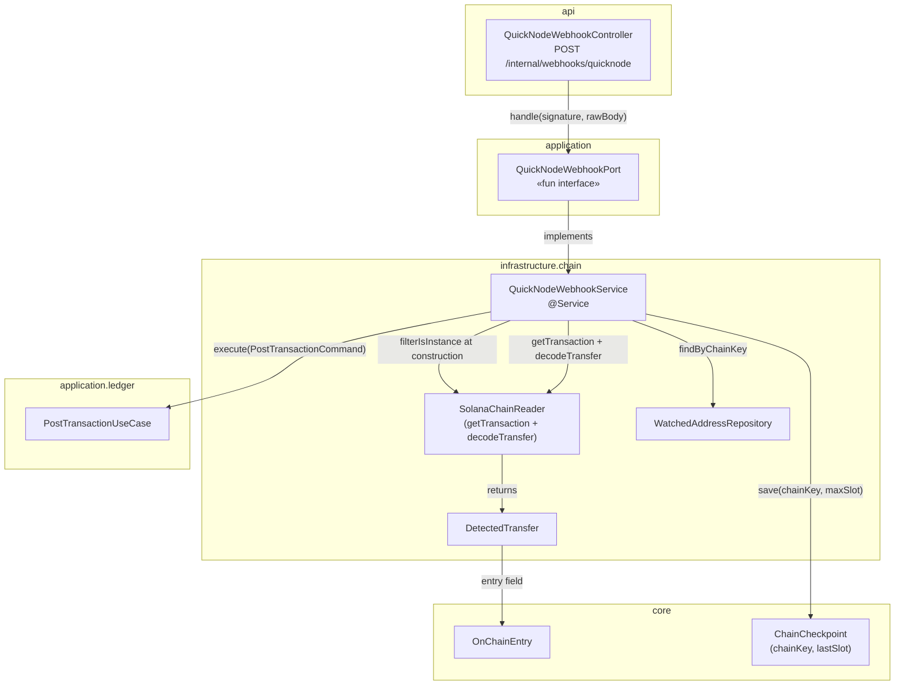
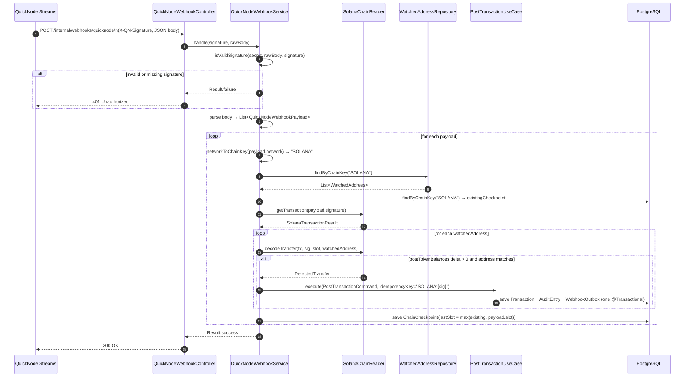

# Idem — Solana Webhook Receiver (QuickNode Streams)

> HTTP entry point: `finance.idem.api.internal` — Service: `finance.idem.infrastructure.chain`.
> **Primary Solana event source** — receives real-time token transfer notifications
> from QuickNode Streams and posts them directly to the ledger.
> Fallback/recovery is `SolanaChainReader` (#74), which replays missed signatures on startup.

---

## Role in the architecture

QuickNode sends a `POST /internal/webhooks/quicknode` request every time a transaction arrives on a watched Solana account. The receiver validates the HMAC signature, calls `getTransaction` to retrieve `postTokenBalances`, decodes the token delta, and posts the `OnChainEntry` to the ledger — no polling.

```
QuickNode cloud ──POST /internal/webhooks/quicknode──► QuickNodeWebhookController
                                                              │
                                                    QuickNodeWebhookPort
                                                              │
                                                    QuickNodeWebhookService
                                                     ├── HMAC validation
                                                     ├── getTransaction (RPC)
                                                     ├── decodeTransfer per watched address
                                                     ├── PostTransactionUseCase.execute()
                                                     └── ChainCheckpointRepository.save()
```

---

## Component overview



---

## Request flow



**Walk-through example**

A customer sends 100 USDC on Solana mainnet to your watched address `HN7cABqLq...`. QuickNode detects the confirmed transaction and calls your endpoint:

1. `POST /internal/webhooks/quicknode` arrives with `X-QN-Signature: abc123...` and a JSON array body.
2. Controller delegates to `QuickNodeWebhookService.handle(signature, rawBody)`.
3. HMAC-SHA256 of the raw body is computed with the configured secret and compared with the header using `MessageDigest.isEqual` (constant-time). Match → continue; mismatch → return `Result.failure` → 401.
4. Body is deserialized as `List<QuickNodeWebhookPayload>`.
5. `network = "mainnet-beta"` → `chainKey = "SOLANA"`.
6. Fetches watched addresses for `SOLANA` — finds `HN7cABqLq...` watching USDC.
7. Reads current checkpoint for `SOLANA`: `lastSlot = 154,600,000`.
8. Calls `solanaReader.getTransaction("5UfgJ5...")` → returns `SolanaTransactionResult` with `postTokenBalances`.
9. Calls `solanaReader.decodeTransfer(tx, sig, slot, watchedAddress)`:
   - Finds `HN7cABqLq...` in `postTokenBalances` with USDC mint match
   - Calculates delta: `postAmount - preAmount = 100_000_000` → `100.000000 USDC`
10. Calls `PostTransactionUseCase.execute(...)` with idempotency key `SOLANA:5UfgJ5...`
11. Checkpoint advances to `max(154,600,000, 154,628,853) = 154,628,853` — even if future payloads have no matching transfers, these slots won't be re-scanned by the fallback reader.
12. Returns `Result.success` → 200 OK to QuickNode.

---

## HMAC signature validation

QuickNode signs each webhook request body with a shared secret and includes it in `X-QN-Signature`.

```
HMAC-SHA256(secret, rawBody) == X-QN-Signature
```

Implementation notes:
- Comparison uses `MessageDigest.isEqual` — constant-time, prevents timing attacks.
- If `idem.chain.quicknode-webhook-secret` is **blank**, HMAC validation is skipped with a WARN log. Dev mode only — never run in production without a secret.
- The raw request body must be read as bytes before any JSON parsing.

---

## `getTransaction` and `decodeTransfer` reuse

`QuickNodeWebhookService` does not duplicate RPC or decode logic. It holds a reference to the `SolanaChainReader` instance (extracted from the `List<ChainReader>` bean at construction time) and calls:

- `solanaReader.getTransaction(signature)` — issues a `getTransaction` JSON-RPC call against the configured QuickNode Solana endpoint, returns `SolanaTransactionResult?`
- `solanaReader.decodeTransfer(tx, signature, slot, watchedAddress)` — computes `postAmount - preAmount` across `postTokenBalances` / `preTokenBalances`, applies decimals, returns `DetectedTransfer?`

Both methods are `internal` visibility — accessible within the `infrastructure` module, not from `api` or `application`.

---

## Checkpoint advancement

The checkpoint is advanced to `max(existingSlot, payload.slot)` for **every payload**, regardless of whether any transfer matched a watched address.

**Why:** if QuickNode delivers a payload for slot `154,628,853` but the transaction didn't involve your watched addresses, the fallback `SolanaChainReader` must still not re-scan that slot on restart.

---

## Idempotency

Key format: `SOLANA:{signature}` — identical to `SolanaChainReader`. If the webhook re-delivers and the fallback reader also processes the same slot on the next restart, `PostTransactionUseCase` returns the cached `TransactionId` without re-executing.

---

## Configuration

```yaml
idem:
  chain:
    solana:
      rpc-url: "${QUICKNODE_SOLANA_URL:}"
    quicknode-webhook-secret: "${QUICKNODE_WEBHOOK_SECRET:}"
```

| Property | Required | Description |
|---|---|---|
| `quicknode-webhook-secret` | Yes (prod) | Shared secret from the QuickNode dashboard. Blank = dev mode (HMAC skipped). |
| `solana.rpc-url` | Yes | QuickNode Solana endpoint used by `SolanaChainReader.getTransaction`. |

The endpoint `POST /internal/webhooks/quicknode` is registered unconditionally. In production, always configure the secret.

---

## Error handling

| Condition | Behaviour |
|---|---|
| Missing or invalid `X-QN-Signature` | Return `Result.failure` → 401 |
| Unparseable body | Log WARN, return `Result.success` |
| Unknown `network` value | Log WARN, return `Result.success` — QuickNode retries on 5xx only |
| `solanaReader` null (no `rpc-url` configured) | Log WARN, skip payload |
| `getTransaction` returns null | Log WARN, advance checkpoint, no decode |
| `decodeTransfer` returns null (outgoing or mismatched) | Skip silently, advance checkpoint |
| `PostTransactionUseCase` failure | Log ERROR — return `Result.success` to suppress QuickNode retry |

Returning 200 even on processing errors is intentional: QuickNode retries on 4xx/5xx, and a retry would cause duplicate processing attempts. The idempotency key is the correct guard.

---

## Test coverage

| Test class | Type |
|---|---|
| `QuickNodeWebhookServiceTest` | Unit (Mockito) — HMAC validation, dev mode, unknown network, valid USDC transfer, unmatched decode, null getTransaction, checkpoint invariants |
| `QuickNodeWebhookControllerTest` | Unit (MockMvc) — 200 on success, 401 on failure, absent header |

```bash
rtk test mvn test -pl infrastructure,api
```

---

## Related

- `docs/solana-chain-reader.md` — `SolanaChainReader` fallback/recovery (startup gap replay)
- `docs/evm-webhook-receiver.md` — EVM counterpart (Alchemy Address Activity webhook)
- `docs/domain-model.md` — `ChainCheckpoint`, `OnChainEntry`, `MonetaryEntry` sealed class
- `application/chain/QuickNodeWebhookPort.kt` — port interface
- `infrastructure/chain/QuickNodeWebhookService.kt` — implementation
- `api/internal/QuickNodeWebhookController.kt` — HTTP entry point
- Issues [#74](https://github.com/idem-finance/idem/issues/74)
