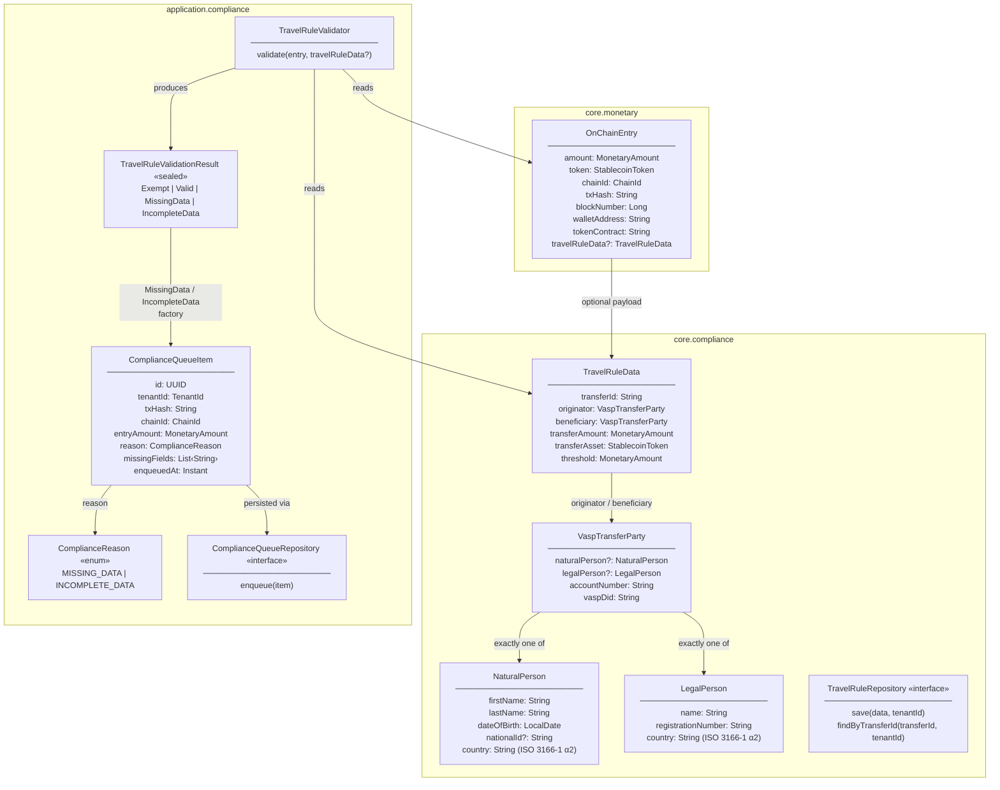
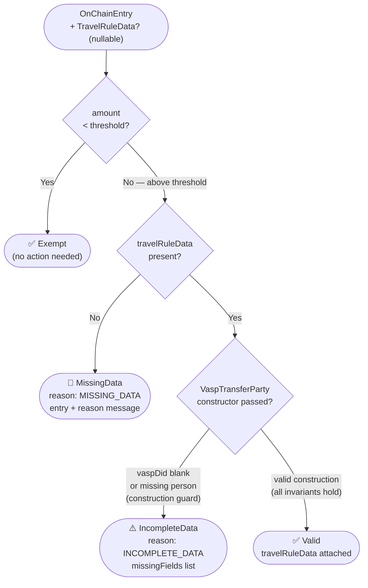
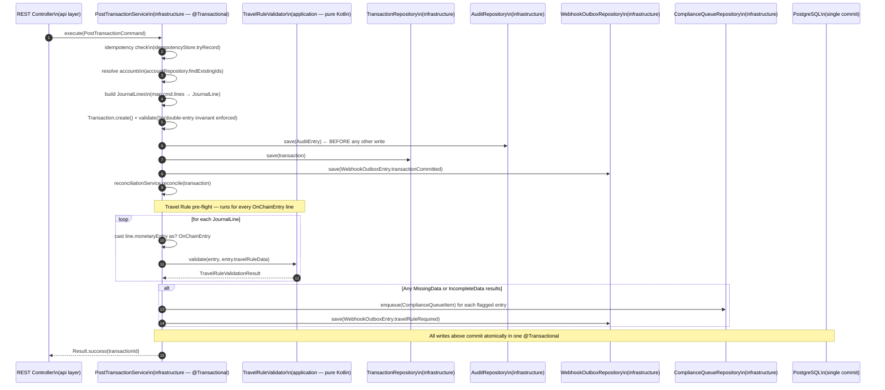
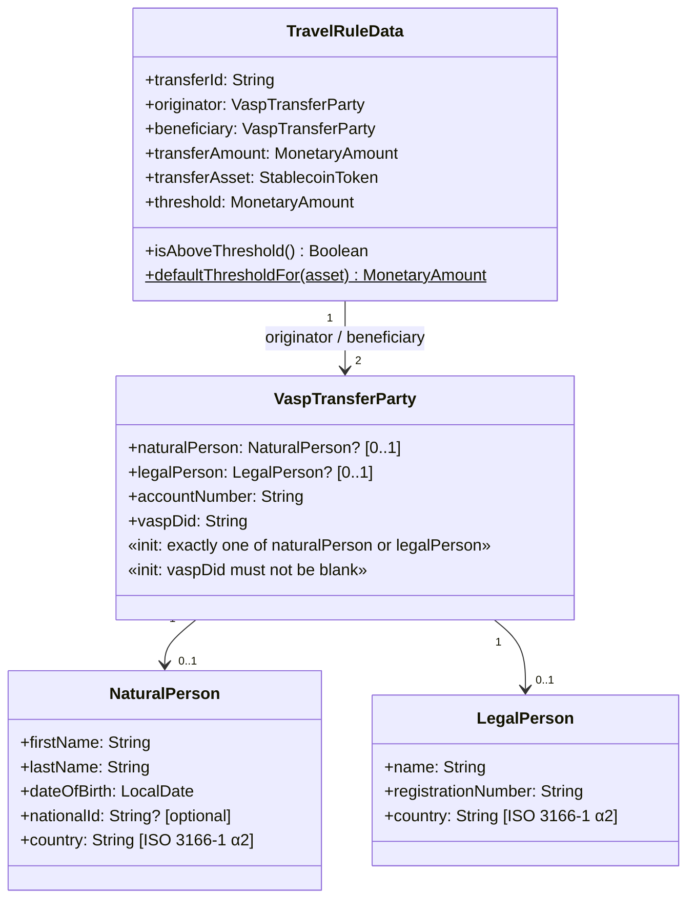
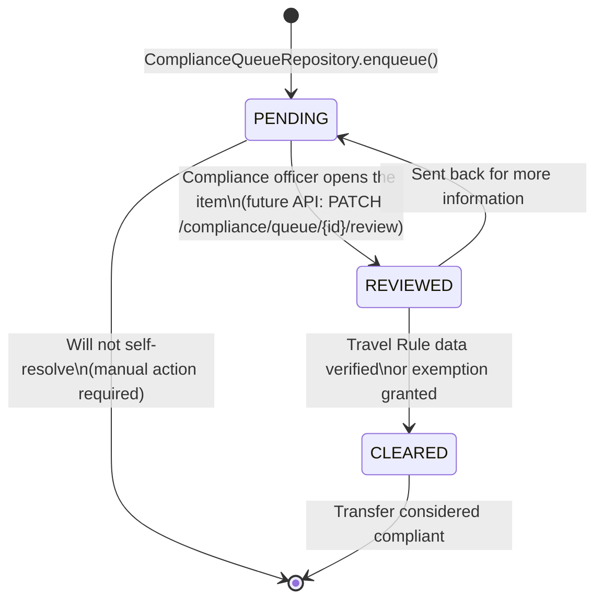
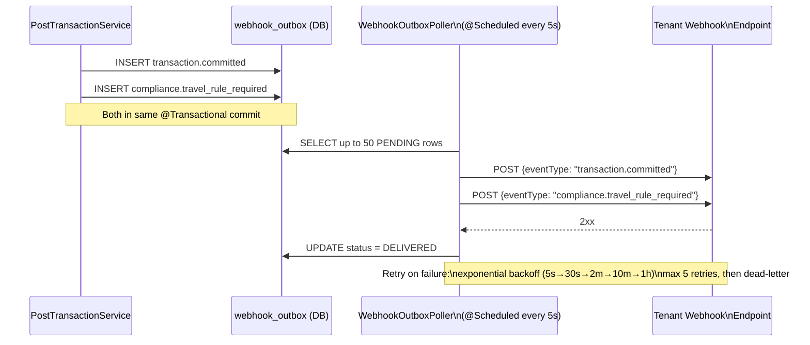
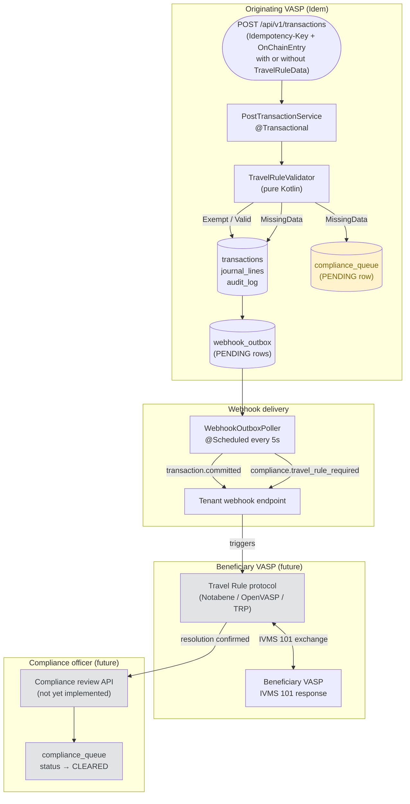

# Idem — Travel Rule (IVMS 101) Flow

> Modules: `core.compliance`, `application.compliance`, `infrastructure.compliance`
> **FATF Travel Rule pre-flight check on every `OnChainEntry` above the USD 1,000 threshold.**
> Non-blocking by design: flagged transfers are queued for compliance review — the transaction
> is never rejected at the ledger level. The originating VASP (Idem) is responsible for
> resolving the gap before settlement is considered final.

---

## Role

The **FATF Travel Rule** (FATF Recommendation 16, updated 2019) requires Virtual Asset
Service Providers (VASPs) to exchange originator and beneficiary information for any
virtual asset transfer above a jurisdictional threshold — USD 1,000 in most markets.
The messaging standard is **IVMS 101** (Inter-VASP Messaging Standard 101).

| Without Travel Rule enforcement | With Idem's Travel Rule check |
|---|---|
| On-chain transfer accepted with no counterparty data | Every `OnChainEntry` above threshold is inspected |
| VASP cannot demonstrate FATF compliance | `TravelRuleData` (IVMS 101 payload) attached or transfer flagged |
| Audit trail missing originator/beneficiary | `compliance_queue` row created; webhook fired to tenant |
| Regulatory exposure for the institution | Clear compliance posture: resolved vs. pending queue |

Idem's implementation is **non-blocking**: a transfer without IVMS 101 data is
**not rejected** — it is committed to the ledger and simultaneously queued for
compliance follow-up. This mirrors real-world VASP practice where settlement cannot
wait for asynchronous counterparty message exchange.

---

## Type map



---

## FATF threshold — per-asset defaults

`TravelRuleData.defaultThresholdFor(asset)` maps the USD 1,000 FATF floor to each
stablecoin's native unit. BRZ is reviewed quarterly.

| Token | Threshold (native units) | Rationale |
|---|---|---|
| USDC | 1,000 | 1:1 USD peg |
| USDT | 1,000 | 1:1 USD peg |
| PYUSD | 1,000 | 1:1 USD peg |
| BRZ | 5,500 | ~BRL/USD 5.5 (reviewed quarterly) |

Callers may supply a custom threshold in `TravelRuleData`. If they do, they own
the responsibility of keeping it in the same denomination as the transfer asset.

---

## Validation outcomes



> **Note on `IncompleteData`**: `VaspTransferParty.init` already enforces non-blank
> `vaspDid` and exactly one of `naturalPerson`/`legalPerson` at construction time.
> This means `IncompleteData` is **currently unreachable** through normal domain
> construction — a validly-constructed `TravelRuleData` is always `Valid`.
> The variant is preserved as a forward compatibility slot for future IVMS 101
> extended-field checks (e.g., national ID presence, date-of-birth format, LEI
> verification for legal persons).

---

## Validation flow (detailed)

```mermaid
flowchart TD
    START(["TravelRuleValidator.validate(\n  entry: OnChainEntry,\n  travelRuleData: TravelRuleData?\n)"]) --> THRESHOLD["Resolve threshold:\ntravelRuleData?.threshold\n?: defaultThresholdFor(entry.token)"]

    THRESHOLD --> CMP{entry.amount\n< threshold?}

    CMP -->|"true\n(below threshold)"| EXEMPT(["return Exempt"])

    CMP -->|"false\n(at or above threshold)"| NULL{travelRuleData\n== null?}

    NULL -->|"null\n(no IVMS 101 payload)"| MISSING(["return MissingData(\n  entry = entry,\n  reason = "Travel rule data required\n           for transfers >= &dollar;{threshold}"\n)"])

    NULL -->|"non-null\n(payload present)"| VALID(["return Valid(\n  travelRuleData = travelRuleData\n)"])

    style EXEMPT fill:#d4edda,color:#155724
    style VALID fill:#d4edda,color:#155724
    style MISSING fill:#f8d7da,color:#721c24
```

---

## Transaction integration — where Travel Rule fits in `PostTransactionService`



> **Atomicity guarantee**: the compliance queue write and the `compliance.travel_rule_required`
> webhook outbox write commit in the **same `@Transactional`** as the primary transaction.
> If any write fails, the entire operation rolls back — there are no orphaned queue rows
> without a corresponding transaction, and no transactions without a corresponding queue row.

---

## IVMS 101 domain model



---

## Compliance queue lifecycle

Once a transfer is flagged (`MissingData` or `IncompleteData`), a `compliance_queue` row
is created. A compliance officer (or future automation) advances it through three statuses:



| Status | Meaning |
|---|---|
| `PENDING` | Flagged; awaiting compliance review |
| `REVIEWED` | Under active review by compliance officer |
| `CLEARED` | Travel Rule satisfied or formal exemption granted |

> **Current state**: status transitions are not yet exposed through an API. The
> `compliance_queue` table is writable only by the application (via `enqueue`). A
> compliance review API (`GET/PATCH /compliance/queue`) is planned as a follow-up issue.

---

## Webhook event — `compliance.travel_rule_required`

When one or more journal lines in a transaction are flagged, the webhook outbox emits
a single `compliance.travel_rule_required` event for the whole transaction (not per line):

```json
{
  "eventType": "compliance.travel_rule_required",
  "transactionId": "txn_01J...",
  "tenantId": "...",
  "occurredAt": "2025-06-27T14:32:00Z"
}
```

This event fires alongside `transaction.committed` in the same atomic commit.
Tenants can subscribe to this event via their webhook endpoint to trigger their own
Travel Rule resolution workflow (e.g., sending an IVMS 101 message to the beneficiary VASP
via Notabene or another Travel Rule protocol provider).



---

## Database schema — `compliance_queue`

```sql
CREATE TABLE compliance_queue (
    id              UUID           NOT NULL DEFAULT gen_random_uuid(),
    tenant_id       UUID           NOT NULL,
    tx_hash         TEXT           NOT NULL,
    chain_id        TEXT           NOT NULL,
    entry_amount    NUMERIC(38,18) NOT NULL,
    reason          TEXT           NOT NULL
        CHECK (reason IN ('MISSING_DATA', 'INCOMPLETE_DATA')),
    missing_fields  JSONB          NOT NULL DEFAULT '[]',
    status          TEXT           NOT NULL DEFAULT 'PENDING'
        CHECK (status IN ('PENDING', 'REVIEWED', 'CLEARED')),
    created_at      TIMESTAMPTZ    NOT NULL DEFAULT now(),
    CONSTRAINT pk_compliance_queue PRIMARY KEY (id)
);

CREATE INDEX idx_compliance_queue_tenant ON compliance_queue (tenant_id, created_at DESC);

ALTER TABLE compliance_queue ENABLE ROW LEVEL SECURITY;
ALTER TABLE compliance_queue FORCE ROW LEVEL SECURITY;

CREATE POLICY tenant_isolation ON compliance_queue
    USING (tenant_id = current_setting('app.tenant_id', true)::UUID);
```

**RLS**: every query is automatically scoped to the calling tenant's `app.tenant_id`.
No application code can accidentally read another tenant's compliance queue rows.

**`missing_fields` JSONB**: populated for `INCOMPLETE_DATA` rows (e.g.,
`["vaspDid", "naturalPerson.nationalId"]`). Empty array for `MISSING_DATA` rows
(there is no partial payload to inspect).

---

## End-to-end flow — full picture



> Greyed-out boxes are **not yet implemented**. The current implementation covers everything
> up to and including the webhook delivery. Notabene integration and the compliance review API
> are planned follow-up issues.

---

## What is not yet implemented

| Gap | Description | Status |
|---|---|---|
| Notabene adapter | Send IVMS 101 payload to beneficiary VASP via Notabene sandbox | Not started — see `infrastructure.compliance` package placeholder |
| Compliance review API | `GET /compliance/queue` (paginated) + `PATCH /compliance/queue/{id}/review` | Not started |
| `IncompleteData` production path | Extended IVMS 101 field validation (LEI, national ID format, etc.) | Reserved; currently unreachable |
| Per-tenant thresholds | Override FATF default on a per-tenant basis (lower threshold for conservative tenants) | Not started |
| Automatic VASP discovery | DID-based VASP DID registry lookup for beneficiary VASP resolution | Not started |
| `TravelRuleData` submission API | `POST /compliance/travel-rule/{transferId}` for retroactive IVMS 101 data submission | Not started |

---

## Key invariants

### Non-blocking — transaction always commits
A missing Travel Rule payload **never causes a `Result.failure`**. The ledger entry is
committed unconditionally. The compliance obligation is tracked via the queue and resolved
asynchronously. This is intentional — rejecting at the ledger layer would require
synchronous cross-VASP communication, which is incompatible with on-chain settlement speed.

### One webhook per transaction, not per line
If a transaction has three `OnChainEntry` lines and all three are above threshold with no
IVMS 101 data, three `compliance_queue` rows are created — but only **one**
`compliance.travel_rule_required` webhook is emitted (for the transaction as a whole).

### FiatEntry lines are invisible to Travel Rule
`TravelRuleValidator.validate` only accepts `OnChainEntry`. The caller (`PostTransactionService`)
casts `line.monetaryEntry as? OnChainEntry` — fiat lines return `null` and are skipped silently.
The Travel Rule does not apply to ACH, PIX, WIRE, or SEPA entries.

### Threshold denominated in token units, not USD
`MonetaryAmount` is a raw `BigDecimal` with no currency tag. Thresholds are expressed
in the token's native unit. Comparing `entry.amount < threshold` is a same-denomination
comparison. The USD-equivalent logic lives in `defaultThresholdFor(asset)`, not in the
validator itself.

---

## Test coverage

| Test class | Type | What it covers |
|---|---|---|
| `TravelRuleValidatorTest` | Unit | 10 cases: Exempt ×3 (at/below threshold), MissingData ×3 (null payload above threshold), Valid ×4 (valid IVMS 101 with natural person, legal person, custom threshold, BRZ) |
| `ComplianceQueueItemTest` | Unit | 3 cases: `from(MissingData)` factory, `from(IncompleteData)` factory, unique ID per call |
| `ComplianceQueueRepositoryAdapterTest` | Integration (Testcontainers) | 3 cases: MISSING_DATA round-trip, INCOMPLETE_DATA JSONB serialization, tenant_id ownership isolation |
| `PostTransactionServiceTest` | Unit | 4 new cases: FiatEntry skip (no queue row), below-threshold skip, MissingData writes queue + webhook, Valid skips queue |
| `TravelRuleDataTest` | Unit | Constructor invariants, `isAboveThreshold`, `defaultThresholdFor` per asset |
| `VaspTransferPartyTest` | Unit | Both-null rejection, both-present rejection, blank vaspDid rejection, blank accountNumber rejection |

```bash
rtk test mvn test -pl core,application,infrastructure
```

---

## Related

- `docs/domain-model.md` — `MonetaryEntry`, `OnChainEntry`, `Transaction`
- `docs/webhook-outbox-poller.md` — outbox delivery and retry mechanics
- `core/compliance/TravelRuleData.kt` — IVMS 101 payload + threshold logic
- `core/compliance/VaspTransferParty.kt` — originator/beneficiary identity
- `application/compliance/TravelRuleValidator.kt` — validation logic
- `application/compliance/TravelRuleValidationResult.kt` — result sealed class
- `infrastructure/compliance/ComplianceQueueRepositoryAdapter.kt` — persistence
- `infrastructure/service/PostTransactionService.kt` — integration point
- `V23__create_compliance_queue.sql` — schema + RLS
- Issue [#172](https://github.com/idem-finance/idem/issues/172) — implementation
