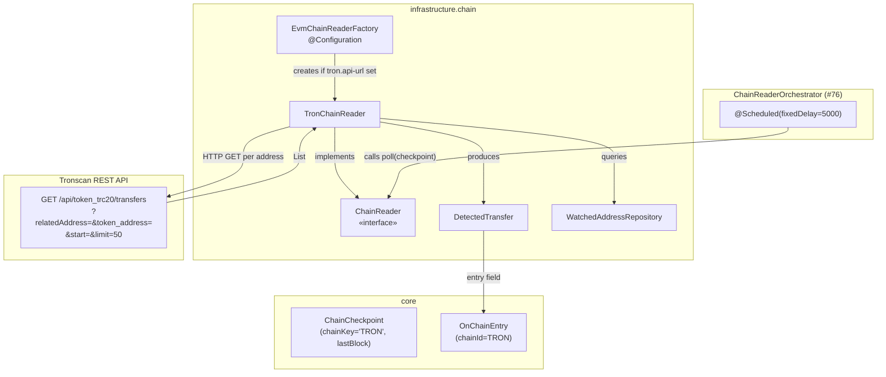
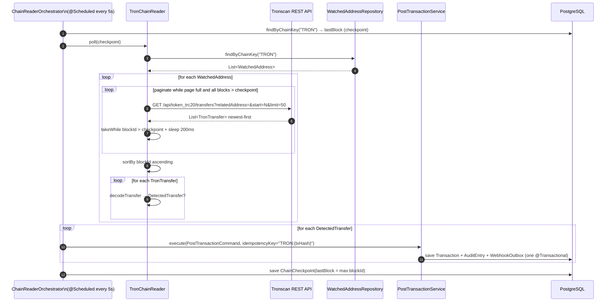
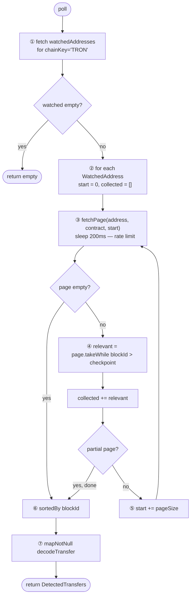
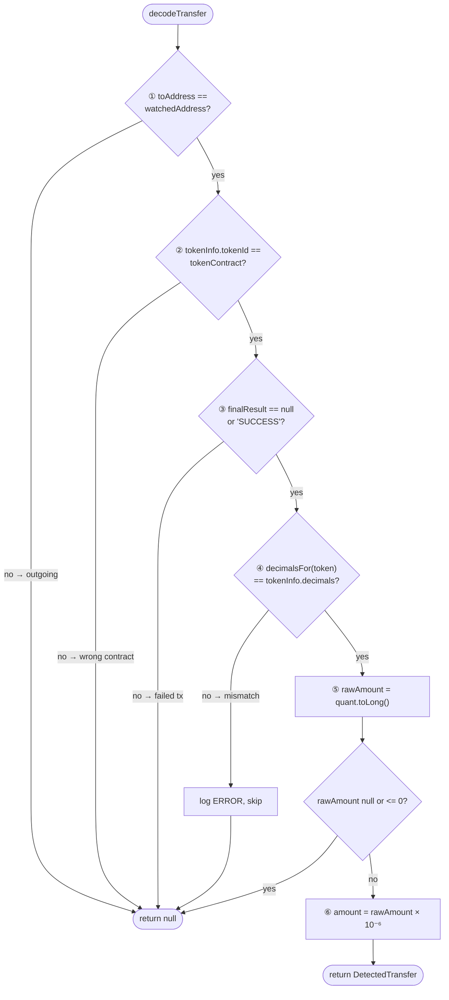

# Idem — Tron Chain Reader (Tronscan REST)

> Infrastructure module (`finance.idem.infrastructure.chain`).
> **Primary (and only) mechanism for Tron** — called on a `@Scheduled` timer by
> `ChainReaderOrchestrator` (#76). Tron has no webhook or WebSocket API, so polling is
> both the correct and the only approach. Block time: 3 seconds; poll interval: 5 seconds.

---

## Why polling (and why Tronscan)

Tronscan's public REST API is pure HTTP and requires no SDK. `java.net.http.HttpClient` + Jackson (already on the classpath for `SolanaChainReader`) is the complete stack. Unlike EVM (`AlchemyWebhookReceiver`) and Solana (`QuickNodeWebhookReceiver`), Tron has no event-push option — polling is intentional, not a gap.

---

## Supported tokens

| Token | TRC-20 Contract | Decimals |
|---|---|---|
| USDT | `TR7NHqjeKQxGTCi8q8ZY4pL8otSzgjLj6t` | 6 |
| USDC | `TEkxiTehnzSmSe2XqrBj4w32RUN966rdz8` | 6 |

Contract addresses are stored in `watched_addresses.token_contract`. `decimalsFor()` validates the on-chain decimal count — a mismatch logs an error and skips the transfer.

---

## Component overview

`EvmChainReaderFactory` creates exactly one `TronChainReader` when `idem.chain.tron.api-url` is non-blank. A single reader handles all Tron watched addresses, issuing one paginated API call per address.



---

## Polling workflow



**Walk-through example**

A customer sends 25 USDT TRC-20 to your watched address `TAbcxyz...`. Because Tron has a 3-second block time, the transfer is confirmed within seconds and appears on Tronscan almost immediately. The scheduler fires every 5 seconds:

1. Orchestrator fires on `@Scheduled(fixedDelay=5000)`.
2. Reads the checkpoint for `TRON`: `lastBlock = 62,000,000`.
3. Calls `TronChainReader.poll(checkpoint = 62,000,000)`.
4. Reader fetches watched addresses for `TRON` — e.g., `walletAddress = TAbcxyz...`, `tokenContract = TR7NHqje...` (USDT).
5. Calls `GET /api/token_trc20/transfers?relatedAddress=TAbcxyz...&token_address=TR7NHqje...&start=0&limit=50`. Sleeps 200ms.
6. Tronscan returns 3 transfers newest-first; all have `blockId > 62,000,000`. Since fewer than 50 were returned (partial page), stops paginating.
7. Sorts ascending by `blockId`.
8. Runs `decodeTransfer(...)` on each. The most recent one: `to = TAbcxyz...`, `quant = 25,000,000` → `25,000,000 × 10⁻⁶ = 25.000000 USDT`.
9. Emits `DetectedTransfer` with key `TRON:abc123txhash`. The pending entry is now settled.
10. Checkpoint advances to the highest `blockId` seen — the next scheduler tick will only look at newer blocks.

The checkpoint and ledger write are atomic — the idempotency key is the safety net for re-scan overlap.

---

## Pagination algorithm

Tronscan returns transfers newest-first, paginated by offset (`start`):



**Walk-through example:** wallet received 120 new transfers since last checkpoint (page size = 50)

| Step | `start` | Transfers returned | Above checkpoint | Continue? |
|---|---|---|---|---|
| ① | 0 | 50 | 50 | yes — full page |
| ② | 50 | 50 | 50 | yes — full page |
| ③ | 100 | 50 | 20 (30 are older) | no — partial result, stop |

Total collected: 120 → sorted ascending by `blockId` → decoded one by one. Each page fetch includes a 200ms sleep before the next request.

`pageSize` defaults to 50 (Tronscan's recommended max). Set to 2 in integration tests to exercise pagination with small fixtures.

---

## Transfer decode



**Walk-through example:** a Tronscan transfer record for a 25 USDT payment

```json
{
  "to":          "TAbcxyz...",
  "from":        "TSomeSender...",
  "tokenInfo":   { "tokenId": "TR7NHqje...", "decimals": "6" },
  "finalResult": "SUCCESS",
  "quant":       "25000000"
}
```

1. `to ("TAbcxyz...") == walletAddress ("TAbcxyz...")` → incoming transfer, continue
2. `tokenInfo.tokenId ("TR7NHqje...") == tokenContract ("TR7NHqje...")` → correct USDT contract, continue
3. `finalResult == "SUCCESS"` → transaction not failed, continue
4. `decimalsFor(USDT) == 6 == tokenInfo.decimals` → correct precision, continue
5. `rawAmount = toLong("25000000") = 25,000,000`, positive → continue
6. `amount = 25,000,000 × 10⁻⁶ = 25.000000 USDT`
7. Return `DetectedTransfer` with key `TRON:abc123txhash`

**Rejection examples:**
- `to` doesn't match `walletAddress` → outgoing transfer (your wallet sent, didn't receive); skip
- `finalResult = "REVERT"` or `"FAILED"` → smart contract rejected the transfer on-chain; skip
- `tokenId` is a different TRC-20 (e.g. a random token sent to the watched address) → step ② skips it
- `quant = "0"` → zero-value event (approval or dust); skip

**`finalResult` note:** older Tronscan responses omit this field. `null` is treated as success; only an explicit non-`"SUCCESS"` value causes the transfer to be skipped.

Both `toAddress` and `tokenInfo.tokenId` are lowercased in the produced `OnChainEntry` — Tronscan addresses are base58-encoded and mixed-case.

---

## Idempotency

Key format: `TRON:{transaction_id}`

Tron transactions emit one TRC-20 transfer per token contract — no `logIndex` needed (unlike EVM). On re-scan, `PostTransactionService` returns the cached result without re-executing.

---

## Rate limiting

Tronscan's public API enforces a rate limit. The reader sleeps **200ms after every HTTP request** in `sleepForRateLimit()`. Inject `requestDelayMs = 0` in tests.

---

## Configuration

```yaml
idem:
  chain:
    tron:
      api-url: https://apilist.tronscan.org
      api-key: "${TRONSCAN_API_KEY:}"
```

`api-url` defaults to blank — the Tron reader is disabled unless explicitly configured.

`api-key` defaults to blank. When non-blank, every Tronscan request includes a
`TRON-PRO-API-KEY: <api-key>` header. Per Tronscan's support center, since 2025-08-31
unauthenticated requests to `apilist.tronscan.org` are no longer guaranteed any QPS — they're
capped at 20 req/s shared globally across all unauthenticated callers, with a follow-up
announcement signalling a move toward mandatory API keys for all requests. Configure
`TRONSCAN_API_KEY` in production deployments to avoid silent throttling (see
[#95](https://github.com/idem-finance/idem/issues/95)).

---

## Lifecycle and shutdown

`TronChainReader` implements `Closeable`. `EvmChainReaderFactory.@PreDestroy` calls `close()` on all `Closeable` readers:

```kotlin
@PreDestroy
fun shutdown() {
    web3jInstances.forEach { it.shutdown() }                         // EVM
    readers.filterIsInstance<Closeable>().forEach(Closeable::close)  // Solana + Tron
}
```

---

## Error handling

| Category | Behaviour |
|---|---|
| HTTP non-200 or JSON parse failure | Log WARN, return empty page — orchestrator continues |
| `finalResult != "SUCCESS"` (non-null) | Skip silently |
| `tokenInfo.decimals` mismatch | Log ERROR, skip |
| Unsupported token | Log ERROR, skip |
| Unparseable or non-positive `quant` | Log WARN, skip |

The orchestrator must catch all exceptions without propagating — a failing reader must not terminate the polling loop for other chains.

---

## Test coverage

| Test class | Type |
|---|---|
| `TronChainReaderTest` | Unit (Mockito) |
| `TronChainReaderIntegrationTest` | Integration (WireMock) |

```bash
rtk test mvn test -pl infrastructure
```

---

## Related

- `docs/chain-reader-orchestrator.md` — central wiring point that calls `poll()` on a `@Scheduled` timer
- `docs/domain-model.md` — `ChainCheckpoint`, `OnChainEntry`, `MonetaryEntry` sealed class
- `docs/evm-chain-reader.md` — EVM counterpart (Alchemy webhook primary, Web3j fallback)
- `infrastructure/chain/EvmChainReaderFactory.kt` — factory that wires all chain readers
- Issues [#49](https://github.com/idem-finance/idem/issues/49), [#76](https://github.com/idem-finance/idem/issues/76), [#95](https://github.com/idem-finance/idem/issues/95)
