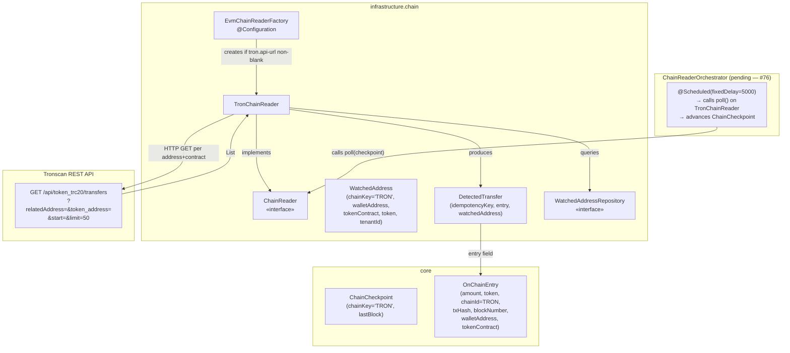
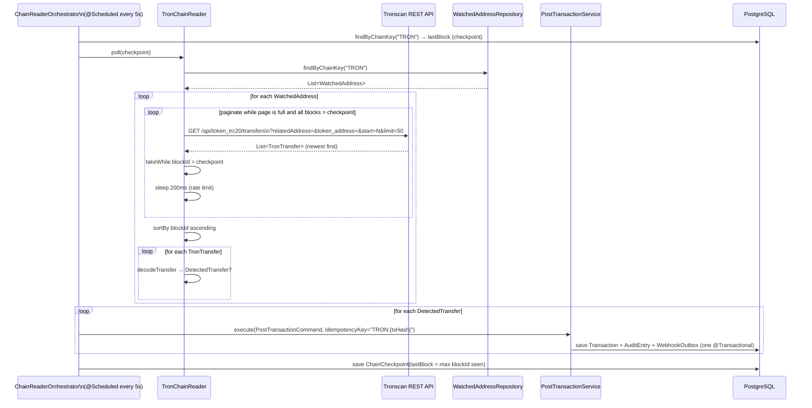
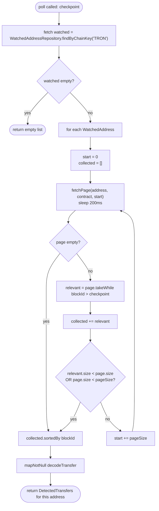
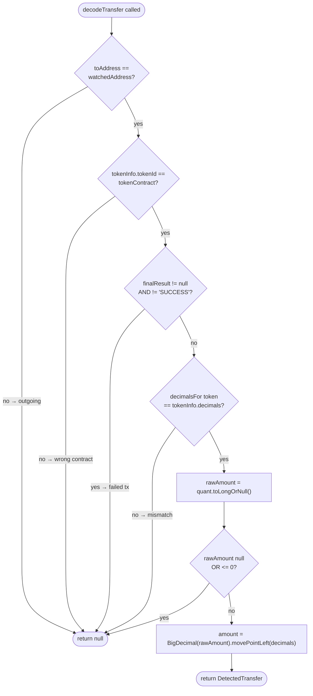

# Idem — Tron Chain Reader (Tronscan REST)

> Infrastructure module (`finance.idem.infrastructure.chain`).
> Polls the Tronscan REST API for incoming TRC-20 transfers into watched wallet addresses
> and converts them into `DetectedTransfer` records that feed the ledger.

---

## Why polling (and why Tronscan)

Tron has a **3-second block time** — the fastest of the three chains Idem supports.
At that cadence, polling every 5 seconds is appropriate and a webhook/WebSocket mechanism
adds no meaningful latency benefit. Tronscan has no webhook or WebSocket subscription API,
so polling is both the correct and the only approach.

The Tronscan REST API (`https://apilist.tronscan.org`) is pure HTTP, language-agnostic,
and requires no SDK. `java.net.http.HttpClient` + Jackson (already on the classpath for
`SolanaChainReader`) is the complete implementation stack.

No SDK was considered because none is needed — the API is a simple paginated JSON feed.

---

## Primary vs fallback role

**`TronChainReader` is the primary (and only) mechanism for Tron.**

Unlike EVM (where `AlchemyWebhookReceiver` is primary and `EvmChainReader` is fallback)
and Solana (where `SolanaWebSocketManager` is primary and `SolanaChainReader` is fallback),
Tron has no event-push option. `TronChainReader` is called on a `@Scheduled` timer by
`ChainReaderOrchestrator` (#76) — this is intentional, not a gap.

---

## Supported tokens

| Token | TRC-20 Contract | Decimals |
|---|---|---|
| USDT | `TR7NHqjeKQxGTCi8q8ZY4pL8otSzgjLj6t` | 6 |
| USDC | `TEkxiTehnzSmSe2XqrBj4w32RUN966rdz8` | 6 |

Contract addresses are stored in `watched_addresses.token_contract` — the reader uses
that value, not a hardcoded constant. `decimalsFor()` validates the on-chain decimal
count against the expected value; a mismatch logs an error and skips the transfer.

---

## Component overview



`EvmChainReaderFactory` creates exactly one `TronChainReader` when `idem.chain.tron.api-url`
is non-blank. A single reader handles all Tron watched addresses — it iterates each
`WatchedAddress` row with `chainKey = 'TRON'` and issues one paginated API call per address.

---

## Polling workflow



The checkpoint and ledger write must be atomic — a crash between them would either skip
transfers (checkpoint advances first) or produce duplicates (commit advances first).
The idempotency key is the safety net for the overlap window on re-scan.

---

## Pagination algorithm

Tronscan returns transfers in **newest-first** order. The reader paginates backward
using an offset (`start`) until it hits the checkpoint boundary:



`pageSize` defaults to 50 (Tronscan's recommended max). It is injectable for tests
(set to 2 in integration tests to trigger pagination with small fixtures).

---

## Transfer decoding



**`finalResult` handling:** some older Tronscan responses omit the field entirely.
A `null` value is treated as successful (processed); only an explicit non-`"SUCCESS"` value
causes the transfer to be skipped.

**Address normalisation:** both `toAddress` and `tokenInfo.tokenId` are lowercased in the
produced `OnChainEntry`. Tronscan addresses are base58-encoded and mixed-case — lowercasing
before storage ensures consistent matching against `WatchedAddress` rows.

---

## Idempotency

Every detected transfer gets the key `TRON:{transaction_id}`.

Tron transactions can only emit one relevant TRC-20 transfer per token contract in normal
operation (unlike EVM, which can have multiple `Transfer` log events per transaction).
Including `logIndex` in the key is therefore unnecessary — the transaction ID alone is
sufficient for deduplication. On a re-scan, `PostTransactionService` returns the cached
`TransactionId` without re-executing.

---

## Rate limiting

Tronscan's public API enforces a rate limit. The reader sleeps **200ms after every HTTP
request** before issuing the next. This is enforced in `sleepForRateLimit()`, called
immediately after each `fetchPage()` regardless of result.

In tests, `requestDelayMs` is injected as `0` to avoid slow test suites.

---

## Decimal precision

Both USDT and USDC on Tron use **6 decimals** (same as EVM). `decimalsFor()` validates
the on-chain `token_info.decimals` value:
- If it matches the expected value for the token → proceed
- If it doesn't → log error, skip the transfer (never silently miscompute an amount)

---

## Configuration

Properties are bound under `idem.chain` via `@ConfigurationProperties`:

```yaml
idem:
  chain:
    tron:
      api-url: https://apilist.tronscan.org
```

`api-url` defaults to blank — the Tron reader is **disabled unless explicitly configured**,
matching the opt-in behaviour of the EVM and Solana readers. In production, consider a
dedicated Tronscan Pro API key and endpoint for higher rate limits.

---

## Lifecycle and shutdown

`TronChainReader` implements `Closeable`. `EvmChainReaderFactory.@PreDestroy` calls
`close()` on all `Closeable` readers, which shuts down the underlying `HttpClient`:

```kotlin
@PreDestroy
fun shutdown() {
    web3jInstances.forEach { it.shutdown() }                         // EVM
    readers.filterIsInstance<Closeable>().forEach(Closeable::close)  // Solana + Tron
}
```

---

## Error handling contract

| Condition | Behaviour |
|---|---|
| Tronscan HTTP non-200 | Log WARN, return `null` from `httpGet` → page treated as empty |
| JSON parse failure | Log WARN, return empty page |
| `quant` not parseable as Long | Log WARN, skip transfer |
| `finalResult != "SUCCESS"` (and non-null) | Skip transfer silently |
| `finalResult == null` | Treated as success — older API responses omit field |
| `tokenInfo.decimals` mismatch | Log ERROR, skip transfer |
| Unsupported token type (e.g. BRZ) | Log ERROR, skip transfer |
| Tronscan network exception | Log WARN, return empty page — orchestrator continues |

The orchestrator must catch all exceptions thrown by `poll()` without propagating — a
single failing reader must not terminate the polling loop for other chains.

---

## Test coverage

| Test class | Type | What it covers |
|---|---|---|
| `TronChainReaderTest` | Unit (Mockito) | `decodeTransfer`: USDT/USDC happy path, outgoing transfer, contract mismatch, FAILED finalResult, null finalResult, unsupported token, decimal mismatch, unparseable quant, zero/negative amount, case-insensitive address/contract, lowercase normalisation; empty repo fast-path; `close()` |
| `TronChainReaderIntegrationTest` | Integration (WireMock) | Full `poll()` path: happy-path USDT detection, checkpoint boundary filter, empty response, outgoing transfer skipped, FAILED result skipped, pagination with offset, ascending sort |

Run with:

```bash
rtk test mvn test -pl infrastructure
```

---

## Related

- `docs/domain-model.md` — `ChainCheckpoint`, `OnChainEntry`, `MonetaryEntry` sealed class
- `docs/evm-chain-reader.md` — EVM counterpart (Alchemy webhook primary, Web3j fallback)
- `infrastructure/chain/EvmChainReaderFactory.kt` — factory that wires all chain readers
- Issues [#49](https://github.com/idem-finance/idem/issues/49), [#76](https://github.com/idem-finance/idem/issues/76)
