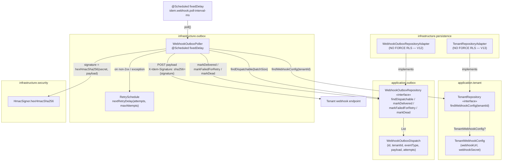
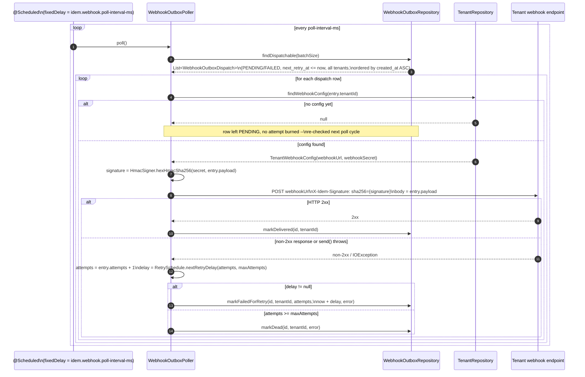

# Idem — Webhook Outbox Poller

> Infrastructure module (`finance.idem.infrastructure.outbox`).
> **Delivery mechanism for the transactional outbox.** No event bus — a single
> `@Scheduled` poller drains `webhook_outbox` across all tenants and POSTs each
> row to that tenant's configured webhook endpoint, signed with their secret.

---

## Role

`PostTransactionService` and `BasicReconciliationService` write
`webhook_outbox` rows (`transaction.committed`, `transaction.settled`,
`reconciliation.unmatched`) inside the same `@Transactional` as the primary
ledger write — see `docs/reconciliation.md`. Until #55, nothing ever read
those rows back out. `WebhookOutboxPoller` closes that gap:

| Trigger | When | Rows polled |
|---|---|---|
| `poll()` | Recurring `@Scheduled(fixedDelayString = "${idem.webhook.poll-interval-ms:5000}")` | up to `idem.webhook.batch-size` rows, `status IN (PENDING, FAILED)` with `next_retry_at <= now()`, **across all tenants**, oldest first |

For each row, the poller resolves the owning tenant's webhook destination and
secret via `TenantRepository`, signs the persisted JSON payload with
HMAC-SHA256, and POSTs it. The outcome (`2xx` / non-`2xx` / exception) drives
the PENDING → DELIVERED | FAILED → ... → DEAD state machine introduced by
PR #90 (#54).

---

## Component overview



---

## Dispatch flow



---

## Tenant webhook configuration

Each tenant's delivery destination and signing secret live in the `tenants`
table (V13):

```sql
CREATE TABLE tenants (
    id             UUID        PRIMARY KEY,
    webhook_url    TEXT,
    webhook_secret TEXT,
    created_at     TIMESTAMPTZ NOT NULL DEFAULT now(),
    updated_at     TIMESTAMPTZ NOT NULL DEFAULT now()
);
```

- RLS is **enabled** with a `tenant_isolation` policy (`id =
  current_setting('app.tenant_id', true)::UUID`) but **NOT FORCED** — the
  same pattern V12 established for `webhook_outbox`. `TenantRepositoryAdapter`
  deliberately does not call `SET LOCAL app.tenant_id`, so the table-owner
  role can resolve *any* tenant's config while the poller iterates
  cross-tenant dispatchable rows.
- `TenantRepository.findWebhookConfig(tenantId)` returns `null` if there is no
  row for that tenant, or if `webhook_url`/`webhook_secret` is null or blank.
  The poller treats `null` as **"not configured yet"** — the row stays
  `PENDING` and is re-checked every poll cycle, no attempt is burned, and no
  HTTP call is made.
- There is **no tenant-management API yet** — rows are written directly
  (tests/ops). A future tenant-facing settings endpoint would read/write its
  own row via `SET LOCAL app.tenant_id`, enforced by the `tenant_isolation`
  policy already in place.

```kotlin
interface TenantRepository {
    fun findWebhookConfig(tenantId: TenantId): TenantWebhookConfig?
}

data class TenantWebhookConfig(val webhookUrl: String, val webhookSecret: String)
```

---

## Cross-tenant dispatch query

`findDispatchable(limit)` is the only cross-tenant query in the outbox —
the whole reason V12 dropped `FORCE ROW LEVEL SECURITY` on `webhook_outbox`:

```sql
SELECT * FROM webhook_outbox
WHERE status IN ('PENDING','FAILED') AND next_retry_at <= now()
ORDER BY created_at ASC
LIMIT :limit
```

Backed by the partial index `idx_webhook_outbox_dispatchable (status,
next_retry_at) WHERE status IN ('PENDING','FAILED')` (V12).
`WebhookOutboxRepositoryAdapter.findDispatchable` and
`TenantRepositoryAdapter.findWebhookConfig` are the only two adapters in the
codebase that intentionally skip `SET LOCAL app.tenant_id` — both are
documented inline with the NO FORCE RLS rationale.

---

## Retry / backoff

`handleFailure` increments `attempts` and looks up the next delay via
`RetrySchedule.nextRetryDelay(attempts, maxAttempts)`:

| Attempt (1-based, after this failure) | Delay until `next_retry_at` |
|---|---|
| 1 | 5 seconds |
| 2 | 30 seconds |
| 3 | 2 minutes |
| 4 | 10 minutes |
| 5 (== `idem.webhook.max-attempts`, default 5) | none — row marked `DEAD` |

`markDead` does not modify `attempts` — it only sets `status = 'DEAD'` and
`last_error`. `DEAD` rows are permanently excluded from `findDispatchable`
(not `PENDING`/`FAILED`); there is no automatic revival.

`idem.webhook.max-attempts` is bounded to `1..RetrySchedule.MAX_SUPPORTED_ATTEMPTS`
(currently `1..5`, matching the table above). `WebhookOutboxPoller`'s `init` block
validates this at Spring context startup — a value outside that range fails fast
with an `IllegalArgumentException` rather than causing rows to be marked `DEAD`
prematurely once `attempts` exceeds the entries defined in `RetrySchedule`'s backoff
table.

---

## HMAC signing (outgoing)

```
X-Idem-Signature: sha256={HmacSigner.hexHmacSha256(tenant.webhookSecret, entry.payload)}
```

`HmacSigner.hexHmacSha256` (`infrastructure.security`) is the same primitive
used to *validate* incoming Alchemy webhooks (see
`docs/evm-webhook-receiver.md`'s HMAC section) — extracted by #55 so both the
incoming-signature check and this outgoing-signature computation share one
implementation. The body sent to the tenant is the **persisted** `payload`
string (the `jsonb` column's round-tripped representation, not necessarily
byte-identical to whatever was originally serialized at write time) — the
signature is computed over that same string, so a receiver verifying the
signature against the raw request body will always match.

---

## Configuration

```yaml
idem:
  webhook:
    timeout-ms: 5000
    max-attempts: 5
    batch-size: 50
    poll-interval-ms: 5000
```

| Property | Default | Notes |
|---|---|---|
| `idem.webhook.timeout-ms` | `5000` | `HttpRequest` timeout per delivery attempt. |
| `idem.webhook.max-attempts` | `5` | Total attempts before a row is marked `DEAD` (see retry table above). Must be in `1..5` -- enforced at startup. |
| `idem.webhook.batch-size` | `50` | Max rows fetched per `poll()` tick, across all tenants. |
| `idem.webhook.poll-interval-ms` | `5000` | `@Scheduled(fixedDelayString = ...)` interval. Integration tests override to `200` for fast scheduling. |

No global `url`/`secret` — those are per-tenant in the `tenants` table (V13).
`webhookHttpClient` is a plain `HttpClient.newHttpClient()` bean
(`WebhookOutboxConfig`), injected explicitly so it can be mocked in
`WebhookOutboxPollerTest`.

---

## Error handling

| Category | Behaviour |
|---|---|
| `findDispatchable` throws | Logged, `poll()` returns — next tick tries again. Never propagates. |
| `findWebhookConfig` throws | Logged per-row, row left untouched (no mark*) — next tick retries config resolution. |
| `findWebhookConfig` returns `null` | Row left `PENDING`, no attempt burned, no HTTP call — "queue until configured". |
| HTTP response `2xx` | `markDelivered(id, tenantId)`. |
| HTTP response non-`2xx` | `handleFailure` with `error = "HTTP {status}"`. |
| `httpClient.send` throws (timeout, connection refused, ...) | `handleFailure` with `error = exception.message ?: exception.javaClass.simpleName`. |
| `handleFailure`, `delay != null` | `markFailedForRetry(id, tenantId, attempts, now + delay, error)`. |
| `handleFailure`, `delay == null` (attempts ≥ maxAttempts) | `markDead(id, tenantId, error)`. |
| `markDelivered`/`markFailedForRetry`/`markDead` throws | Logged, swallowed — never propagates out of `poll()`. |

Every external call (DB read, tenant config lookup, HTTP send, DB write) is
individually wrapped in `runCatching` and logged — matching the
"log and continue" convention established by `ChainReaderOrchestrator`
(`docs/chain-reader-orchestrator.md`).

---

## Test coverage

| Test class | Type |
|---|---|
| `HmacSignerTest` | Unit — known-vector HMAC-SHA256 hex digest, different secret/body → different signature |
| `RetryScheduleTest` | Unit — backoff table (5s/30s/2m/10m, `null` at maxAttempts) |
| `TenantRepositoryAdapterTest` | Integration (Testcontainers Postgres) — `findWebhookConfig`: config present, no row, blank url/secret, cross-tenant resolution without `app.tenant_id` (NO FORCE RLS) |
| `WebhookOutboxRepositoryAdapterTest` | Integration (Testcontainers Postgres) — `findDispatchable`: cross-tenant rows, status/`next_retry_at` filtering, `limit`, `created_at ASC` ordering |
| `WebhookOutboxPollerTest` | Unit (Mockito-Kotlin) — delivered on 200, no config → PENDING, config lookup throws, non-2xx → retry with backoff, `send()` throws → retry, maxAttempts → DEAD, empty/throwing `findDispatchable`, `X-Idem-Signature` signed with the resolved tenant's secret |
| `WebhookOutboxPollerIntegrationTest` | Integration (Testcontainers Postgres + WireMock, `@EnableScheduling` with `poll-interval-ms=200`) — end-to-end: delivered + signature verified against the persisted payload, retry-on-500 with ~5s backoff, dead-letter at `attempts=4→5`, unconfigured tenant stays PENDING |

```bash
rtk test mvn test -pl infrastructure
```

---

## Related

- `docs/reconciliation.md` — `BasicReconciliationService`, one of the producers of `webhook_outbox` rows this poller delivers
- `docs/evm-webhook-receiver.md` — `HmacSigner`'s other caller (incoming `X-Alchemy-Signature` validation)
- `docs/domain-model.md` — `TenantRepository` / `TenantWebhookConfig` (Tenant domain)
- `infrastructure/outbox/WebhookOutboxPoller.kt`
- `infrastructure/persistence/outbox/WebhookOutboxRepositoryAdapter.kt`
- `infrastructure/persistence/tenant/TenantRepositoryAdapter.kt`
- Issue [#55](https://github.com/idem-finance/idem/issues/55)
